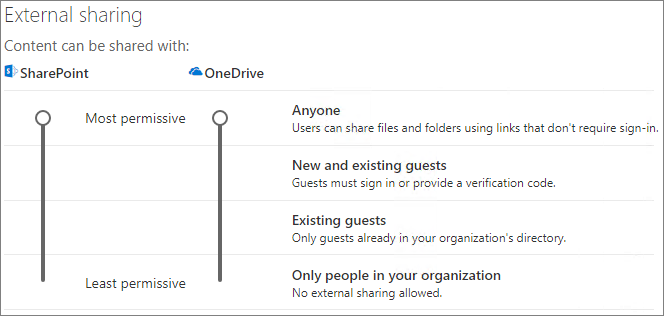

# Collaborate with guests in a site

If you need to collaborate with guests across documents, data, and lists, you can use a SharePoint site. Modern SharePoint sites are connected to Office 365 Groups which can manage the site membership and provide additional collaboration tools such as a shared mailbox and calendar.

In this article, we'll walk through the Microsoft 365 configuration steps necessary to set up a SharePoint site for collaboration with guests.

## Azure Organizational relationships settings

Sharing in Microsoft 365 is governed at its highest level by the organizational relationships settings in Azure Active Directory. If guest sharing is disabled or restricted in Azure AD, this will override any sharing settings that you configure in Microsoft 365.

Check the organizational relationships settings to ensure that sharing with guests is not blocked.

To set organizational relationship settings

1. Log in to Microsoft Azure at [https://portal.azure.com](https://portal.azure.com).
2. In the left navigation, click **Azure Active Directory**.
3. In the **Overview** pane, click **Organizational relationships**.
4. In the **Organizational relationships** pane, click **Settings**.
5. Ensure that **Admins and users in the guest inviter role can invite** and **Members can invite** are both set to **Yes**.
6. If you made changes, click **Save**.

Note the settings in the **Collaboration restrictions** section. Make sure that the domains of the users that you want to collaborate with aren't blocked.

## Office 365 Groups guest settings

Modern SharePoint sites use Office 365 Groups to control site access. The Office 365 Groups guest settings must be turned on in order for guest access in SharePoint sites to work.

To set Office 365 Groups guest settings

1. In the Microsoft 365 admin center, in the left navigation, expand **Settings**.
2. Click **Services & add-ins**.
3. In the list, click **Office 365 Groups**.
4. Ensure that the **Let group members outside your organization access group content** and **Let group owners add people outside your organization to groups** check boxes are both checked.
5. If you made changes, click **Save changes**.

## SharePoint organization level sharing settings

In order for guests to have access to SharePoint sites, the SharePoint organization-level sharing settings must allow for sharing with guests.

The organization-level settings determine what settings are available for individual sites. Site settings cannot be more permissive than the organization-level settings.

If you want to allow file and folder sharing with anonymous users, choose **Anyone**. If you want to ensure that all guests have to authenticate, choose **New and existing guests**. Choose the most permissive setting that will be needed by any site in your organization.

To set SharePoint organization level sharing settings

1. In the Microsoft 365 admin center, in the left navigation, under **Admin centers**, click **SharePoint**.
2. In the SharePoint admin center, in the left navigation, click **Sharing**.
3. Ensure that external sharing for SharePoint is set to **Anyone** or **New and existing guests**.
4. If you made changes, click **Save**.

## SharePoint organization level default link settings

The default file and folder link settings determine which link option is shown to the user by default when they share a file or folder. Users can change the link type to one of the other options before sharing if desired.

Keep in mind that this setting affects all teams and SharePoint sites in your organization.

Choose the type of link that's selected by default when users share files and folders:

- **Anyone with the link** - Choose this option if you expect to share a lot of files and folders with anonymous users. If you want to allow *Anyone* links but are concerned about accidental anonymous sharing, consider one of the other options as the default. This link type is only available if you've enabled **Anyone** sharing.
- **Only people in your organization** - Choose this option if you expect most file and folder sharing to be with people inside your organization.
- **Specific people** - Consider this option if you expect to do a lot of file and folder sharing with guests. This type of link works with guests and requires them to authenticate.
 

To set the SharePoint organization level default link settings

1. Navigate to the Sharing page in the SharePoint admin center.
2. Under **File and folder links**, select the default sharing link that you want to use.
3. If you made changes, click **Save**.

## Create a site

The next step is to create the site that you plan to use for collaborating with guests.

To create a site
1. In the SharePoint admin center, under **Sites**, click **Active sites**.
2. Click **Create**.
3. Click **Team site**.
4. Type a site name and enter a name for the Group owner (site owner).
5. Under **Advanced settings**, choose if you want this to be a public or private site.
6. Click **Next**.
7. Click **Finish**.

We'll invite users later. Next, it's important to check the site-level sharing settings for this site.

## SharePoint site level sharing settings

Check the site-level sharing settings to make sure that they allow the type of access that you want for this site. For example, if you set the organization-level settings to **Anyone**, but you want all guests to authenticate for this site, then make sure the site-level sharing settings are set to **New and existing guests**.

Note that the site cannot be shared with anonymous users (**Anyone** setting), but individual files and folders can.

To set site-level sharing settings
1. In the SharePoint admin center, in the left navigation, expand **Sites** and click **Active sites**.
2. Select the site that you just created.
3. In the ribbon, click **Sharing**.
4. Ensure that sharing is set to **Anyone** or **New and existing guests**.
5. If you made changes, click **Save**.

## Invite users

Guest sharing settings are now configured, so you can start adding internal users and guests to your site. Site access is controlled through the associated Office 365 Group, so we'll be adding users there.

To invite internal users to a group
1. Navigate to the site where you want to add users.
2. Click **Members** in the upper right.
3. Click **Add members**.
4. Type the names or email addresses of the users that you want to invite to the site, and then click **Save**.

Guest users can't be added from the site. You need to add them using Outlook on the web.

To invite guests to a site
1. In Outlook on the web, under **Groups**, click the group where you want to add members.
2. Open the group contact card, and then, under **More options** (...), click **Add members**.
3. Type the email addresses of the guests that you want to invite, and then click **Add**.
4. Click **Close**.

## See Also
