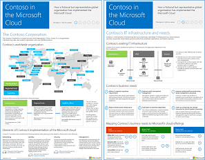

# Contoso in the Microsoft Cloud

 **Summary:** How a fictional but representative global organization is adopting a cloud-inclusive IT infrastructure with Microsoft's cloud offerings.
  
This article links you to a set of articles that describe how the Contoso Corporation, a global manufacturing conglomerate with its headquarters in Paris, is embracing a cloud-inclusive IT infrastructure and has addressed major design decisions for networking, identity, and security and how it is implementing enterprise cloud scenarios to address its business problems. You can also view this information as an 11-page poster and print it in tabloid format (also known as ledger, 11 x 17, or A3).
  

  
[PDF](https://go.microsoft.com/fwlink/p/?linkid=842085)  | [Visio](https://go.microsoft.com/fwlink/p/?linkid=842086)  | [More languages](https://www.microsoft.com/download/details.aspx?id=54427)
  
See the following sections:
  
- [Hybrid cloud overview](hybrid-cloud-overview.md)
    
    The Contoso Corporation is a global conglomerate manufacturing, sales, and support organization with over 100,000 products.
    
- [Contoso's IT infrastructure and needs](contoso’s-it-infrastructure-and-needs.md)
    
    Contoso is transitioning from an on-premises, centralized IT infrastructure to a cloud-inclusive one that incorporates cloud-based personal productivity workloads, applications, and hybrid scenarios.
    
- [Networking for the Contoso Corporation](networking-for-the-contoso-corporation.md)
    
    For best performance to cloud-based services, Contoso's network engineers optimized traffic to their Internet edge and across the Internet.
    
- [Identity for the Contoso Corporation](identity-for-the-contoso-corporation.md)
    
    Contoso's identity in the cloud solution leverages their on-premises identity provider and includes federated authentication with their existing trusted, third-party identity providers.
    
- [Subscriptions, licenses, and user accounts for the Contoso Corporation](subscriptions-licenses-and-user-accounts-for-the-contoso-corporation.md)
    
    Contoso uses the organization/subscriptions/licenses/user accounts hierarchy to access Microsoft's cloud offerings.
    
- [Security for the Contoso Corporation](security-for-the-contoso-corporation.md)
    
    When transitioning their IT infrastructure to a cloud-inclusive one, Contoso made sure that their on-premises security requirements were supported and implemented in Microsoft's cloud offerings.
    
- [Enterprise scenarios for the Contoso Corporation](enterprise-scenarios-for-the-contoso-corporation.md)
    
    See how Contoso is addressing its business needs with Microsoft's cloud offerings.
    
> [!NOTE]
> These articles reflect the **September 2017** release of the Contoso in the Microsoft Cloud poster.
  
## See Also

[Microsoft Cloud IT architecture resources](microsoft-cloud-it-architecture-resources.md)

[Microsoft's Enterprise Cloud Roadmap: Resources for IT Decision Makers](https://sway.com/FJ2xsyWtkJc2taRD)

#### 

