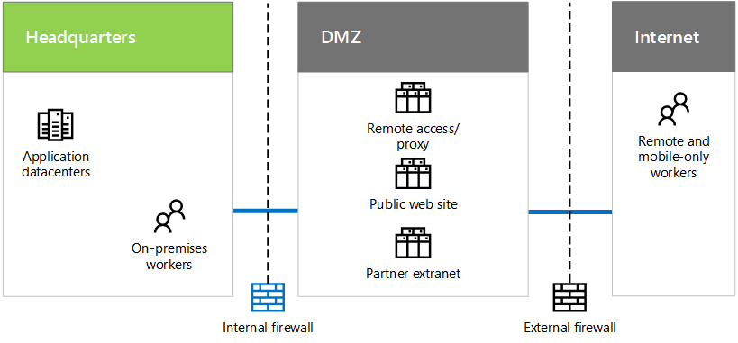

# Contoso's IT infrastructure and needs

 **Summary:** Understand the basic structure of Contoso's on-premises IT infrastructure and how its business needs can be met by Microsoft's cloud offerings.
  
Contoso is in the process of transitioning from an on-premises, centralized IT infrastructure to a cloud-inclusive one that incorporates cloud-based personal productivity workloads, applications, and hybrid scenarios.
  
## Contoso's existing IT infrastructure

Contoso uses a mostly centralized on-premises IT infrastructure, with application datacenters in the Paris headquarters.
  
**Figure 1: Contoso's existing IT infrastructure**

  
Figure 1 shows a headquarters office with application datacenters, a DMZ, and the Internet.
  
In Contoso's DMZ, different sets of servers provide:
  
- Remote access to the Contoso intranet and web proxying for workers in the Paris headquarters.
    
- Hosting for the Contoso public web site, from which customers can order products, parts, or supplies.
    
- Hosting for the Contoso partner extranet for partner communication and collaboration.
    
## Contoso's business needs

Here are Contoso's business needs in priority order:
  
1. Adhere to regional regulatory requirements
    
    To prevent fines and maintain good relations with local governments, Contoso must ensure compliance with data storage and encryption regulations.
    
2. Improve vendor and partner management
    
    The partner extranet is aging and expensive to maintain. Contoso wants to replace it with a cloud-based solution that uses federated authentication.
    
3. Improve mobile workforce productivity, device management, and access
    
    Contoso's mobile-only workforce is expanding and needs device management to ensure intellectual property protection and more efficient access to resources.
    
4. Reduce remote access infrastructure
    
    By moving resources commonly accessed by remote workers to the cloud, Contoso will save money by reducing maintenance and support costs for their remote access solution.
    
5. Scale down on-premises datacenters
    
    The Contoso datacenters contain hundreds of servers, some of which are running legacy or archival functions that distract IT staff from maintaining high business value workloads.
    
6. Scale-up computing and storage resources for end-of-quarter processing
    
    End-of-quarter financial accounting and projection processing along with inventory management requires short-term increases in servers and storage.
    
## Mapping Contoso's business needs to Microsoft's cloud offerings

Based on an analysis of Microsoft's cloud offerings, Contoso's IT department determined the following mapping:
  
|**Software as a Service (SaaS)**|**Platform as a Service (Azure PaaS )**|**Infrastructure as a Service (Azure IaaS )**|
|:-----|:-----|:-----|
|**Office 365:** Primary personal and group productivity applications in the cloud.   Business needs: 1 3 5    |Host sales and support documents and information systems using cloud-based apps.    Business need: 3    |Move archival and legacy systems to cloud-based servers.    Business need: 5    |
|**Dynamics 365:** Use cloud-based customer and vendor management. Remove partner extranet in the DMZ.   Business need: 2    |Mobile applications are cloud-based, rather than Paris datacenter-based.    Business needs: 3 4    |Migrate low-use apps and data out of on-premises datacenters.    Business need: 5    |
|**Intune/EMS:** Manage iOS and Android devices.   Business need: 3    ||Add temporary servers and storage for end-of-quarter processing needs.    Business need: 6    |
   
## See Also

[Contoso in the Microsoft Cloud](contoso-in-the-microsoft-cloud.md)
  
[Microsoft Cloud IT architecture resources](microsoft-cloud-it-architecture-resources.md)

[Microsoft's Enterprise Cloud Roadmap: Resources for IT Decision Makers](https://sway.com/FJ2xsyWtkJc2taRD)

