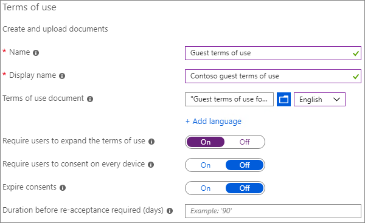
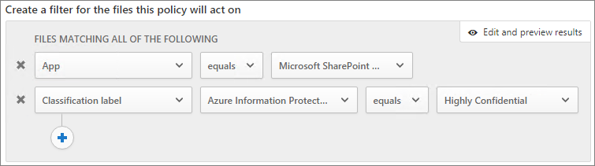

---
title: "Create a secure guest sharing environment"
ms.author: mikeplum
author: MikePlumleyMSFT
manager: pamgreen
audience: ITPro
ms.topic: article
ms.service: sharepoint-online
localization_priority: Priority
description: "Learn how to create a secure guest sharing environment in Microsoft 365."
---

# Create a secure guest sharing environment

- Set up multi-factor authentication for guests.
- Set up a terms of use for guests.
- Set up quarterly guest access reviews to periodically validate whether guests continue to need permissions to teams and sites.
- Restrict guests to web-only access for unmanaged devices.
- Configure a session timeout policy to ensure guests authenticate daily.
- Create and publish sensitivity labels to classify content.
- Create a sensitive information type for a highly confidential project.
- Use Cloud App Security to assign a *highly confidential* label to documents that contain the sensitive information type.
- Use Cloud App Security to remove guest access from files labeled as *highly confidential*.

## Set up multi-factor authentication for guests

Multi-factor authentication greatly reduces the chances of an account being compromised. Since guest users may be using personal email accounts that don't adhere to any governance policies or best practices, it is especially important to require multi-factor authentication for guests. If a guest user's username and password is stolen, requiring a second factor of authentication greatly reduces the chances of unknown parties gaining access to your sites and files.

In this example, we'll set up multi-factor authentication for guests by using a conditional access policy in Azure AD.

To set up multi-factor authentication for guests
1. In Microsoft Azure, search for *Conditional access*.
2. On the **Conditional Access - Policies** blade, click **New policy**.
3. In the **Name** field, type *Guest MFA*.
4. Under **Assignments**, click **Users and groups**.
5. On the **Users and groups** blade, select **Select users and groups**, select the **All guests and external users** check box, and then click **Done**.
4. Under **Access controls**, click **Grant**.
5. On the **Grant** blade, select the **Require multi-factor authentication** check box, and then click **Select**.
6. On the **New** blade, under **Enable policy**, click **On**, and then click **Create**.

### More information

[Planning a cloud-based Azure Multi-Factor Authentication deployment](https://docs.microsoft.com/azure/active-directory/authentication/howto-mfa-getstarted)

## Set up a terms of use for guests

Often times guest users may not have signed non-disclosure agreements or other legal agreements with your organization. You can require guests to agree to a terms of use before accessing files that are shared with them. The terms of use can be displayed the first time the attempt to access a shared file or site.

To create a terms of use, you first need to create the document in Word or another authoring program, and then save it as a .pdf file. This file can then be uploaded to Azure AD.

To create an Azure AD terms of use
1. Sign in to Azure as a Global Administrator, Security Administrator, or Conditional Access Administrator.
2. Navigate to [Terms of use](https://aka.ms/catou).
3. Click **New terms**. 
   
4. In the Name box, type *Guest terms of use*.
5. In the Display name box, type *Contoso guest terms of use*.
6. For **Terms of use document**, browse to the pdf file that you created and select it.
7. Select the language for your terms of use document.
8. Set **Require users to expand the terms of use** to **On**.
9. Under **Conditional Access**, in the **Enforce with Conditional Access policy template** list choose **Create conditional access policy later**.
10. Click **Create**.

Once you've created the terms of use, the next step is to create a conditional access policy that displays the terms of use to guest users.

To create a conditional access policy
1. In Microsoft Azure, search for *Conditional access*.
2. On the **Conditional Access - Policies** blade, click **New policy**.
3. In the **Name** box, type *Guest user terms of use policy*.
4. Under **Assignments**, click **Users and groups**.
5. On the **Users and groups** blade, select **Select users and groups**, select the **All guests and external users** check box, and then click **Done**.
6. Under **Assignments**, click **Cloud apps or actions**.
7. On the **Include** tab, select **Select apps**, and then click **Select**.
8. On the **Select** blade, select **Microsoft Teams**, **Office 365 SharePoint Online**, and **Outlook Groups**, and then click **Select**.
9. On the **Cloud apps or actions** blade, click **Done**.
10. Under **Access controls**, click **Grant**.
11. On the **Grant** blade, select **Guest terms of use**, and then click **Select**.
12. On the **New** blade, under **Enable policy**, click **On**, and then click **Create**.

### More information
[Azure Active Directory terms of use](https://docs.microsoft.com/azure/active-directory/conditional-access/terms-of-use)

## Set up guest access reviews

With access reviews in Azure AD, you can automate a periodic review of user access to various teams and groups. By requiring an access review for guests specifically, you can help ensure that guest users do not retain access to your organization's sensitive information for longer than is necessary.

Access reviews can be organized into programs. A program is a grouping of similar access reviews that can be used to organize reviews for reporting and auditing purposes.

In this example, we'll create a program for guest access reviews.

To create a program
1. Sign in to the Azure portal and open the [Identity Governance page](https://portal.azure.com/#blade/Microsoft_AAD_ERM/DashboardBlade).
2. In the left menu, click **Programs**
3. Click **New program**.
4. In the **Name** box, type *Guest access review program*.
5. In the **Description** box, type *Program for guest access reviews*.
6. Click **Create**.

Once the program has been created, we can create a guest access review and associate it with the program.

To set up a guest user access review
1. On the [Identity Governance page](https://portal.azure.com/#blade/Microsoft_AAD_ERM/DashboardBlade), in the left menu, click **Access reviews**.
2. Click **New access review**. 
   
3. In the **Name** box, type *Quarterly guest access review*.
4. For **Frequency**, choose **Quarterly**.
5. For **End**, choose **Never**.
6. For **Scope**, choose **Guest users only**.
7. Click **Group**, select the groups that you want to include in the access review, and then click **Select**.
8. Under **Programs**, click **Link to program**.
9. On the **Select a program** blade, choose **Guest access review program**
10. Click **Start**.

A separate access review is created for each group that you specify. Group owners of each groups will be emailed quarterly to approve or deny guest access to their groups.

It's important to note that guests can be given access to teams or groups, or to individual files and folders. When given access to files and folders, guests may not be added to any particular group. If you want to perform access reviews on guest users who don't belong to a team or group, you can create a dynamic group in Azure AD to contain all guests and then create an access review for that group.

### More information
[Manage guest access with Azure AD access reviews](https://docs.microsoft.com/azure/active-directory/governance/manage-guest-access-with-access-reviews)

[Create an access review of groups or applications in Azure AD access reviews](https://docs.microsoft.com/azure/active-directory/governance/create-access-review)

## Set up web-only access for guest users

You can reduce your management surface area by requiring guest users to access your teams, sites, and files by using a web browser. This is done with an Azure AD conditional access policy.

To restrict guests to web-ony access
1. In Microsoft Azure, search for *Conditional access*.
2. On the **Conditional Access - Policies** blade, click **New policy**.
3. In the **Name** box, type *Guest user browser access*.
4. Under **Assignments**, click **Users and groups**.
5. On the **Users and groups** blade, select **Select users and groups**, select the **All guests and external users** check box, and then click **Done**.
6. Under **Assignments**, click **Cloud apps or actions**.
7. On the **Include** tab, select **Select apps**, and then click **Select**.
8. On the **Select** blade, select **Microsoft Teams**, **Office 365 SharePoint Online**, and **Outlook Groups**, and then click **Select**.
9. On the **Cloud apps or actions** blade, click **Done**.
10. Under **Assignments**, click **Conditions**.
11. On the **Conditions** blade, click **Client apps**.
12. On the **Client apps** blade, click **Yes** for **Configure**, and then select the **Mobile apps and desktop clients** and **Modern authentication clients** settings. 
    
13. Click **Done**, and then on the **Conditions** blade, click **Done** again.
14. Under **Access controls**, click **Grant**.
15. On the **Grant** blade, select **Require device to be marked as compliant** and **Require Hybrid Azure AD joined device**.
16. Under **For multiple controls**, select **Require one of the selected controls**, and then click **Select**.
17. On the **New** blade, under **Enable policy**, click **On**, and then click **Create**.

## Configure a session timeout for guest users

Requiring guests to authenticate on a regular basis can reduce the possibility of unknown users accessing your organization's content if a guest's device is not kept secure. You can configure a session timeout conditional access policy for guest users in Azure AD.

To configure guest session timeout
1. In Microsoft Azure, search for *Conditional access*.
2. On the **Conditional Access - Policies** blade, click **New policy**.
3. In the **Name** box, type *Guest session timeout*.
4. Under **Assignments**, click **Users and groups**.
5. On the **Users and groups** blade, select **Select users and groups**, select the **All guests and external users** check box, and then click **Done**.
6. Under **Assignments**, click **Cloud apps or actions**.
7. On the **Include** tab, select **Select apps**, and then click **Select**.
8. On the **Select** blade, select **Microsoft Teams**, **Office 365 SharePoint Online**, and **Outlook Groups**, and then click **Select**.
9. On the **Cloud apps or actions** blade, click **Done**.
10. Under **Access controls**, click **Session**.
11. On the **Session** blade, select **Sign-in frequency**.
12. Select **1** and **Days** for the time period, and then click **Select**.
13. On the **New** blade, under **Enable policy**, click **On**, and then click **Create**.

## Create sensitivity labels

Sensitivity labels can be used in a variety of ways to classify and protect your organization's information. In this example, we'll look at how labels can be used to help you manage guest access to shared files and folders.

First, we'll create three sensitivity labels in the Security and Compliance Center:

- General
- Confidential
- Highly Confidential

Use the following procedure to create the **General** and **Confidential** labels.

To create a classification label (General and Confidential)
1. In the [Microsoft 365 Compliance Center](https://compliance.microsoft.com), in the left navigation, expand **Classification**, and then click **Sensitivity labels**.
2. Click **Create a label**.
3. In **Label name**, type *General* or *Confidential*.
4. In **Tooltip**, type *General information that can be shared with employees, guests, and partners* or *Confidential information. Share only with employees and authorized guests*, and then click **Next**.
5. Leave encryption **Off** and click **Next**.
6. Leave content marking **Off** and click **Next**.
7. Leave endpoint data loss prevention **Off** and click **Next**.
8. Leave auto labeling **Off** and click **Next**.
9. Click **Create**.

With the *Highly Confidential* label, we'll add some additional controls.

To create a classification label (Highly confidential)
1. Click **Create a label**.
2. In **Label name**, type *Highly confidential*.
3. In **Tooltip**, type *Highly confidential information. Do not share with guests*, and then click **Next**.
4. Leave encryption **Off** and click **Next**.
5. Turn content marking **On**, select the **Add a header** check box, and then click **Customize text**.
6. Type *Highly confidential* for the header text and click **Save**.
7. On the **Content marking** page, turn content marking **On**.
8. Select the **Add a watermark** check box, and then click **Customize text**.
9. For **Watermark text**, type *Highly Confidential*.
10. Type *24* for **Font size**, and then click **Save**.
11. On the **Content marking** page, click **Next**.
12. Leave endpoint data loss prevention **Off** and click **Next**.
13. Leave auto labeling **Off** and click **Next**.
14. Click **Create**.

To publish labels
1. On the **Sensitivity labels** page, click **Publish labels**.
2. Click **Choose labels to publish**.
3. Click **Add**, select the labels that you created, and then click **Add**.
4. Click **Done**.
5. Click **Next**.
6. Leave the users and groups set to **All** and click **Next**.
7. Click **Next**.
8. On the **Policy settings** page, type *Document sensitivity* for the name, and then click **Next**.
9. Click **Publish**.

## Create a sensitive information type for a highly confidential project

To create a sensitive information type
1. In the [Microsoft 365 Compliance Center](https://compliance.microsoft.com), in the left navigation, expand **Classification**, and then click **Sensitive info types**.
2. Click **Create**.
3. For **Name** and **Description**, type **Project Saturn**, and then click **Next**.
4. Click **Add an element**.
5. On the **Detect content containing** list, select **Keywords**, and then enter *Project Saturn* in the keyword box.
6. Click **Next**, and then click **Finish**.
7. If asked if you would like to test the sensitive information type, click **No**.

## Create a policy to assign a label based on a sensitive information type

Time delay as custom label replicated to MCAS

To create a sensitive information type-based file policy
1. Open [Microsoft Cloud App Security](https://portal.cloudappsecurity.com).
2. In the left navigation, expand **Control**, and then click **Policies**.
3. Click **Create policy**, and then choose **File policy**.
4. For **Policy name**, type *Project Saturn labeling*.
5. Under **Create a filter for the files this policy will act on**, click X twice to delete the default 6ilters.
7. In the **Select a filter** list, choose **App**, and then select **Microsoft SharePoint Online** from the **Select apps...** list.
8. Under **Inspection method**, choose **Data classification service**.
9. On the **Choose inspection type** list, choose **Sensitive information type**.
10. Search for and select the *Project Saturn* sensitivity label, and then click **Done**. 
   
11. Under **Governance**, expand **Microsoft SharePoint Online**.
12. Select the **Apply classification label** check box and select the **Highly Confidential** label.
13. Click **Create**.

## Create a policy to remove guest access to highly confidential files

To create a label-based file policy
1. Open [Microsoft Cloud App Security](https://portal.cloudappsecurity.com).
2. In the left navigation, expand **Control**, and then click **Policies**.
3. Click **Create policy**, and then choose **File policy**.
4. For **Policy name**, type *Project Saturn - remove guest access*.
5. Under **Create a filter for the files this policy will act on**, click X twice to delete the default filters.
6. In the **Select a filter** list, choose **App**, and then select **Microsoft SharePoint Online** from the **Select apps...** list.
7. Click **Add a filter**.
8. In the **Select a filter** list, choose **Classification label**, and then select **Azure Information Protection** from the **Select filter...** list.
9. In the **Select classification label** list, select **Highly Confidential**. 
   
10. Under **Governance**, expand **Microsoft SharePoint Online**.
11. Select the **Send policy-match digest to file owner** and **Remove external users** check boxes.
12. For the custom notification message, type *This file is highly confidential. Company policy prohibits sharing it with guests*.
13. Click **Create**.

## Test the solution

## See Also

SharingSecurity