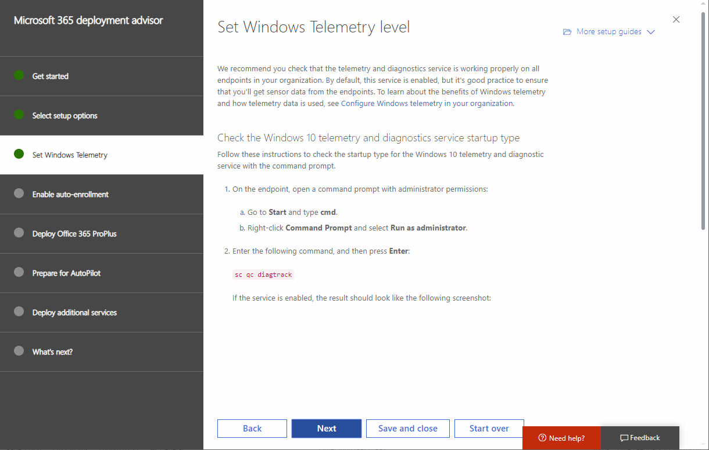
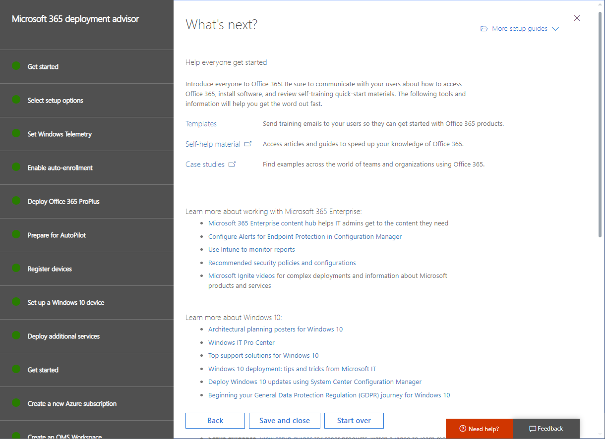

# Deployment advisors for Office 365 or Microsoft 365 services

The deployment advisors for Office 365 or Microsoft 365 provide self-guided support for setting up Office 365 for your organization. To access them:

1. Sign in as a tenant administrator in the [Microsoft 365 admin center](https://admin.microsoft.com).
2. Select one of the deployment advisors or guides listed below.

If you don't sign in as a tenant admin, you will eventually see a message that you need to have tenant administrator permissions.

Each advisor is a wizard that guides you through your choices for the features and options you want to deploy. In some cases, you can use the wizard to activate a setting. Here is an example.

FIGURE1

The advisor steps you through decisions for customization to your needs. Along the way, you'll get instructions, scripts, and other resources to make the configuration changes.

At the end, you'll get links to videos and reference articles. Here is an example.

FIGURE2

You can use these advisors anytime to learn more about Office 365 features and options. This includes during planning or after you've already set up the services.
  
## Microsoft 365: Windows 10 with Office 365

Microsoft 365 is a complete, intelligent solution that includes Office 365, Windows 10, and Enterprise Mobility + Security (EMS). Microsoft 365 empowers everyone to be creative and work together, securely. 

Use this advisor to set up Windows 10 devices or upgrade users' computers to Windows 10, with optional deployment of Office apps, Windows Analytics, and Windows Defender Advanced Threat Protection (Microsoft 365 Enterprise E5 plan only).

|||
|:-------|:-----|
| **Action:** | Run the [Microsoft 365 deployment advisor](https://aka.ms/microsoft365setupguide) |
|||

## Prepare your Office 365 environment 

You'll need to tell us your deployment goals to make sure you add domains, create users, and assign licenses in the proper order. 

Watch the [Prepare your environment](https://go.microsoft.com/fwlink/?linkid=2043822) video for an overview.

|||
|:-------|:-----|
| **Action:** | Run the [Prepare your environment guide](https://go.microsoft.com/fwlink/?linkid=2005213) |
|||

+++++++++++++++++++++++++++++++++++++++++++++++++++++++++++++++

OLD SECTION

The deployment advisors for Office 365 provide self-guided support for setting up Office 365 for your organization. To access them for your Office 365 or Microsoft 365 subscription:

1. Sign in as a tenant administrator in the [Microsoft 365 admin center](https://admin.microsoft.com).
2. Select one of the deployment advisors or guides listed in this article.

>[!Note]
>If you do not sign in as a tenant admin, you will eventually see a message that you need to have tenant administrator permissions.
>

Within each advisor, select the features and options you want to deploy. Here is an example.

The advisor builds a step-by-step setup plan that's customized to your needs. Along the way, you'll get a full set of instructions, scripts, and other resources to make the configuration changes.

At the end, you'll get links to videos and reference articles. Here is an example.

Some advisors have automation that will change some of your settings, while in other areas of the advisor you change your settings and data, using the advisor to guide you. 

You can use these advisors anytime to learn more about Office 365 features and options. This includes during planning or after you've already set up the services.
  
## Microsoft 365: Windows 10 with Office 365

Microsoft 365 is a complete, intelligent solution that includes Office 365, Windows 10, and Enterprise Mobility + Security (EMS). Microsoft 365 empowers everyone to be creative and work together, securely. 

Use this advisor to set up Windows 10 devices or upgrade users' computers to Windows 10, with optional deployment of Office apps, Windows Analytics, and Windows Defender Advanced Threat Protection (Microsoft 365 Enterprise E5 plan only).

|||
|:-------|:-----|
| **Action:** | Run the [Microsoft 365 deployment advisor](https://aka.ms/microsoft365setupguide) |
|||

<!--
Run the [Microsoft 365 deployment advisor](https://aka.ms/microsoft365setupguide).
-->

## Prepare your Office 365 environment 

You'll need to tell us your deployment goals to make sure you add domains, create users, and assign licenses in the proper order. 

Watch the [Prepare your environment](https://go.microsoft.com/fwlink/?linkid=2043822) video for an overview.

|||
|:-------|:-----|
| **Action:** | Run the [Prepare your environment guide](https://go.microsoft.com/fwlink/?linkid=2005213) |
|||

+++++++++++++++++++++++++++++++++++++++++++++++++++++++++++++++

## Email migration and protection

### Exchange migration advisor

The [Office 365 mail migration advisor](https://aka.ms/office365setup) will help you move mailboxes from your current mail system to Exchange Online in Office 365 with automated tools and step-by-step guidance. We'll recommend the best migration path for your organization based on your current mail system, the number of mailboxes you want to migrate, and how you plan to manage users and user access.
  
The [Gmail contacts and calendar assistant](https://aka.ms/gmailcontactscalendar) gives step-by-step instructions for migrating your Gmail contacts and Google Calendar items to Office 365. When you migrate a user's Gmail mailbox to Office 365, email messages are migrated, but contacts and calendar items are not. This guide provides the steps for importing Gmail contacts and Google Calendar items to Office 365.
  
### Exchange Online Protection
Microsoft [Exchange Online Protection (EOP)](https://aka.ms/EOPguidance) is a cloud-based email filtering service that helps protect your organization against spam and malware and includes features to safeguard your organization from messaging policy violations.
  

## File creation, storage, and sharing

### Office 365 ProPlus
The [Office ProPlus quick start guide](https://aka.ms/OPPquickstartguide) walks you through the steps for installing Office on either a PC or a Mac for your company and it includes tips for getting everyone started with Office.

The [Office ProPlus  deployment advisor ](https://aka.ms/o365proplusdeploy) helps you get your users up and running on the latest versions of Office. This advisor walks you through the steps for helping users install Office directly from the Office 365 portal online or for deploying Office to your users from an on-premises location. Included are instructions for using System Center Configuration Manager, a Group Policy startup script, an operating system disk image, or Remote Desktop Services (RDS) shared activation.

### OneDrive for Business
Use the [OneDrive for Business quick start guide](https://aka.ms/ODfBquickstartguide) to get started quickly with OneDrive for Business for file storage, sharing, and syncing.
  
### SharePoint Online
  
The [SharePoint Online quick start](https://aka.ms/SPOquickstartguide) shows you how to set up SharePoint in the cloud for document storage and content management. This basic setup is all you need if you don't have a large amount of data to migrate or an on-premises SharePoint Server that you want to continue running in a hybrid setup.
  
The [SharePoint Online deployment advisor](https://aka.ms/spoguidance) helps you choose the deployment option that works best for your organization and gives the steps for configuring SharePoint Online features to meet your business needs. Choose from cloud deployment, hybrid deployment, or on-premises-to-cloud migration. Then follow the steps for configuring SharePoint Online features, like file storage and sharing, external file sharing, site collections, global settings, and user profiles, and your Office 365 team site.
  
## Security and Identity

### Azure Active Directory Connect (Azure AD Connect) advisor
The [Azure AD Connect advisor](https://aka.ms/aadconnectpwsync) is a step-by-step guide that shows you how to add user account information to Office 365 without manually creating each user. It also shows you how to configure password hash synchronization or pass-through authentication, so users can sign into their email and your domain using the same password. If you choose to set up federated sign-in with AD FS, this guide also gives you steps for deploying AD FS on a new server or in an existing Windows Server 2012 R2 farm. Azure AD Connect replaces older versions of identity integration tools, such as DirSync and Azure AD Sync, and is primarily used for adding users and other data to Azure Active Directory for Office 365.
  
### Azure
The [Azure AD Basic setup guide](https://aka.ms/azureadbasic) helps you set up features, like group-based access management, self-service password reset for cloud applications, and Azure Active Directory Application Proxy for publishing on-premises web applications.
  
The [Azure AD Premium setup guide](https://aka.ms/aadpguidance) helps you enable the many features of Azure Active Directory Premium (Azure AD Premium), which provides identity management capabilities like multi-factor authentication, single sign-on (SSO), device registration, self-service password and group management, and security monitoring.
  
### Verify your domain
The [Verify your domain in Office 365](https://aka.ms/verifyyourdomaino365) advisor helps you customize Office 365 by adding your own domain name (also known as your website name).
  
## Communication and online conferencing

### Office 365 Groups
[Office 365 Groups setup guide](https://aka.ms/groupsguide)

Office 365 Groups are a shared workspace for email, conversations, files, and events where group members can collectively get stuff done. Groups in Office 365 lets you choose a set of people that you wish to collaborate with and easily set up a collection of resources for those people to share. You don't have to worry about manually assigning permissions to all those resources, because adding members to the group automatically gives them the permissions they need to the tools your group provides.
  
### Microsoft Teams

[Teams deployment advisor](https://aka.ms/teamsguidance)
  
Microsoft Teams is the chat-based collaboration service in Office 365 that provides team workspaces for chats, calls, meetings, and private messages. The deployment advisor for Teams helps you set up and configure the optimal Teams experience with Exchange Online, SharePoint Online, OneDrive for Business, and Office 365 Groups. It includes information about configuring tenant settings, Teams and Channels for your projects, Calls and Meetings, Messaging, Tabs for quick access to apps, informational Bots, and Connectors to third-party services.
  
### Skype for Business

[Skype for Business quick start guide](https://aka.ms/SfBquickstartguide)
  
Get going fast with Skype for Business for instant messaging (IM), presence, online meetings, and screen sharing. If you don't need advanced features, this basic setup is all you need.
  
[Skype for Business deployment advisor](https://aka.ms/skypeguidance)
  
The Skype for Business deployment advisor helps you get up and running with Skype for Business Online. This advisor shows you how to set up Skype for Business features, like instant messaging (IM), online meetings, video conferencing, public switched telephone network (PSTN) conferencing, cloud private brand exchange (PBX), and Skype Meeting Broadcast. Steps are included for setting up a hybrid environment, where you connect Skype for Business Online to your on-premises Skype for Business deployment.
  
### Yammer

[Intro to Yammer: your corporate social network](https://aka.ms/yamquickstartguide)
  
This quick start guide shows you how to successfully roll out Yammer in your organization. If you don't have existing Yammer networks to consolidate or migrate, this basic setup is all you need.
  
[Yammer Enterprise setup guide](https://aka.ms/yammerdeploy)
  
The Yammer Enterprise deployment advisor helps you get your organization up and running with Yammer Enterprise. It includes guidance on connecting existing Yammer networks you might have to Office 365 or setting up a new Yammer domain. If you have multiple Yammer networks, it also describes how to consolidate Yammer networks into a single Yammer Enterprise network.
  
## Business apps

[Microsoft StaffHub setup guide](https://aka.ms/staffhubguide)
  
Microsoft StaffHub is a cloud-based platform that works across all your devices. It enables firstline workers (employees with roles that don't require a computer) and their managers to manage shift schedules, communicate with their teams, and share content.
  
## Videos for IT pros

### Admin center
[Admin center orientation](https://www.microsoft.com/en-us/videoplayer/embed/RWfMut)

[Create users in the Admin center](https://aka.ms/ac-createusers)

[DNS records and the Admin center](https://aka.ms/ac-dnsrecords)

[Verify your domain in the Admin center](https://aka.ms/ac-verifydns)

### Device security

[Intune](https://go.microsoft.com/fwlink/?linkid=2054124)

### Mail migration and protection

[Prepare your environment](https://go.microsoft.com/fwlink/?linkid=2043822)

### Office 365 ProPlus

[Office experience as a subscription service](https://aka.ms/qo45jf)
  
[Overview of Office 365 ProPlus](https://aka.ms/r359zr)
  

### OneDrive for Business

[OneDrive for Business Integrated Advantage](https://aka.ms/f66hqa)

[Welcome to OneDrive: Coming from another cloud storage provider](https://videoplayercdn.osi.office.net/embed/6b11f30b-725a-4145-8b72-45a41793a432)

### Outlook

[Outlook for iOS introduction and setup](https://aka.ms/mpuwwm)

[Outlook for Android introduction and setup](https://aka.ms/qrbfm3)

[Outlook for Windows Phone introduction and setup](https://aka.ms/kkw96x)

### SharePoint

[SharePoint: Overview](https://go.microsoft.com/fwlink/?linkid=2005315)

[SharePoint: Hybrid](https://go.microsoft.com/fwlink/?linkid=2005219)

[SharePoint: Troubleshooting](https://go.microsoft.com/fwlink/?linkid=2005220)

  
### Skype for Business

[Skype for Business Enablement quick start](https://aka.ms/cjfutd)

[Getting started with Skype](https://aka.ms/ofg77x)

### Teams

[Getting started with Teams](https://youtu.be/ENEQzM2u_vA)

    
## Walkthroughs for users

[Office mobile apps](https://aka.ms/officemobileappsetup)

[Productivity Library](https://aka.ms/productivitylibraryguidance)
