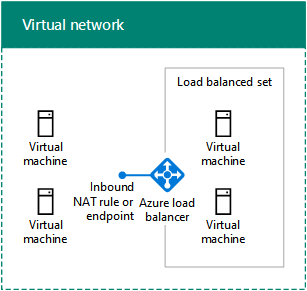
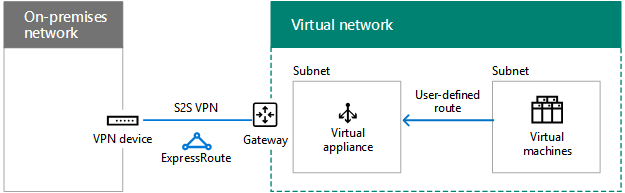
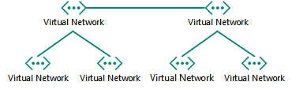
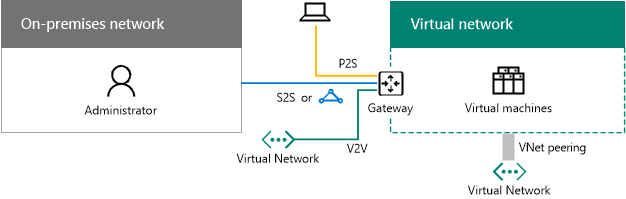
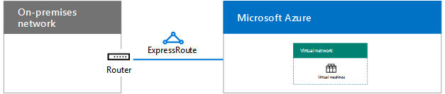

# Designing networking for Microsoft Azure IaaS

 **Summary:** Understand how to design optimized networking for workloads in Microsoft Azure IaaS.
  
Optimizing networking for IT workloads hosted in Azure IaaS requires an understanding of Azure virtual networks (VNets), address spaces, routing, DNS, and load balancing.
  
## Planning steps for any VNet

Follow these steps for any type of VNet.
  
### Step 1: Prepare your intranet for Microsoft cloud services.

Go through the **Steps to prepare your network for Microsoft cloud services** section in [Common elements of Microsoft cloud connectivity](common-elements-of-microsoft-cloud-connectivity.md).
  
### Step 2: Optimize your Internet bandwidth.

Optimize your Internet bandwidth using steps 2 - 4 of the **Steps to prepare your network for Microsoft SaaS services** section in [Designing networking for Microsoft SaaS](designing-networking-for-microsoft-saas.md).
  
### Step 3: Determine the type of VNet (cloud-only or cross-premises).

A cloud-only VNet has no connection to an on-premises network. Here is an example.
  
**Figure 1: A cloud-only VNet**

  
Figure 1 shows a set of virtual machines in a cloud-only VNet.
  
A cross-premises VNet has a site-to-site (S2S) VPN or ExpressRoute connection to an on-premises network through an Azure gateway. Here is an example.
  
**Figure 2: A cross-premises VNet**

  
Figure 2 shows a set of virtual machines in a cross-premises VNet, which is connected to an on-premises network.
  
See the additional [Planning steps for a cross-premises VNet](designing-networking-for-microsoft-azure-iaas.md#cross_prem) section in this article.
  
### Step 4: Determine the address space of the VNet.

Table 1 shows the address spaces for the different types of VNets.
  
|**Type of VNet**|**Virtual network address space**|
|:-----|:-----|
|Cloud-only    |Arbitrary private address space    |
|Interconnected cloud-only    |Arbitrary private, but not overlapping with other connected VNets    |
|Cross-premises    |Private, but not overlapping with on-premises    |
|Interconnected cross-premises    |Private, but not overlapping with on-premises and other connected VNets    |
   
 **Table 1: Types of VNets and their corresponding address space**
  
Virtual machines are assigned an address configuration from the address space of the subnet by DHCP:
  
- Address/subnet mask
    
- Default gateway
    
- DNS server IP addresses
    
You can also reserve a static IP address.
  
Virtual machines can also be assigned a public IP address, either individually or from the containing cloud service (for classic deployment machines only).
  
### Step 5: Determine the subnets within the VNet and the address spaces assigned to each.

There are two types of subnets in a VNet, a gateway subnet and a virtual machine-hosting subnet.
  
**Figure 3: The two types of subnets in Azure**

  
Figure 3 shows a VNet containing a gateway subnet that has an Azure gateway and a set of virtual machine-hosting subnets containing virtual machines.
  
The Azure gateway subnet is needed by Azure to host the two virtual machines of your Azure gateway. Specify an address space with at least a 29-bit prefix length (example: 192.168.15.248/29). A 28-bit or smaller prefix length is recommended, especially if you are planning to use ExpressRoute.
  
A best practice for determining the address space of the Azure gateway subnet is:
  
1. Decide on the size of the gateway subnet.
    
2. In the variable bits in the address space of the VNet, set the bits used for the gateway subnet to 0 and set the remaining bits to 1.
    
3. Convert to decimal and express as an address space with the prefix length set to the size of the gateway subnet.
    
With this method, the address space for the gateway subnet is always at the farthest end of the VNet address space.
  
Here is an example of defining the address prefix for the gateway subnet: The address space of the VNet is 10.119.0.0/16. The organization will initially use a site-to-site VPN connection, but will eventually get ExpressRoute. Table 2 shows the steps and results of determining the gateway subnet address prefix in network prefix notation (also known as CIDR).

Here are the steps and example of determining the gateway subnet address prefix:

1. Decide on the size of the gateway subnet. For our example, we chose /28.
2. Set the bits in the variable portion of the VNet address space (b) to 0 for the gateway subnet bits (G), otherwise 1 (V). For our example, we are using the 10.119.0.0/16 address space for the VNet.
 
 10.119. bbbbbbbb . bbbbbbbb
 10.119. VVVVVVVV . VVVVGGGG
 10.119. 11111111 . 11110000
  
3. Convert the result from step 2 to decimal and express as an address space. For our example, 10.119. 11111111 . 11110000 is 10.119.255.240, and with the prefix length from step 1, (28 in our example), the resulting gateway subnet address prefix is 10.119.255.240/28.
  
See [Address space calculator for Azure gateway subnets](https://gallery.technet.microsoft.com/scriptcenter/Address-prefix-calculator-a94b6eed) for more information.
  
Virtual machine-hosting subnets are where you place Azure virtual machines, which you can do according to typical on-premises guidelines, such as a common role or tier of an application or for subnet isolation.
  
Azure uses the first 3 addresses on each subnet. Therefore, the number of possible addresses on an Azure subnet is 2n - 5, where n is the number of host bits. Table 3 shows the range of virtual machines required, the number of hosts bits needed, and the corresponding subnet size.
  
|**Virtual machines required**|**Host bits**|**Subnet size**|
|:-----|:-----|:-----|
|1-3    |3    |/29    |
|4-11    |4    |/28    |
|12-27    |5    |/27    |
|28-59    |6    |/26    |
|60-123    |7    |/25    |
   
 **Table 3: Virtual machine requirements and their subnet sizes**
  
For more information about the maximum amount of virtual machines on a subnet or VNet, see [Networking Limits](https://docs.microsoft.com/azure/azure-subscription-service-limits#networking-limits).
  
For more information, see [Plan and design Azure Virtual Networks](https://azure.microsoft.com/documentation/articles/virtual-network-vnet-plan-design-arm/).
  
### Step 6: Determine the DNS server configuration and the addresses of the DNS servers to assign to VMs in the VNet.

Azure assigns virtual machines the addresses of DNS servers by DHCP. DNS servers can be:
  
- Supplied by Azure: Provides local name registration and local and Internet name resolution
    
- Provided by you: Provides local or intranet name registration and either intranet or Internet name resolution
    
Table 4 shows the different configurations of DNS servers for each type of VNet.
    
|**Type of VNet**|**DNS server**|
|:-----|:-----|
|Cloud-only    |Azure-supplied for local and Internet name resolution    Azure virtual machine for local and Internet name resolution (DNS forwarding)    |
|Cross-premises    |On-premises for local and intranet name resolution    Azure virtual machine for local and intranet name resolution (DNS replication and forwarding)    |
   
 **Table 4: DNS server options for the two different types of VNets**
  
For more information, see [Name Resolution for VMs and Role Instances](https://docs.microsoft.com/azure/virtual-network/virtual-networks-name-resolution-for-vms-and-role-instances).
  
### Step 7: Determine the load balancing configuration (Internet-facing or internal).

In some cases, you want to distribute incoming traffic to a set of servers that have the same role. Azure IaaS has a built-in facility to do this for Internet-facing and internal traffic loads.
  
Azure Internet-facing load balancing randomly distributes unsolicited incoming traffic from the Internet to the members of a load-balanced set.
  
**Figure 4: An external load balancer in Azure**

  
Figure 4 shows an external load balancer in Azure that distributes incoming traffic on an inbound NAT rule or endpoint to a set of virtual machines in a load-balanced set.
  
Azure internal load balancing randomly distributes unsolicited incoming traffic from other Azure VMs or from intranet computers to the members of a load-balanced set. 
  
**Figure 5: An internal load balancer in Azure**

  
Figure 5 shows an internal load balancer in Azure that distributes incoming traffic on an inbound NAT rule or endpoint to a set of virtual machines in a load-balanced set.
  
For more information, see [Azure Load Balancer](https://docs.microsoft.com/azure/load-balancer/load-balancer-overview).
  
### Step 8: Determine the use of virtual appliances and user-defined routes.

If you need to forward traffic to virtual appliances in your VNet, you may need to add one or more user-defined routes to a subnet.
  
**Figure 6: Virtual appliances and user-defined routes in Azure**

  
Figure 6 shows a cross-premises VNet and a user-defined route assigned to a virtual machine-hosting subnet that points to a virtual appliance.
  
For more information, see [User Defined Routes and IP Forwarding](https://docs.microsoft.com/azure/virtual-network/virtual-networks-udr-overview).
  
### Step 9: Determine how computers from the Internet will connect to virtual machines.

There are multiple ways to provide Internet access to the virtual machines on a VNet, which includes access from your organization network through your proxy server or other edge device.
  
Table 5 lists the methods for filtering or inspecting unsolicited incoming traffic.
  
|**Method**|**Deployment model**|
|:-----|:-----|
|1. Endpoints and ACLs configured on cloud services    |Classic    |
|2. Network security groups    |Resource Manager and classic    |
|3. Internet-facing load balancer with inbound NAT rules    |Resource Manager    |
|4. Network security appliances in the Azure Marketplace (not shown)    |Resource Manager and classic    |
   
 **Table 5: Methods of connecting to virtual machines and their corresponding Azure deployment models**
  
**Figure 7: Connecting to Azure virtual machines over the Internet**

  
Figure 7 shows an Internet-connected computer connecting to a virtual machine in a cloud service using an endpoint, a virtual machine on a subnet using a network security group, and a virtual machine on a subnet using an external load balancer and inbound NAT rules.
  
Additional security is provided by:
  
- Remote Desktop and SSH connections, which are authenticated and encrypted.
    
- Remote PowerShell sessions, which are authenticated and encrypted.
    
- IPsec transport mode, which you can use for end-to-end encryption.
    
- Azure DDOS protection, which helps prevent external and internal attacks
    
For more information, see [Microsoft Cloud Security for Enterprise Architects](https://aka.ms/cloudarchsecurity) and [Azure Network Security](https://azure.microsoft.com/blog/azure-network-security/).
  
### Step 10: For multiple VNets, determine the VNet-to-VNet connection topology.

VNets can be connected to each other using topologies similar to those used for connecting the sites of an organization.
  
A daisy chain configuration connects the VNets in a series.
  
**Figure 8: A daisy-chained configuration for VNets**

  
Figure 8 shows five VNets connected in series using a daisy-chained configuration.
  
A spoke and hub configuration connects multiple VNets to a set of central VNets, which are themselves connected to each other.
  
**Figure 9: A spoke and hub configuration for VNets**

  
Figure 9 shows six VNets, two VNets are hubs that are connected to each other and also two other spoke VNets.
  
A full mesh configuration connects every VNet to each other.
  
**Figure 10: A full mesh configuration for VNets**

  
Figure 10 shows four VNets that are all connected to each other, using a total of six VNet-to-VNet connections.
  
## Planning steps for a cross-premises VNet

Follow these steps for a cross-premises VNet.
  
> [!TIP]
> To create a simulated cross-premises dev/test environment, see [Simulated cross-premises virtual network in Azure](simulated-cross-premises-virtual-network-in-azure.md). 
  
### Step 1: Determine the cross-premises connection to the VNet (S2S VPN or ExpressRoute).

Table 6 lists the different types of connections.
  
|**Type of connection**|**Purpose**|
|:-----|:-----|
|Site-to-Site (S2S) VPN    |Connect 1-10 sites (including other VNets) to a single VNet.    |
|ExpressRoute    |A private, secure link to Azure via an Internet Exchange Provider (IXP) or a Network Service Provider (NSP).    |
|Point-to-Site (P2S) VPN    |Connects a single computer to a VNet.    |
|VNet peering or VNet-to-VNet (V2V) VPN    |Connects a VNet to another VNet.    |
   
 **Table 6: The types of connections for cross-premises VNets**
  
For more information on the maximum number of connections, see [Networking Limits](https://docs.microsoft.com/azure/azure-subscription-service-limits#networking-limits).
  
For more information about VPN devices, see [VPN devices for site-to-site virtual network connections](https://docs.microsoft.com/azure/vpn-gateway/vpn-gateway-about-vpn-devices).
  
For more information about VNet peering, see [VNet peering](https://docs.microsoft.com/azure/virtual-network/virtual-network-peering-overview).
  
**Figure 11: The four ways to connect to a cross-premises VNet**

  
Figure 11 shows a VNet with the four types of connections: a P2S connection from a computer, an S2S VPN connection from an on-premises network, an ExpressRoute connection from an on-premises network, and a VNet-to-VNet connection from another VNet. 
  
You can connect to VMs in a VNet in the following ways:
  
- Administration of VNet VMs from your on-premises network or the Internet
    
- IT workload access from your on-premises network
    
- Extension of your network through additional VNets
    
Security for connections is provided by the following:
  
- P2S uses the Secure Socket Tunneling Protocol (SSTP) 
    
- S2S and VNet-to-VNet VPN connections use IPsec tunnel mode with AES256
    
- ExpressRoute is a private WAN connection
    
For more information, see [Microsoft Cloud Security for Enterprise Architects](https://aka.ms/cloudarchsecurity) and [Azure Network Security](https://azure.microsoft.com/blog/azure-network-security/).
  
### Step 2: Determine the on-premises VPN device or router.

Your on-premises VPN device or router acts as:
  
- An IPsec peer, terminating the S2S VPN connection from the Azure gateway.
    
- The BPG peer and termination point for the private peering ExpressRoute connection.
    
**Figure 12: The on-premises VPN router or device**

  
Figure 12 shows a cross-premises VNet connected to an on-premises VPN router or device.
  
For more information, see [About VPN gateway](https://docs.microsoft.com/azure/vpn-gateway/vpn-gateway-about-vpngateways).
  
### Step 3: Add routes to your intranet to make the address space of the VNet reachable.

Routing to VNets from on-premises consists of the following:
  
1. A route for the VNet address space that points toward your VPN device.
    
2. A route for the VNet address space on your VPN device that points across the S2S VPN or ExpressRoute connection
    
**Figure 13: The on-premises routes needed to make a VNet reachable**

  
Figure 13 shows the routing information needed by the on-premises routers and the VPN router or device that represents the address space of the VNet.
  
### Step 4: For ExpressRoute, plan for the new connection with your provider.

You can create an ExpressRoute connection with private peering between your on-premises network and the Microsoft cloud in three different ways:
  
- Co-located at a cloud exchange
    
- Point-to-point Ethernet connections
    
- Any-to-any (IP VPN) networks
    
**Figure 14: Using ExpressRoute to connect to a cross-premises VNet**

  
Figure 14 shows a cross-premises VNet and an ExpressRoute connection from an on-premises router to Microsoft Azure.
  
For more information, see [ExpressRoute for Microsoft cloud connectivity](expressroute-for-microsoft-cloud-connectivity.md).
  
### Step 5: Determine the Local Network address space for the Azure gateway.

For the routing to on-premises or other VNets from a VNet, Azure forwards traffic across an Azure gateway that matches the Local Network address space assigned to the gateway.
  
**Figure 15: The Local Network address space for a cross-premises VNet**

  
Figure 15 shows a cross-premises VNet and the Local Network address space on the Azure gateway, which represents the reachable address space on the on-premises network. 
  
You can define the Local Network address space in these ways:
  
- Option 1: The list of prefixes for the address space currently needed or in use (updates might be needed when you add new subnets).
    
- Option 2: Your entire on-premises address space (updates only needed when you add new address space).
    
Because the Azure gateway does not allow summarized routes, you must define the Local Network address space for option 2 so that it does not include the VNet address space.
  
**Figure 16: The address space hole created by the VNet address space**

  
Figure 16 shows a representation of an address space, with the root space and the VNet address space.
  
Here is an example of defining the prefixes for the Local Network address space around the address space "hole" created by the VNet:
  
- An organization uses portions of the private address space (10.0.0.0/8, 172.16.0.0/12, and 192.168.0.0/16) across their on-premises network. They chose option 2 and 10.100.100.0/24 as their VNet address space.
    
Table 7 shows the steps and resulting prefixes that define the Local Network address space for this example.
  
|**Step**|**Results**|
|:-----|:-----|
|1. List the prefixes that are not the root space for the VNet address space.    |172.16.0.0/12 and 192.168.0.0/16    |
|2. List the non-overlapping prefixes for variable octets up to but not including the last used octet in the VNet address space.    |10.0.0.0/16, 10.1.0.0/16…10.99.0.0/16, 10.101.0.0/16…10.254.0.0/16, 10.255.0.0/16 (255 prefixes, skipping 10.100.0.0/16)    |
|3. List the non-overlapping prefixes within the last used octet of the VNet address space.    |10.100.0.0/24, 10.100.1.0/24…10.100.99.0/24, 10.100.101.0/24…10.100.254.0/24, 10.100.0.255.0/24 (255 prefixes, skipping 10.100.100.0/24)    |
   
 **Table 7: Example Local Address network space**
  
### Step 6: Configure on-premises DNS servers for DNS replication with DNS servers hosted in Azure.

To ensure that on-premises computers can resolve the names of Azure-based servers and Azure-based servers can resolve the names of on-premises computers, configure:
  
- The DNS servers in your VNet to forward to on-premises DNS servers
    
- DNS replication of the appropriate zones between DNS servers on-premises and in the VNet
    
**Figure 17: DNS replication and forwarding for a DNS server in a cross-premises VNet**

  
Figure 17 shows a cross-premises VNet with DNS servers in the on-premises network and on a subnet in the VNet. DNS replication and forwarding has been configured between the two DNS servers.
  
### Step 7: Determine the use of forced tunneling.

The default system route for Azure subnets points to the Internet. To ensure that all traffic from virtual machines travels across the cross-premises connection, create a routing table with the default route that uses the Azure gateway as its next-hop address. You then associate the route table with the subnet. This is known as forced tunneling. For more information, see [Configure forced tunneling](https://docs.microsoft.com/azure/vpn-gateway/vpn-gateway-forced-tunneling-rm).
  
**Figure 18: User-defined routes and forced tunneling for a cross-premises VNet**

  
Figure 18 shows a cross-premises VNet with a user-defined route for a subnet pointing to the Azure gateway.
  
## SharePoint Server 2016 farm in Azure

An example of an intranet IT workload hosted in Azure IaaS is a highly-available, multi-tier SharePoint Server 2016 farm.
  
**Figure 19: A highly-available intranet SharePoint Server 2016 farm in Azure IaaS**

  
Figure 19 shows the nine servers of a SharePoint Server 2016 farm deployed in a cross-premises VNet that uses internal load balancers for the front-end and data tiers. For more information, including step-by-step design and deployment instructions, see [SharePoint Server 2016 in Microsoft Azure](https://docs.microsoft.com/SharePoint/administration/sharepoint-server-2016-in-microsoft-azure).
  
> [!TIP]
> To create a single-server SharePoint Server 2016 farm in a simulated cross-premises VNet, see [Intranet SharePoint Server 2016 in Azure dev/test environment](https://docs.microsoft.com/SharePoint/administration/intranet-sharepoint-server-2016-in-azure-dev-test-environment). 
  
For additional examples of IT workloads deployed on virtual machines in a cross-premises Azure virtual network, see [Hybrid cloud scenarios for Azure IaaS](https://docs.microsoft.com/office365/enterprise/hybrid-cloud-scenarios-for-azure-iaas).
  
## See also

[Microsoft Cloud Networking for Enterprise Architects](microsoft-cloud-networking-for-enterprise-architects.md)
  
[Microsoft Cloud IT architecture resources](microsoft-cloud-it-architecture-resources.md)

