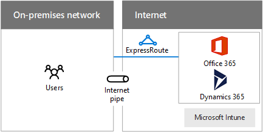

# Designing networking for Microsoft SaaS

 **Summary:** Understand how to optimize your network for access to Microsoft's SaaS services, including Office 365, Microsoft Intune, and Dynamics 365.
  
Optimizing your network for Microsoft SaaS services requires careful analysis of your Internet edge, your client devices, and typical IT operations.
  
## Steps to prepare your network for Microsoft SaaS services

Follow these steps to optimize your network for Microsoft SaaS services:
  
1. Go through the **Steps to prepare your network for Microsoft cloud services** section in [Common elements of Microsoft cloud connectivity](common-elements-of-microsoft-cloud-connectivity.md).
    
2. Optimize your Internet egress for Microsoft SaaS services using the proxy server recommendations.
    
3. Optimize your Internet throughput using the proximity and location recommendations.
    
4. Optimize the performance of your client computers and the intranet on which they are located using the client usage considerations.
    
5. As needed, optimize the performance of data migrations and synchronization using the IT operations considerations.
    
## Internet edge considerations

Here are some things to consider optimize your Internet edge and throughput to Microsoft SaaS services.
  
**Figure 1: Connection options for Microsoft SaaS services**

  
Figure 1 shows an on-premises network connecting to Microsoft SaaS services over an Internet pipe or ExpressRoute.
  
Here are some recommendations to optimize your proxy server:
  
- Configure web clients using WPAD, PAC, or GPO
    
- Don't use SSL interception
    
- Use a PAC file to bypass the proxy for Microsoft SaaS service DNS names
    
- Allow traffic for CRL/OCSP verification
    
Here are some proxy server bottlenecks to check:
  
- Insufficient persistent connections (Outlook)
    
- Insufficient capacity
    
- Doing off-network evaluation
    
- Requiring authentication
    
- No support for UDP traffic (Skype for Business)
    
Here are some proximity and location recommendations:
  
- Don't route your Internet traffic over the private WAN
    
- Use in-region DNS and Internet traffic flow for out-of-region users
    
- Use ExpressRoute for high bandwidth to Office 365 and concurrent connectivity with Azure services
    
Here are the outbound ports needed for Office 365 traffic:
  
- TCP 80 (for CRL/OCSP checks)
    
- TCP 443
    
- UDP 3478
    
- TCP 5223
    
- TCP 50000-59999
    
- UDP 50000-59999
    
## Client usage considerations

First, configure the set of services that your clients will be using, such as:
  
- Azure Active Directory
    
- Office 365
    
  - Office client apps
    
  - SharePoint Online
    
  - Exchange Online
    
  - Skype for Business
    
- Microsoft Intune
    
- Dynamics 365
    
For your client computers, determine the following:
  
- Maximum number at any one time (time of day, seasonal, peaks and troughs in usage)
    
- Total bandwidth needed for peaks
    
- Latency to the Internet egress device
    
- Country of origin vs. country of datacenter co-location
    
For each type of client (PC, smartphone, tablet), ensure the current:
  
- Operating system
    
- Internet browser
    
- TCP/IP stack
    
- Network hardware
    
- OS drivers for network hardware
    
- Updates and patches are installed
    
Additionally, optimize intranet connection throughput (wired, wireless, or VPN).
  
For more information, see [NAT support with Office 365](https://support.office.com/article/NAT-support-with-Office-365-170e96ea-d65d-4e51-acac-1de56abe39b9).
  
For the latest recommendations for using ExpressRoute with Office 365, see [ExpressRoute for Office 365](https://support.office.com/article/Azure-ExpressRoute-for-Office-365-6d2534a2-c19c-4a99-be5e-33a0cee5d3bd).
  
To optimize your intranet performance, do the following:
  
- Use tools to gauge round trip times (RTTs) to your Internet edge devices (PsPing, Ping, Tracert, TraceTCP, Network Monitor)
    
- Perform egress path analysis using flow protocols
    
- Perform analysis of intermediate devices (age, health, etc.)
    
For more information, see the [PsPing tool](https://technet.microsoft.com/sysinternals/jj729731.aspx).
  
## IT operations considerations

Here are some things to consider when operating an IT workload in a Microsoft SaaS service.
  
### One-time migrations

Examples of one-time migrations are bulk data transfer for cloud-based applications or archival storage.
  
To optimize your network for on-time migrations:
  
- Avoid peak network usage and computer patching times
    
- Should be baselined and piloted, assess network health and resolve issues before attempting actual migration
    
- Perform post-mortem for future migrations
    
### Ongoing synchronizations

Examples of ongoing synchronizations are directory information, settings, or files.
  
To optimize your network for ongoing synchronizations:
  
- Ensure that a network bandwidth monitoring system is in place, resolve or dismiss collected errors
    
- Use bandwidth monitoring results to determine need for network changes (scale-up/out, new circuits, or adding devices)
    
For more information, see:
  
- [Network and migration planning for Office 365](https://aka.ms/tune)
    
- [Office 365 Performance Management Microsoft Virtual Academy course](https://aka.ms/o365perf)
    
- [ExpressRoute for Office 365](https://aka.ms/expressrouteoffice365)
    
## See Also

[Microsoft Cloud Networking for Enterprise Architects](microsoft-cloud-networking-for-enterprise-architects.md)
  
[Microsoft Cloud IT architecture resources](microsoft-cloud-it-architecture-resources.md)

[Microsoft's Enterprise Cloud Roadmap: Resources for IT Decision Makers](https://sway.com/FJ2xsyWtkJc2taRD)

#### 

