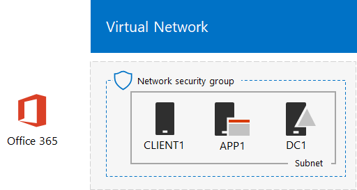

# Directory synchronization for your Office 365 dev/test environment

 **Summary:** Configure directory synchronization for your Office 365 dev/test environment.
  
Many organizations use Azure AD Connect and directory synchronization to synchronize the set of accounts in their on-premises Active Directory Domain Services (AD DS) forest to the set of accounts in Office 365. This article describes how you can add directory synchronization with password hash synchronization to the Office 365 dev/test environment, resulting in the following configuration.
  

  
This configuration consists of: 
  
- An Office 365 E5 Trial Subscription, which expires 30 days from when you create it.
- A simplified organization intranet connected to the Internet, consisting of three virtual machines on a subnet of an Azure virtual network (DC1, APP1, and CLIENT1). Azure AD Connect runs on APP1 to synchronize the AD DS domain to Office 365.
    
There are two phases to setting up this dev/test environment:
  
1. Create the Office 365 dev/test environment (the DC1, APP1, and CLIENT1 virtual machines in an Azure virtual network with an Office 365 E5 trial subscription).
2. Install and configure Azure AD Connect on APP1.
    
> [!TIP]
> Click [here](http://aka.ms/catlgstack) for a visual map to all the articles in the Office 365 Test Lab Guide stack.
  
## Phase 1: Create an Office 365 dev/test environment

Follow the instructions in phases 1, 2, and 3 of the [Office 365 dev/test environment](office-365-dev-test-environment.md) article. Here is the resulting configuration.
  

  
This configuration consists of: 
  
- An Office 365 E5 Trial Subscription.
- A simplified organization intranet connected to the Internet, consisting of the DC1, APP1, and CLIENT1 virtual machines on a subnet of an Azure virtual network.
    
## Phase 2: Install Azure AD Connect on APP1

Once installed and configured, Azure AD Connect synchronizes the set of accounts in the CORP AD DS domain with the set of accounts in your Office 365 trial subscription. The following procedure steps you through installing Azure AD Connect on APP1 and checking that it works.
  
### Install and configure Azure AD Connect on APP1

1. From the [Azure portal](https://portal.azure.com), connect to APP1 with the CORP\\User1 account.
    
2. From APP1, open an administrator-level Windows PowerShell command prompt, and then run these commands:
    
  ```
  Set-ItemProperty -Path "HKLM:\SOFTWARE\Microsoft\Active Setup\Installed Components\{A509B1A7-37EF-4b3f-8CFC-4F3A74704073}" -Name "IsInstalled" -Value 0
Set-ItemProperty -Path "HKLM:\SOFTWARE\Microsoft\Active Setup\Installed Components\{A509B1A8-37EF-4b3f-8CFC-4F3A74704073}" -Name "IsInstalled" -Value 0
Stop-Process -Name Explorer -Force

  ```

3. From the task bar, click **Internet Explorer** and go to [https://aka.ms/aadconnect](https://aka.ms/aadconnect).
    
4. On the Microsoft Azure Active Directory Connect page, click **Download**, and then click **Run**.
    
5. On the **Welcome to Azure AD Connect** page, click **I agree**, and then click **Continue**.
    
6. On the **Express Settings** page, click **Use express settings**.
    
7. On the **Connect to Azure AD** page, type your global administrator account name in **Username,** type its password in **Password**, and then click **Next**.
    
8. On the **Connect to AD DS** page, type **CORP\\User1** in **Username,** type its password in **Password**, and then click **Next**.
    
9. On the **Azure AD sign-in configuration** page, click **Continue without any verified domains**, and then click **Next**.
    
10. On the **Ready to configure** page, click **Install**.
    
11. On the **Configuration complete** page, click **Exit**.
    
12. In Internet Explorer, go to the Microsoft 365 admin center ([https://admin.microsoft.com](https://admin.microsoft.com)) and sign in to your Office 365 trial subscription with your global administrator account.
    
13. From the main portal page, click **Admin**.
    
14. In the left navigation, click **Users > Active users**.
    
    Note the account named **User1**. This account is from the CORP AD DS domain and is proof that directory synchronization has worked.
    
15. Click the **User1** account. For product licenses, click **Edit**.
    
16. In **Product licenses**, select your country, and then click the **Off** control for **Office 365 Enterprise E5** (switching it to **On**). Click **Save** at the bottom of the page, and then click **Close**.
    
This is the resulting configuration.
  

  
This configuration consists of: 
  
- An Office 365 E5 Trial Subscription.
- A simplified organization intranet connected to the Internet, consisting of the DC1, APP1, and CLIENT1 virtual machines on a subnet of an Azure virtual network. Azure AD Connect runs on APP1 to synchronize the CORP AD DS domain to Office 365 every 30 minutes.
    
## Next Step

When you are ready to deploy directory synchronization for your organization, see [Deploy Office 365 Directory Synchronization in Microsoft Azure](deploy-office-365-directory-synchronization-dirsync-in-microsoft-azure.md).

## See Also

[Cloud adoption Test Lab Guides (TLGs)](cloud-adoption-test-lab-guides-tlgs.md)

[Base Configuration dev/test environment](base-configuration-dev-test-environment.md)

[Office 365 dev/test environment](office-365-dev-test-environment.md)

[Advanced Threat Protection for your Office 365 dev/test environment](advanced-threat-protection-for-your-office-365-dev-test-environment.md)

[Cloud adoption and hybrid solutions](cloud-adoption-and-hybrid-solutions.md)


