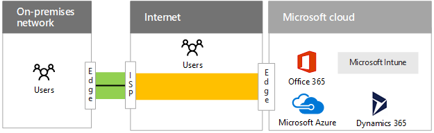
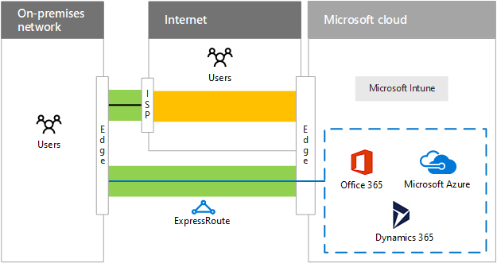
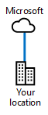
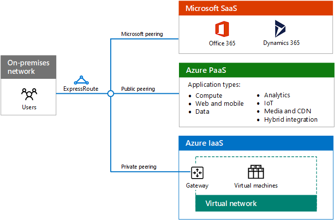
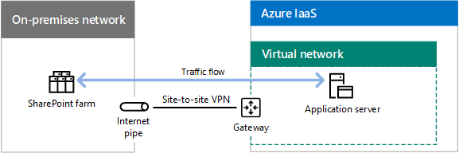
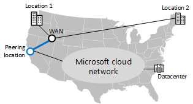
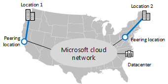

# ExpressRoute for Microsoft cloud connectivity

 **Summary:** Understand how ExpressRoute can help you with faster and more reliable connections to Microsoft's cloud services and platforms.
  
ExpressRoute provides a private, dedicated, high-throughput network connection to Microsoft's cloud.
  
## ExpressRoute to the Microsoft cloud

Here is the networking path to the Microsoft cloud without an ExpressRoute connection.
  
**Figure 1: The networking path without ExpressRoute**

  
Figure 1 shows the typical path between an on-premises network and the Microsoft cloud. The on-premises network edge connects to the Internet through a WAN link to an ISP. The traffic then travels across the Internet to the edge of the Microsoft cloud. Cloud offerings within the Microsoft cloud include Office 365, Microsoft Azure, Microsoft Intune, and Dynamics 365. Users of an organization can be located on the on-premises network or on the Internet.
  
Without an ExpressRoute connection, the only part of the traffic path to the Microsoft cloud that you can control (and have a relationship with the service provider) is the link between your on-premises network edge and your ISP. 
  
The path between your ISP and the Microsoft cloud edge is a best-effort delivery system on the Internet subject to outages, traffic congestion, and monitoring by malicious users.
  
Users on the Internet, such as roaming or remote users, send their traffic to the Microsoft cloud over the Internet.
  
Here are the networking paths to the Microsoft cloud with an ExpressRoute connection.
  
**Figure 2: The networking paths with ExpressRoute**

  
Figure 2 shows two networking paths. Traffic to Microsoft Intune travels the same path as normal Internet traffic. Traffic to Office 365, Microsoft Azure, and Dynamics 365 travels across the ExpressRoute connection, a dedicated path between the edge of the on-premises network and the edge of the Microsoft cloud.
  
With an ExpressRoute connection, you now have control, through a relationship with your service provider, over the entire traffic path from your edge to the Microsoft cloud edge. This connection can offer predictable performance and a [99.95% uptime SLA](https://azure.microsoft.com/support/legal/sla/expressroute/v1_3/).
  
You can now count on predictable throughput and latency, based on your service provider's connection, to Office 365, Azure, and Dynamics 365 services. ExpressRoute connections to Microsoft Intune are not supported at this time.
  
Traffic sent over the ExpressRoute connection is no longer subject to Internet outages, traffic congestion, and monitoring.
  
Users on the Internet, such as roaming or remote users, still send their traffic to the Microsoft cloud over the Internet. One exception is traffic to an intranet line of business application hosted in Azure IaaS, which is sent over the ExpressRoute connection via a remote access connection to the on-premises network.
  
Even with an ExpressRoute connection, some traffic is still sent over the Internet, such as DNS queries, certificate revocation list checking, and content delivery network (CDN) requests.
  
See these additional resources for more information:
  
- [ExpressRoute for Office 365](https://aka.ms/expressrouteoffice365)
    
- [ExpressRoute for Azure](https://azure.microsoft.com/services/expressroute/)
    
## Advantages of ExpressRoute for Azure

Here are some advantages of using ExpressRoute for Azure-based cloud services:
  
- **Predictable performance:** With a dedicated path to the edge of the Microsoft cloud, your performance is not subject to Internet provider outages and spikes in Internet traffic. You can determine and hold your providers accountable to a throughput and latency SLA to the Microsoft cloud.
    
- **Data privacy for your traffic:** Traffic sent over your dedicated ExpressRoute connection is not subject to Internet monitoring or packet capture and analysis by malicious users. It is as secure as using Multiprotocol Label Switching (MPLS)-based WAN links.
    
- **High throughput connections:** With wide support for ExpressRoute connections by exchange providers and network service providers, you can obtain up to a 10 Gbps link to the Microsoft cloud.
    
- **Lower cost for some configurations:** Although ExpressRoute connections are an additional cost, in some cases a single ExpressRoute connection can cost less than increasing your Internet capacity at multiple locations of your organization to provide adequate throughput to Microsoft cloud services.
    
An ExpressRoute connection is not a guarantee of higher performance in every configuration. It is possible to have lower performance over a low-bandwidth ExpressRoute connection than a high-bandwidth Internet connection that is only a few hops away from a regional Microsoft datacenter.
  
For the latest recommendations for using ExpressRoute with Office 365, see [ExpressRoute for Office 365](https://support.office.com/article/Azure-ExpressRoute-for-Office-365-6d2534a2-c19c-4a99-be5e-33a0cee5d3bd).
  
## ExpressRoute connectivity models

Table 1 shows the three primary connectivity models for ExpressRoute connections.
  
|**Co-located at a cloud exchange**|**Point-to-point Ethernet**|**Any-to-any (IP VPN) connection**|
|:-----|:-----|:-----|
||||
|If your datacenter is co-located in a facility with a cloud exchange, you can order a virtual cross-connection to the Microsoft cloud through the co-location provider's Ethernet exchange.    |If your datacenter is located on your premises, you can use a point-to-point Ethernet link to connect to the Microsoft cloud.    |If you are already using an IP VPN (MPLS) provider to connect the sites of your organization, an ExpressRoute connection to the Microsoft cloud acts like another location on your private WAN.    |
   
 **Table 1: ExpressRoute connectivity models**
  
## ExpressRoute peering relationships to Microsoft cloud services

A single ExpressRoute connection supports up to two different Border Gateway Protocol (BGP) peering relationships to different parts of the Microsoft cloud. BPG uses peering relationships to establish trust and exchange routing information.
  
**Figure 3: The two different BGP relationships in a single ExpressRoute connection**

  
Figure 3 shows an ExpressRoute connection from an on-premises network. The ExpressRoute connection has two logical peering relationships. A Microsoft peering relationship goes to Microsoft SaaS services, including Office 365, Dynamcs 365, and Azure PaaS services. A private peering relationship goes to Azure IaaS and to a virtual network gateway that hosts virtual machines.
  
The Microsoft peering BGP relationship: 
  
- Is from a router in your DMZ to the public addresses of Office 365, Dynamics 365, and Azure services. 
    
- Supports bidirectional-initiated communication.
    
The private peering BGP relationship:
  
- Is from a router on the edge of your organization network to the private IP addresses assigned to your Azure VNets.
    
- Supports bidirectional-initiated communication.
    
- Is an extension of your organization network to the Microsoft cloud, complete with internally-consistent addressing and routing.

>[!Note]
>The public peering BGP relationship described in previous versions of this article has been deprecated.
>
    
## Example of application deployment and traffic flow with ExpressRoute

How traffic travels across ExpressRoute connections and within the Microsoft cloud is a function of the routes at the hops of the path between the source and the destination and application behavior. Here is an example of an application running on an Azure virtual machine that accesses an on-premises SharePoint farm over a site-to-site VPN connection.
  
**Figure 4: An application on an Azure virtual machine accessing an on-premises SharePoint farm**

  
Figure 4 shows an on-premises SharePoint farm, a site-to-site VPN connection between the on-premises network and a virtual network in Azure IaaS, an application server running as an Azure IaaS virtual machine, and the traffic flow between the application server and the SharePoint farm.
  
The application locates the IP address of the SharePoint farm using the on-premises DNS and all traffic goes over the site-to-site VPN connection.
  
This organization migrated their on-premises SharePoint farm to SharePoint Online in Office 365 and deployed an ExpressRoute connection.
  
**Figure 5: Moving the on-premises SharePoint farm to SharePoint Online**

  
Figure 5 shows the addition of an ExpressRoute connection with peering relationships to Microsoft SaaS and Office 365 and to Azure IaaS containing the application server on a virtual network. The SharePoint on-premises farm has been migrated to Office 365.
  
With the Microsoft and private peering relationships:
  
- From the Azure virtual network gateway, on-premises locations are available across the ExpressRoute connection.
    
- From the Office 365 subscription, public IP addresses of edge devices, such as proxy servers, are available across the ExpressRoute connection.
    
- From the on-premises network edge, the private IP addresses of the Azure VNet and the public IP addresses of Office 365 are available across the ExpressRoute connection.
    
When the application accesses the URLs of SharePoint Online, it forwards its traffic across the ExpressRoute connection to a proxy server in the edge. 
  
When the proxy server locates the IP address of SharePoint Online, it forwards the traffic back over the ExpressRoute connection. Response traffic travels the reverse path.
  
**Figure 6: Traffic flow when the SharePoint farm has been migrated to SharePoint Online in Office 365**

  
Figure 6 shows how the traffic between the application server and SharePoint Online in Office 365 flows over the private peering relationship from the application server to the on-premises network edge, and then from the edge over the Microsoft peering relationship to Office 365.
  
The result is hair pinning, a consequence of the routing and application behavior.
  
## ExpressRoute and Microsoft's cloud network

ExpressRoute connections are available in two different versions: ExpressRoute and ExpressRoute Premium.
  
### ExpressRoute

How traffic travels between your organization network and a Microsoft datacenter is a combination of:
  
- Your locations.
    
- Microsoft cloud peering locations (the physical locations to connect to the Microsoft edge).
    
- Microsoft datacenter locations.
    
Microsoft datacenter and cloud peering locations are all connected to the Microsoft cloud network.
  
When you create an ExpressRoute connection to a Microsoft cloud peering location, you are connected to the Microsoft cloud network and all the Microsoft datacenter locations in the same continent. The traffic between the cloud peering location and the destination Microsoft datacenter is carried over the Microsoft cloud network.
  
This can result in non-optimal delivery to local Microsoft datacenters for the any-to-any connectivity model.
  
**Figure 7: Example of a geographically-distributed organization that uses a single ExpressRoute connection**

  
Figure 7 shows an organization with two locations, Location 1 in the northwest of the United States and Location 2 in the northeast. They are connected by an any-to-any WAN provider. This organization also has an ExpressRoute connection to a Microsoft peering location on the west coast. Traffic from Location 2 in the northeast destined for an east coast datacenter must travel all the way across the organization's WAN to the west coast, to the Microsoft peering location, and then back across the country over the Microsoft cloud network to the east coast datacenter.
  
For optimal delivery, use multiple ExpressRoute connections to regional Microsoft cloud peering locations. 
  
**Figure 8: The use of multiple ExpressRoute connections for optimal delivery to regional datacenters**

  
Figure 8 shows the same organization with two ExpressRoute connections, one for each location, to regionally local Microsoft peering locations. In this configuration, traffic from Location 2 in the northeast destined for an east coast datacenter goes directly to an east coast peering location, to the Microsoft cloud network, and then to the east coast datacenter.
  
Multiple ExpressRoute connections can provide:
  
- Better performance to regionally local Microsoft datacenter locations.
    
- Higher availability to the Microsoft cloud when a local ExpressRoute connection becomes unavailable.
    
This works well for organizations in the same continent. However, traffic to Microsoft datacenters outside the organization's continent travels over the Internet.
  
For intercontinental traffic over the Microsoft cloud network, you must use ExpressRoute Premium connections.
  
### ExpressRoute Premium

For organizations that are globally distributed across continents, you can use ExpressRoute Premium. 
  
With ExpressRoute Premium, you can reach any Microsoft datacenter on any continent from any Microsoft peering location on any continent. The traffic between continents is carried over the Microsoft cloud network.
  
With multiple ExpressRoute Premium connections, you can have:
  
- Better performance to continentally local Microsoft datacenters.
    
- Higher availability to the global Microsoft cloud when a local ExpressRoute connection becomes unavailable.
    
ExpressRoute Premium is required for Office 365-based ExpressRoute connections.
  
**Figure 9: The world-wide Microsoft cloud network**

  
Figure 9 shows a logical diagram of the worldwide Microsoft cloud network, with networks that span the continents and regions of the world and their interconnections. With a portion of the Microsoft cloud network in each continent, a global enterprise creates ExpressRoute Premium connections from its regional hub offices to local Microsoft peering locations.
  
For a regional office, appropriate Office 365 traffic to:
  
- Continental Office 365 datacenters travels over the Microsoft cloud network within the continent.
    
- Office 365 datacenters in another continent travels over the intercontinental Microsoft cloud network.
    
For more information, see:
  
- [Azure ExpressRoute for Office 365 Training](https://channel9.msdn.com/series/aer/)
    
- [Network planning and performance tuning for Office 365](https://aka.ms/tune)
    
## ExpressRoute options

You can also incorporate the following options into your ExpressRoute deployment:
  
- **Security at your edge:** To provide advanced security for the traffic sent and received over the ExpressRoute connection, such as traffic inspection or intrusion/malware detection, place your security appliances in the traffic path within your DMZ or at the border of your intranet.
    
- **Internet traffic for VMs:** To prevent Azure VMs from initiating traffic directly with Internet locations, advertise the default route to Microsoft. Traffic to the Internet is routed across the ExpressRoute connection and through your on-premises proxy servers. Traffic from Azure VMs to Azure PaaS services or Office 365 is routed back across the ExpressRoute connection.
    
- **WAN optimizers:** You can deploy WAN optimizers on both sides of a private peering connection for a cross-premises Azure virtual network (VNet). Inside the Azure VNet, use a WAN optimizer network appliance from the Azure marketplace and user-defined routing to route the traffic through the appliance.
    
- **Quality of service:** Use Differentiated Services Code Point (DSCP) values in the IPv4 header of your traffic to mark it for voice, video/interactive, or best-effort delivery. This is especially important for the Microsoft peering relationship and Skype for Business Online traffic.
    
See these additional resources for more information:
  
- [ExpressRoute for Office 365](https://aka.ms/expressrouteoffice365)
    
- [Azure ExpressRoute for Office 365 Training](https://channel9.msdn.com/series/aer/)
    
- [ExpressRoute for Azure](https://azure.microsoft.com/services/expressroute/)
    
## Next step

[Designing networking for Microsoft SaaS](designing-networking-for-microsoft-saas.md)

## See also

[Microsoft Cloud Networking for Enterprise Architects](microsoft-cloud-networking-for-enterprise-architects.md)
  
[Microsoft Cloud IT architecture resources](microsoft-cloud-it-architecture-resources.md)

