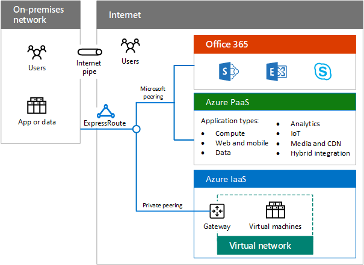

# Hybrid cloud overview

 **Summary:** Understand the definition and elements of Microsoft hybrid cloud.
  
Hybrid cloud uses compute or storage resources on your on-premises network and in the cloud. You can use hybrid cloud as a path to migrate your business and its IT needs to the cloud or integrate cloud platforms and services with your existing on-premises infrastructure as part of your overall IT strategy.
  
## Microsoft hybrid cloud

Microsoft hybrid cloud is a set of business scenarios that combine a Microsoft cloud platform with an on-premises component, such as: 
  
- Getting search results from content both in an on-premises SharePoint farm and in SharePoint Online in Office 365.
    
- A mobile app running in Azure that queries an on-premises data store.
    
- An intranet IT workload running on Azure virtual machines.
    
**Figure 1: Components of the Microsoft hybrid cloud**

  
Figure 1 shows the components of the Microsoft hybrid cloud, from an on-premises network to the set of Office 365, Azure Platform as a Service (PaaS), and Azure Infrastructure as a Service (IaaS) services available across the Internet or an ExpressRoute connection.
  
Because Microsoft has the most complete cloud solution in the marketplace—including Software as a Service (SaaS), PaaS, and IaaS—you can:
  
- Leverage your existing on-premises investments as you migrate workloads and applications to the cloud.
    
- Incorporate hybrid cloud scenarios into your long-term IT plans, for example, when regulations or policies do not permit moving specific data or workloads to the cloud.
    
- Create additional hybrid scenarios that include multiple Microsoft cloud services and platforms.
    
Scenarios for hybrid cloud with Microsoft cloud services vary with the platform.
  
- SaaS
    
    Microsoft SaaS services include Office 365, Microsoft Intune, and Microsoft Dynamics 365. Hybrid cloud scenarios with Microsoft SaaS combine these services with on-premises services or applications. For example, Exchange Online running in Office 365 can be integrated with Skype for Business 2019 that is deployed on-premises.
    
- Azure PaaS
    
    Microsoft Azure PaaS services allow you to create cloud-based applications. Hybrid cloud scenarios with Azure PaaS services combine an Azure PaaS app with on-premises resources or applications. For example, an Azure PaaS app could securely query an on-premises data store for information needed to display to mobile app users.
    
- Azure IaaS
    
    Azure IaaS services allow you to build and run server-based IT workloads in the cloud, rather than in your on-premises datacenter. Hybrid cloud scenarios with Azure IaaS services typically consist of an IT workload that runs on virtual machines that is transparently connected to your on-premises network. Your on-premises users will not notice the difference.
    
## Elements of hybrid cloud

You must account for the following elements when planning and implementing hybrid cloud scenarios with Microsoft cloud platforms and services.
  
- Networking
    
    Networking for hybrid cloud scenarios includes the connectivity to Microsoft cloud platforms and services and enough bandwidth to be performant under peak loads. For more information, see [Microsoft Cloud Networking for Enterprise Architects](microsoft-cloud-networking-for-enterprise-architects.md).
    
- Identity
    
    Identity for SaaS and Azure PaaS hybrid scenarios can include Azure AD as a common identity provider, which can be synchronized with your on-premises Windows Server AD, or federated with Windows Server AD or other identity providers. You can also extend your on-premises Identity infrastructure to Azure IaaS. For more information, see [Microsoft Cloud Identity for Enterprise Architects](microsoft-cloud-it-architecture-resources.md#identity).
    
- Security
    
    Security for hybrid cloud scenarios includes protection and management for your identities, data protection, administrative privilege management, threat awareness, and the implementation of governance and security policies. For more information, see [Microsoft Cloud Security for Enterprise Architects](microsoft-cloud-it-architecture-resources.md#security).
    
- Management
    
    Management for hybrid cloud scenarios includes the ability to maintain settings, data, accounts, policies, and permissions and to monitor the ongoing health of the elements of the scenario and its performance. You can also use the same tool set, such as Systems Management Server, for managing virtual machines in Azure IaaS.
    
## See Also

[Microsoft Hybrid Cloud for Enterprise Architects](microsoft-hybrid-cloud-for-enterprise-architects.md)
  
[Microsoft Cloud IT architecture resources](microsoft-cloud-it-architecture-resources.md)

