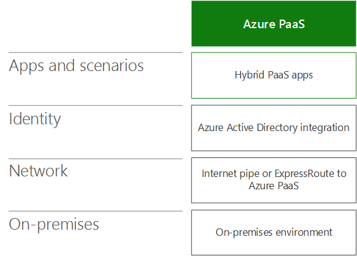
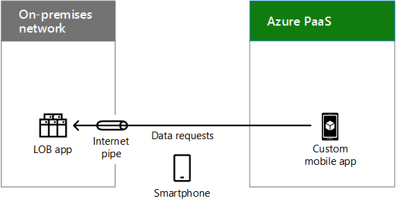

# Hybrid cloud scenarios for Azure PaaS

 **Summary:** Understand the hybrid architecture and scenarios for Microsoft's Platform as a Service (PaaS)-based cloud offerings in Azure.
  
Combine on-premises data or computing resources with new or converted applications running in Azure PaaS, which can take advantage of cloud performance, reliability, and scale and provide better support for mobile users. 
  
## Azure PaaS hybrid scenario architecture

Figure 1 shows the architecture of Microsoft PaaS-based hybrid scenarios in Azure.
  
**Figure 1: Microsoft PaaS-based hybrid scenarios in Azure**

  
For each layer of the architecture:
  
- Apps and scenarios
    
    A hybrid PaaS application runs in Azure and uses on-premises compute or storage resources.
    
- Identity
    
    Consists of either directory synchronization or federation with a third-party identity provider.
    
- Network
    
    Consists of either your existing Internet pipe or an ExpressRoute connection with public peering to Azure PaaS. You must include a way for the Azure PaaS application to access the on-premises compute or storage resource.
    
- On-premises
    
    Consists of identity and security infrastructure and existing line of business (LOB) applications or database servers, which an Azure PaaS application can securely access.
    
## Azure PaaS hybrid application

Figure 2 shows the configuration of a hybrid application running in Azure.
  
**Figure 2: Azure PaaS-based hybrid application**

  
In Figure 2, an on-premises network hosts storage or apps on servers and a DMZ containing a proxy server. It is connected to Azure PaaS services either over the Internet or with an ExpressRoute connection.
  
An organization can make its compute or storage resources available to the Azure PaaS hybrid application by:
  
- Hosting the resource on servers in the DMZ.
    
- Hosting a reverse proxy server in the DMZ, which allows authenticated, inbound, HTTPS-based requests to the resource that is located on-premises.
    
The Azure app can use credentials from:
  
- Azure AD, which can be synchronized with your on-premises identity provider, such as Windows Server AD.
    
- A third-party identity provider.
    
### Example Azure PaaS hybrid application

Figure 3 shows an example hybrid application running in Azure.
  
**Figure 3: An example Azure PaaS-based hybrid application**

  
In Figure 3, an on-premises network hosts an LOB app. Azure PaaS hosts a custom mobile app. A smartphone on the Internet accesses the custom mobile app in Azure, which sends data requests to the on-premises LOB app.
  
This example Azure PaaS hybrid application is a custom mobile app that provides up-to-date contact information on employees. The end-to-end hybrid scenario consists of:
  
- A smartphone app that requires validated, on-premises credentials to run.
    
- A custom mobile app running in Azure PaaS, which requests information about specific employees based on queries from a user's smartphone app.
    
- A reverse proxy server in the DMZ that validates the custom mobile app and forwards the request.
    
- An LOB application server farm that services the contact request, subject to the permissions of the user's account.
    
Because the on-premises identity provider has been synchronized with Azure AD, both the custom mobile app and the LOB app can validate the requesting user's account name.
  
## See Also

[Microsoft Hybrid Cloud for Enterprise Architects](microsoft-hybrid-cloud-for-enterprise-architects.md)
  
[Microsoft Cloud IT architecture resources](microsoft-cloud-it-architecture-resources.md)

