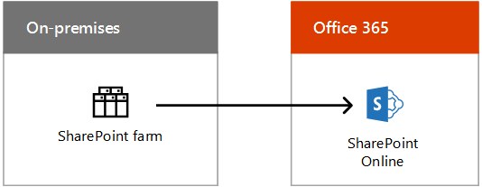
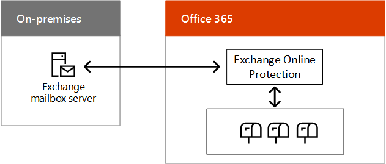

# Hybrid cloud scenarios for Microsoft SaaS (Office 365)

 **Summary:** Understand the hybrid architecture and scenarios for Microsoft's SaaS-based cloud offerings (Office 365).
  
Combine on-premises deployments of Exchange, SharePoint, or Skype for Business with their counterparts in Office 365 as part of a cloud migration or long-term integration strategy.
  
## Microsoft SaaS hybrid scenario architecture

Figure 1 shows the architecture of Microsoft SaaS-based hybrid scenarios for Office 365.
  
**Figure 1: Microsoft SaaS-based hybrid scenarios for Office 365**

  
For each layer of the architecture:
  
- Apps and scenarios
    
    There are a variety of SaaS-based hybrid scenarios, aligning around Office Server products and their Office 365 counterparts:
    
  - Exchange Server combined with Exchange Online (Exchange Server hybrid)
    
  - Skype for Business Server combined with Skype for Business Online and the new Cloud PBX and Cloud Connector Edition scenarios
    
  - SharePoint Server 2016 or SharePoint Server 2013 combined with SharePoint Online (multiple scenarios)
    
    There is also Exchange Online with Skype for Business Server on-premises, a cross-product hybrid scenario.
    
- Identity
    
    Can include directory synchronization with your on-premises Windows Server AD. Alternately, you can configure Azure AD to federate with a third-party identity provider.
    
- Network
    
    Consists of either your existing Internet pipe or an ExpressRoute connection with Microsoft peering for Office 365 or Dynamics 365.
    
- On-premises
    
    Can consist of existing servers for Exchange, SharePoint, and Skype for Business, which should be updated to their latest versions. You can then combine them with their Office 365 counterparts for hybrid scenarios.
    
Set up your own [Office 365 dev/test environment](office-365-dev-test-environment.md).
  
## Skype for Business 2015 Hybrid

Skype for Business 2015 Hybrid allows you to combine an existing on-premises deployment with Skype for Business Online. Some users are homed on-premises and some users are homed online, but the users share the same Session Initiation Protocol (SIP) domain, such as contoso.com. You can use this hybrid configuration to migrate from on-premises to Office 365 over time, on your schedule. Skype for Business 2015 can also be integrated with Exchange Online.
  
**Figure 2: The Skype for Business 2015 hybrid configuration**

  
Figure 2 shows the Skype for Business 2015 hybrid configuration, consisting of an on-premises Skype for Business 2015 front end pool and edge server communicating with Skype for Business Online in Office 365.
  
For more information, see:
  
- [Plan hybrid connectivity between Skype for Business Server and Skype for Business Online](https://technet.microsoft.com/library/jj205403.aspx)
    
- [Supported hybrid configurations for Skype for Business Server 2015](https://technet.microsoft.com/library/jj945633.aspx)
    
- [Skype for Business Hybrid](http://hybrid.office.com/skype-for-business/)
    
## Cloud PBX with Skype for Business Server

Cloud PBX with Skype for Business Server allows you to transition an existing Skype for Business Server on-premises deployment to a topology with on-premises Public Switched Telephone Network (PSTN) connectivity. 
  
**Figure 3: Cloud PBX with Skype for Business Server**

  
Figure 3 shows the Cloud PBX with Skype for Business Server configuration, consisting of an on-premises existing PBX or Telco gateway, a Skype for Business Server, and the PSTN connected to the Microsoft Cloud PBX in Office 365, which includes Skype for Business Online.
  
Users in the organization who are homed in the cloud can receive private branch exchange (PBX) services from the Microsoft cloud that include signaling and voicemail, but PSTN connectivity (dial tone) is provided through Enterprise Voice from your on-premises Skype for Business Server deployment.
  
This is a great example of a hybrid configuration that allows you to gradually migrate to a cloud-based service. You can retain your users' voice capabilities as you begin to move them to Skype for Business Online. You can move your users at your own pace, knowing that their voice features will continue no matter where they are homed. 
  
For more information, see [Plan hybrid connectivity between Skype for Business Server and Skype for Business Online or Lync Server 2013](https://technet.microsoft.com/library/jj205403.aspx).
  
If you do not already have an existing Lync Server or Skype for Business Server deployment, you can use Skype for Business Cloud Connector Edition, a set of packaged virtual machines (VMs) that implement on-premises PSTN connectivity with Cloud PBX.
  
For more information, see [Plan for Skype for Business Cloud Connector Edition](https://technet.microsoft.com/library/mt605227.aspx).
  
## SharePoint Hybrid

SharePoint hybrid combines SharePoint Online in Office 365 with your on-premises SharePoint farm for a best of both worlds, connected experience.
  
**Figure 4: The SharePoint hybrid configuration**

  
Figure 4 shows the SharePoint hybrid configuration, consisting of an on-premises SharePoint farm communicating with SharePoint Online in Office 365.
  
SharePoint hybrid scenarios:
  
- [Hybrid OneDrive for Business](https://technet.microsoft.com/library/mt147425%28v=office.16%29.aspx)
    
- [Hybrid team sites](https://technet.microsoft.com/library/mt346110%28v=office.16%29.aspx)
    
- [Hybrid Extranet B2B](https://support.office.com/article/SharePoint-Business-to-Business-Collaboration-Extranet-for-Partners-with-Office-365-7b087413-165a-4e94-8871-4393e0b9c037)
    
- [Hybrid search](https://technet.microsoft.com/library/dn720906%28v=office.16%29.aspx)
    
- [Hybrid profiles](https://support.office.com/article/Plan-hybrid-profiles-96d1eaf0-94eb-40c5-ab76-c82907777db4)
    
- [Hybrid Picker](https://support.office.com/article/Hybrid-picker-in-the-SharePoint-Online-admin-center-efce8417-c9bc-4a2c-ac9d-cce6c4e84a9c)
    
    It is easy to enable hybrid scenarios using the wizards that automate hybrid configuration, available from the SharePoint Online admin center in Office 365.
    
- [Extensible hybrid app launcher](https://support.office.com/article/The-extensible-hybrid-app-launcher-617a7cb5-53da-4128-961a-64a840c0ab91)
    
    Allows users to view and use Office 365 video and Delve apps and experiences within the pages of their on-premises SharePoint farm.
    
All of these SharePoint hybrid scenarios, except the Extensible hybrid app launcher, are available for both SharePoint 2016 and SharePoint 2013 users.
  
For more information, see [SharePoint Hybrid](http://hybrid.office.com/sharepoint/).
  
## Exchange Server 2016 Hybrid

With Exchange Server 2016 Hybrid, you can realize the benefits of Exchange Online in Office 365 for online users while on-premises users continue to use existing Exchange Server infrastructure. 
  
**Figure 5: The Exchange 2016 hybrid configuration**

  
Figure 5 shows the Exchange 2016 hybrid configuration, consisting of on-premises Exchange mailbox servers communicating with Exchange Online Protection and mailboxes in Office 365.
  
Some users have an on-premises email server and some users use Exchange Online, but all users share the same e-mail address space. 
  
This hybrid configuration:
  
- Leverages your existing Exchange Server infrastructure while you migrate to Exchange Online over time, on your schedule.
    
- Allows you to support remote sites without investing in branch office infrastructure.
    
- Allows you to route incoming Internet email through Exchange Online Protection in Office 365.
    
- Serves the needs of multinational organizations with subsidiaries that require data to reside on-premises.
    
You can also integrate this hybrid configuration with other Microsoft Office 365 applications, including Skype for Business Online and SharePoint Online.
  
For more information, see [Exchange Server Hybrid Deployments](https://technet.microsoft.com/library/jj200581%28v=exchg.150%29.aspx) and [Exchange Hybrid](http://hybrid.office.com/exchange/).
  
## See Also

#### 

[Microsoft Hybrid Cloud for Enterprise Architects](microsoft-hybrid-cloud-for-enterprise-architects.md)
  
[Microsoft Cloud IT architecture resources](microsoft-cloud-it-architecture-resources.md)

[Microsoft's Enterprise Cloud Roadmap: Resources for IT Decision Makers](https://sway.com/FJ2xsyWtkJc2taRD)

#### 

