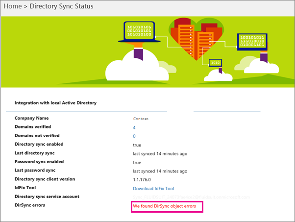
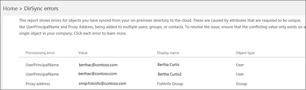

# View directory synchronization errors in Office 365

You can view directory synchronization errors in the [Microsoft 365 admin center](https://admin.microsoft.com). Only the User object errors are displayed. To view errors by using PowerShell, see [Identify objects with DirSyncProvisioningErrors](https://docs.microsoft.com/azure/active-directory/hybrid/how-to-connect-syncservice-duplicate-attribute-resiliency).

After viewing, see [fixing problems with directory synchronization for Office 365](fix-problems-with-directory-synchronization.md) to correct any identified issues.
  
## View directory synchronization errors in the admin center

To view any errors in the admin center:
  
1. Sign in to Office 365 with your work or school account. 
    
2. Go to the [About the admin center](https://support.office.com/article/758befc4-0888-4009-9f14-0d147402fd23).
    
3. On the **Home** page you will see the **DirSync Status** tile. 
    
    
  
4. On the tile, choose **DirSync Status** to go to the **Directory Sync Status** page. 
    
    On the bottom of the page you can see if there are DirSync errors.
    
    
  
    Choose **We found DirSync object errors** to go to a detailed view of the directory synchronization errors. 
    
    > [!NOTE]
    > You can also go to the **DirSync errors** page if you choose **We found DirSync object errors** on the **DirSync status** tile. 
  

  
5. On the **DirSync errors** page, choose any of the errors listed to display the details pane with information about the error and tips on how to fix it. 
