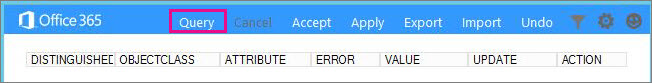

# Download and run the Office 365 IdFix tool

IdFix identifies errors such as duplicates and formatting problems in your Active Directory Domain Services (AD DS) domain before you synchronize to Office 365. 
  
To finish this task successfully, you should be comfortable working with user, group, and contact objects in AD DS.
  
If you can't complete this task, there are a couple of other things you can do. These methods might be easier, but they might also take longer or have other drawbacks. They are:
  
- **Run directory synchronization without running IdFix** 

  You can synchronize your directory without using the IdFix tool, but we don't recommend it. Fixing errors before you synchronize takes less time and often provides a smoother transition to the cloud. 

- **Hire a consultant** 

  Getting expert help can get your users up and running quickly and your directory synchronized. 
    
## What you need to run IdFix

The easiest way to get IdFix up and running is to download it onto a computer that is joined to your AD DS domain. You can run it on the domain controller if you want, but it's not necessary.
  
### IdFix hardware requirements

The computer where you download IdFix needs to meet these minimum hardware requirements:
  
- 4 GB RAM
- 2 GB of hard disk space
   
### IdFix software requirements

The computer where you download IdFix needs to be joined to the same AD DS domain from which you want to synchronize users to Office 365. 

The computer also needs to have .NET Framework 4.0 installed. If you are running Windows Server 2008 or later, the .NET Framework is probably already installed. If not, you can [download .NET 4.0 from the download center](https://go.microsoft.com/fwlink/p/?LinkId=400475) or with Windows Update. 
  
### IdFix permissions requirements

The user account that you use to run IdFix must have read and write access to the AD DS domain.
  
If you aren't sure if your user account meets these requirements, and you're not sure how to check, you can still download and run IdFix. If your user account doesn't have the right permissions, IdFix will simply display an error when you try to run it.
  
## Download and extract IdFix

Follow these instructions. 
  
1. Sign in to the computer where you want to run the IdFix tool.
    
2. Go to the Microsoft download site for the [IdFix DirSync Error Remediation Tool](https://go.microsoft.com/fwlink/?linkid=867219).
    
3. Download and open the zip file.
    
3. In the **IdFix** window, choose **Extract**, and then **Extract all**. By default, IdFix is extracted to `C:\Users\<your user name>\Documents\IdFix`. 
    
6. Choose **Extract**.

These instructions were done with Internet Explorer on a server running Windows Server 2016. If you're using a different version of Windows or a different browser, your steps might vary.
    
## Run the IdFix tool

After you download and extract IdFix, run it to search for problems in your AD DS domain.
  
1. Using an account that has read/write access to your AD DS domain, sign in to the computer where you downloaded IdFix.
    
2. In File Explorer, go to the location where you extracted IdFix. If you chose the default folder during extraction, go to `C:\Users\<your user name>\Documents\IdFix`. 
    
3. Double-click **IdFix.exe**. 
  
4. By default, IdFix uses the Multi-Tenant rule set to test the entries in your directory. This is the right rule set for most Office 365 customers. However, if you are an Office 365 Dedicated or International Traffic in Arms Regulations (ITAR)) customer, you can configure IdFix to use the Dedicated rule set instead. If you aren't sure what type of customer you are, you can safely skip this step. To set the rule set to Dedicated, click the gear icon in the menu bar, and then choose **Dedicated**.
    
5. Choose **Query**.
    
    
  
6. By default, IdFix searches the entire directory for errors.
    
    Depending on the size of your directory, running the query can take a while. You can watch the progress at the bottom of the tool's main window. If you click **Cancel**, you'll need to restart from the beginning.
  
7. After IdFix completes the query, you can synchronize your directory if there are no errors. If there are errors in your directory, it is recommended that you fix them before you synchronize. See [prepare directory attributes for synchronization with Office 365](prepare-directory-attributes-for-synch-with-idfix.md) for more information.
    
    While it is not mandatory to fix the errors before you synchronize, we strongly recommend that you at least review all the errors returned by IdFix.
    
    Each error is displayed in a separate row in the tool's main window . 
    
8. If you agree with the suggested change in the **UPDATE** column, in the **ACTION** column select what you want IdFix to do to implement the change and then click **Apply**. When you click **Apply**, the tool makes the changes in the directory.
    
    You don't have to click **Apply** after each update. Instead, you can fix several errors before you click **Apply** and IdFix will change them all at the same time. You can sort the errors by error type by clicking **ERROR** at the top of the column that lists the error types. 
    
    One strategy is to fix all the errors of the same type; for example, fix all the duplicates first, and apply them. Next, fix the character format errors, and so on. Each time you apply the changes, the IdFix tool creates a separate log file that you can use to undo your changes in case you make a mistake. The [transaction log](idfix-transaction-log.md) is stored in the folder where you extracted IdFix, which is _C:\Users\<your user name>\Documents\IdFix_ by default. 
    
    
  
9. After all of your changes are made to the directory, run IdFix again to ensure that the fixes you made didn't introduce new errors. You can repeat these steps as many times as you need to. It's a good idea to go through the process a few times before you synchronize.
    
## Additional resources on IdFix 

- [IdFix excluded and supported objects and attributes](idfix-excluded-and-supported-objects-and-attributes.md)  
- [Office 365 IdFix transaction log](idfix-transaction-log.md)
    
## Video training

For more information, see the lesson [Install and use the IdFix tool](https://support.office.com/article/install-and-use-the-idfix-tool-4d81d73c-f172-4fd5-8542-f601c0c96aa9?ui=en-US&rs=en-US&ad=US), brought to you by LinkedIn Learning.
  

