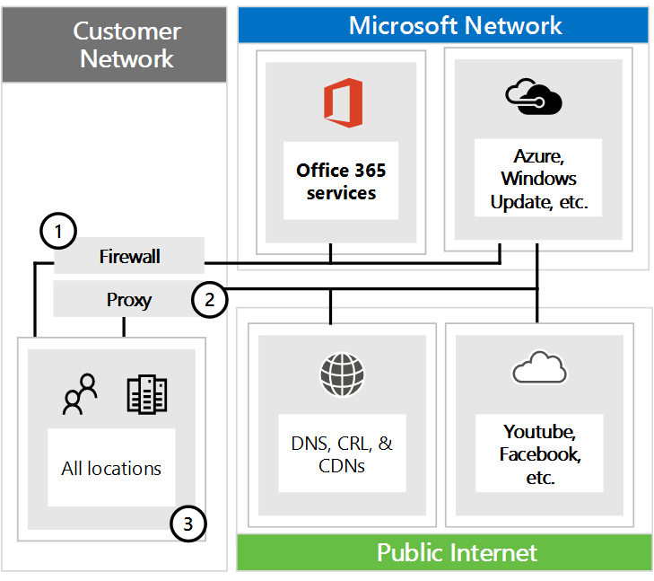

# Managing Office 365 endpoints

Most enterprise organizations that have multiple office locations and a connecting WAN will need to need to have configuration for Office 365 network connectivity. You can optimize your network by sending all trusted Office 365 network requests directly through your firewall, bypassing all additional packet level inspection or processing. This reduces slow performance from latency and reduces your perimeter capacity requirements. Identifying Office 365 network traffic is the first step in providing optimal performance for your Office 365 users. More information about Office 365 network connectivity is in the [Office 365 Network Connectivity Principles](office-365-network-connectivity-principles.md)

Microsoft recommends you access the Office 365 network endpoints and changes to them at the provided [Office 365 IP Address and URL Web Services](office-365-ip-web-service.md)

Regardless of how you manage vital Office 365 network traffic, Office 365 requires Internet connectivity. Other network endpoints where connectivity is reuqired are listed at [Additional endpoints not included in the Office 365 IP Address and URL Web service](additional-office365-ip-addresses-and-urls.md)

How you use the Office 365 network endpoints will depend on your enterprise organization network architecture. Here we outline several ways that enteprise network architectures can integrate with Office 365 IP Addresses and URLs. The easiest way to choose which network requests to trust is to use SDWAN devices that support automated Office 365 configuration at each of your user locations. 

## SDWAN for local branch egress of vital Office 365 network traffic

At each branch office location you can provide an SDWAN device which is configured to route IP Addresses for Office 365 Optimize category, or Optimize and Allow categories, directly to Microsoft's network. Other network traffic including on-premises datacenter traffic, generic internet web sites traffic, and Office 365 Default category traffic is sent to another location where you have a more substantial network perimeter. 

Microsoft is working with SDWAN providers to enable automated configuration. You can read further about the [Office 365 Networking Partner Program](office-365-networking-partner-program.md)

<a name="pacfiles"> </a>
## Use of a PAC file to route vital Office 365 network traffic direct

Use PAC or WPAD files to manage network requests that are associated with Office 365 but don't have an IP address provided. Typical network requests that are sent through a proxy or perimeter device incur additional latency. While SSL Break and Inspect incurs the largest tax, other services such as proxy authentication, and reputation lookup can cause a poor user experience. Additionally, these perimeter network devices need enough capacity to process all of the network connection requests. We recommend bypassing your proxy or inspection infrastructure for direct Office 365 network requests.
  
We provide a PowerShell script which reads the latest network endpoints from the web services and creates a sample PAC file. This is available at [PowerShell Gallery Get-PacFile](https://www.powershellgallery.com/packages/Get-PacFile)

Once this script is downloaded and installed you can use it to generate a PAC file. You can also modify the script so that it integrates with your existing PAC file management. The PAC file is deployed to users machines as point (1) in Figure 1. When using a PAC file for direct egress of vital Office 365 network traffic you also need to allow connectivity to the IP Addresses behind these URLs on your network perimeter firewall. This is done by fetching the IP Addresses for the same Office 365 endpoint categories as specified in the PAC file and creating firewall ACLs based on those. The firewall is shown as point (3) in Figure 1. Separately if you choose to only route Optimize network traffic direct, any required Allow category Office 365 network endpoints that you send to the proxy server will need to be listed in the proxy server for bypassing further processing such as SSL break and Inspect and Proxy Authentication which are incompatible with both the Optimize and Allow category network traffic. The proxy server is shown as point (2) in Figure 1. Common configuration is to permit all network egress traffic from the proxy server such that destination IP Addresses for Office 365 network traffic that hits the proxy server is not required. Read about issues with SSL Break and Inspect at [Using third-party network devices or solutions on Office 365 traffic](https://support.microsoft.com/en-us/help/2690045/using-third-party-network-devices-or-solutions-with-office-365)


Figure 1 - Simple enterprise network perimeter

There are two types of PAC file that the script will generate.
|**Type**|**Description**|
|:-----|:-----|
|**1** <br/> |Send Optimize traffic direct and all else to the proxy server <br/> |
|**2** <br/> |Send Optimize and Allow traffic direct and all else to the proxy server. Can also be used to send all supported ExpressRoute for Office 365 traffic to ExpressRoute network segments and all else to the proxy server <br/> |

Here's a simple example of calling the PowerShell script:

```powershell
Get-PacFile -ClientRequestId b10c5ed1-bad1-445f-b386-b919946339a7
```

There are a number of parameters you can pass to the script:

|**Parameter**|**Description**|
|:-----|:-----|
|**ClientRequestId** <br/> |This is required and is a GUID passed to the web service that represents the client machine making the call <br/> |
|**Instance** <br/> |The Office 365 service instance which defaults to Worldwide. Also passed to the web service <br/> |
|**TenantName** <br/> |Your Office 365 tenant name. Passed to the web service and used as a replacable parameter in some Office 365 URLs <br/> |
|**Type** <br/> |The type of the proxy PAC file that you want to generate <br/> |

Here's another example of calling the PowerShell script with additional parameters specified:

```powershell
Get-PacFile -Type 2 -Instance Worldwide -TenantName Contoso -ClientRequestId b10c5ed1-bad1-445f-b386-b919946339a7 
```

## Proxy server bypass processing of Office 365 network traffic 

Where PAC files are not used for direct egress, you will still want to bypass processing on your network perimeter by configuring your proxy server. Some proxy server vendors have enabled automated configuration of this as descibed in the [Office 365 Networking Partner Program](office-365-networking-partner-program.md). If you are doing this manually you will need to obtain the Optimize and Allow endpoint category data from the IPURL web services and configure your proxy server to bypass processing for these. It is important to avoid SSL Break and Inspect and Proxy Authentication for the Optimize and Allow category endpoints. 
  
<a name="bkmk_changes"> </a>
## Change management for Office 365 IP Addresses and URLs

In addition to selecting appropriate configuration for your network perimeter it is critical that you adopt a change management process for Office 365 network endpoints. These endpoints change regularly and if you do not manage the changes you can end up with users blocked or with poor performance after a new IP Address or URL is added. 

Changes to the Office 365 IP Addresses and URLs are usually published near the last day of each month. Sometimes a change will be published outside of that schedule due to operational, support or security requirements.

When a change is published that requires you to take action because an IP Address or URL was added you should expect to receive 30 days notice from the time we published the change until there is live Office 365 service on that endpoint. Whilst we will aim for this notificaiton period it may not always be possible due to operational, support or security requirements. Changes that do not require immediate action to maintain connectivity such as removed IP Addresses or URLs or less significant changes do not include advance notification. Regardless of what notification is provided, we will list the expected service active date for each change.

### Change notification using web services

You can use the IPURL web services to get change notification. We recommend you call the /version web method once an hour to check the version of the endpoints that you are using to connect to Office 365. If this version changes when compared to the version that you have in use then you should get the latest endpoint data from the /endpoints web method and optionally get the differences from the /changes web method. It is not necessary to call the /endpoints or /changes web methods if there has not been any change to the version you found. Read more about the [Office 365 IP Address and URL Web service](office-365-ip-web-service.md) 

### Change notification using RSS feeds

The web services provide an RSS feed which you can subscribe to in Outlook. There are links to the RSS URLs on each of the Office 365 service instance specific pages for the IP Addresses and URLs. The RSS feed is further described in the [Office 365 IP Address and URL Web service](office-365-ip-web-service.md) 

### Change notification and approval review using Microsoft Flow

We understand that some customers still require manual processing for network endpoint changes that come through each month. You can use Microsoft Flow to create a flow that notifies you by email and optionally runs an approval process for changes when Office 365 network endpoints have changes. Once review is completed you can have the flow automatically email the changes to your firewall and proxy server management team. Read about the Microsoft Flow sampleand template at [Use Microsoft Flow to receive an email for changes to Office 365 IP Addresses and URLs](https://techcommunity.microsoft.com/t5/Office-365-Networking/Use-Microsoft-Flow-to-receive-an-email-for-changes-to-Office-365/td-p/240651)
  
<a name="FAQ"> </a>
## Office 365 network endpoints FAQ

Frequently-asked administrator questions about Office 365 connectivity:
  
### How do I submit a question?

Click the link at the bottom to indicate if the article was helpful or not and submit any additional questions. We monitor the feedback and update the questions here with the most frequently asked.
  
### How do I determine the location of my tenant?

 **Tenant location** is best determined using our [datacenter map](http://aka.ms/datamaps).
  
### Am I peering appropriately with Microsoft?

 **Peering locations** are described in more detail in [peering with Microsoft](https://www.microsoft.com/peering).
  
With over 2500 ISP peering relationships globally and 70 points of presence, getting from your network to ours should be seamless. It can't hurt to spend a few minutes making sure your ISP's peering relationship is the most optimal, [here's a few examples](https://blogs.technet.microsoft.com/onthewire/2017/03/22/__guidance/) of good and not so good peering hand-offs to our network. 
  
### I see network requests to IP addresses not on the published list, do I need to provide access to them?
<a name="bkmk_MissingIP"> </a>

We only provide IP addresses for the Office 365 servers you should route directly to. This isn't a comprehensive list of all IP addresses you'll see network requests for. You will see network requests to Microsoft and third-party owned, unpublished, IP addresses. These IP addresses are dynamically generated or managed in a way that prevents timely notice when they change. If your firewall can't allow access based on the FQDNs for these network requests, use a PAC or WPAD file to manage the requests.
  
See an IP associated with Office 365 that you want more information on?
  
1. Check if the IP address is included in a larger published range using a [CIDR calculator](http://jodies.de/ipcalc).
2. See if a partner owns the IP with a [whois query](https://dnsquery.org/). If it's Microsoft owned, it may be an internal partner.
3. Check the certificate, in a browser connect to the IP address using  *HTTPS://\<IP_ADDRESS\>*  , check the domains listed on the certificate to understand what domains are associated with the IP address. If it's a Microsoft owned IP address and not on the list of Office 365 IP addresses, it's likely the IP address is associated with a Microsoft CDN such as  *MSOCDN.NET*  or another Microsoft domain without published IP information. If you do find the domain on the certificate is one where we claim to list the IP address, please let us know.

### Why do I see names such as nsatc.net or akadns.net in the Microsoft domain names?
<a name="bkmk_akamai"> </a>

Office 365 and other Microsoft services use several third-party services such as Akamai and MarkMonitor to improve your Office 365 experience. To keep giving you the best experience possible, we may change these services in the future. In doing so, we often publish the CNAME record which points to a third party owned domain, A record, or IP address. Third party domains may host content, such as a CDN, or they may host a service, such as a geographical traffic management service. When you see connections to these third parties, they're in the form of a redirect or referral, not an initial request from the client. Some customers need to ensure this form of referral and redirection is allowed to pass without explicitly adding the long list of potential FQDNs third party services may use.
  
The list of services is subject to change at any time. Some of the services currently in use include:
  
[MarkMonitor](https://www.markmonitor.com/) is in use when you see requests that include  *\*.nsatc.net*  . This service provides domain name protection and monitoring to protect against malicious behavior.
  
[ExactTarget](https://www.marketingcloud.com/) is in use when you see requests to  *\*.exacttarget.com*  . This service provides email link management and monitoring against malicious behavior.
  
[Akamai](https://www.akamai.com/) is in use when you see requests that include one of the following FQDNs. This service offers geo-DNS and content delivery network services.
  
```
*.akadns.net
*.akam.net
*.akamai.com
*.akamai.net
*.akamaiedge.net
*.akamaihd.net
*.akamaized.net
*.edgekey.net
*.edgesuite.net
```

### I have to have the minimum connectivity possible for Office 365
<a name="bkmk_thirdparty"> </a>

Office 365 is a suite of services built to function over the internet, the reliability and availability promises are based on many standard internet services being available. For example, standard internet services such as DNS, CRL, and CDNs must be reachable to use Office 365 just as they must be reachable to use most modern internet services.

The Office 365 suite is broken down into major service areas. These can be selectively enabled for connectivity and there is a Common area which is a dependency for all and is always required.

|**Service Area**|**Description**|
|:-----|:-----|
|**Exchange** <br/> |Exchange Online and Exchange Online Protection <br/> |
|**SharePoint** <br/> |SharePoint Online and OneDrive for Business <br/> |
|**Skype** <br/> |Skype for Business and Microsoft Teams <br/> |
|**Common** <br/> |Office 365 Pro Plus, Office Online, Azure AD and other common network endpoints <br/> |

In addition to basic internet services, there are third-party services that are only used to integrate functionality. While these are needed for integration, they're marked as optional in the Office 365 endpoints article which means core functionality of the service will continue to function if the endpoint isn't accessible. Any network endpoint which is required will have the required attribute set to true. Any network endpoint which is optional will have the required attribute set to false and the notes attribute will detail the missing functionality you should expect if connectivity is blocked.
  
If you're attempting to use Office 365 and are finding third party services aren't accessible you'll want to [ensure all FQDNs marked required or optional in this article are allowed through the proxy and firewall](urls-and-ip-address-ranges.md).
  
### How do I block access to Microsoft's consumer services?
<a name="bkmk_consumer"> </a>

Restricting access to our consumer services should be done at your own risk, the only reliable way to block consumer services is to restrict access to the  *login.live.com*  FQDN. This FQDN is used by a broad set of services including non-consumer services such as MSDN, TechNet, and others. Restricting access to this FQDN may result in the need to also include exceptions to the rule for network requests associated with these services.
  
Keep in mind that blocking access to the Microsoft consumer services alone won't prevent the ability for someone on your network to exfiltrate information using an Office 365 tenant or other service.
  
## Related Topics

[Office 365 IP Address and URL Web service](office-365-ip-web-service.md)

[Microsoft Azure Datacenter IP Ranges](https://www.microsoft.com/download/details.aspx?id=41653)
  
[Microsoft Public IP Space](https://www.microsoft.com/download/details.aspx?id=53602)
  
[Network infrastructure requirements for Microsoft Intune](https://docs.microsoft.com/intune/get-started/network-infrastructure-requirements-for-microsoft-intune)
  
[Power BI and ExpressRoute](https://powerbi.microsoft.com/documentation/powerbi-admin-power-bi-expressroute/)
  
[Office 365 URLs and IP address ranges](urls-and-ip-address-ranges.md)
  
[Managing ExpressRoute for Office 365 connectivity](managing-expressroute-for-connectivity.md)
  
[Office 365 Network Connectivity Principles](office-365-network-connectivity-principles.md)
