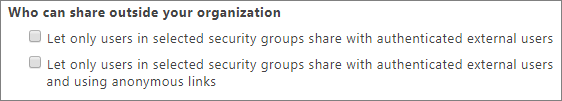

#  Microsoft 365 guest sharing settings

## Azure Active Directory

Azure Active Directory is the directory service used by  Microsoft 365. The Azure Active Directory Organizational relationships settings directly affect sharing in Teams, Office 365 Groups, SharePoint, and OneDrive.

> [!NOTE]
> These settings only affect SharePoint when [SharePoint and OneDrive integration with Azure AD B2B (Preview)](https://docs.microsoft.com/sharepoint/sharepoint-azureb2b-integration-preview) has been configured.

**Navigation:** [Azure Active Directory admin center](https://aad.portal.azure.com) > Azure Active Directory > Organizational relationships > Settings

|**Setting**|**Default**|**Description**|
|:-----|:-----|:-----|
|Guest users permissions are limited|Yes|This setting affects the directory tasks that a guest can perform. It does not affect guests in  Microsoft 365|
|Admins and users in the guest inviter role can invite|Yes|When set to **Yes**, admins can invite guests via Azure AD and via  Microsoft 365 sharing experiences such as Teams and SharePoint; when set to **No**, they cannot.    Microsoft 365 does not use the guest inviter role, so non-admin members of the guest inviter role can only invite guests via Azure AD.|
|Members can invite|Yes|When set to **Yes**, members in Azure AD can invite guests via Azure AD; when set to **No**, they cannot. This setting does not affect  Microsoft 365 guest invitation experiences such as Teams and SharePoint. Note that **members** refers to members in Azure AD (as opposed to guests) and not to site or gorup members in  Microsoft 365.  This is identical to the **Let users add new guests to the organization** setting in the  Microsoft 365 admin center.|
|Guests can invite|Yes|INFO NEEDED|
|Enable Email One-Time Passcode for guests (Preview)|No|When set to **Yes**, guests without an MSA or a work or school account can [authenticate with Azure AD using a one-time passcode](https://docs.microsoft.com/azure/active-directory/b2b/one-time-passcode); when set to **No**, users will need to create a Microsoft account in order to authenticate. This setting must be set to **Yes** for [SharePoint and OneDrive integration with Azure AD B2B (Preview)](https://docs.microsoft.com/sharepoint/sharepoint-azureb2b-integration-preview) to work.|
|Collaboration restrictions|Allow invitations to be sent to any domain|This setting allows you to specify a list of allowed or blocked domains for sharing. When allowed domains are specified, then sharing invitations can only be sent to those domains. When denied domains are specified, then sharing invitations cannot be sent to those domains.  This setting affects  Microsoft 365 sharing experiences such as Teams and SharePoint. You can allow or block domains at a more granular level by using domain filtering in SharePoint or Teams.|

These settings affect how users are invited to the directory. They do not affect sharing with guests who are already in the directory.

##  Microsoft 365

|**Setting**|**Default**|**Description**|
|:-----|:-----|:-----|
|Let users add new guests to the organization|On| |

|**Setting**|**Default**|**Description**|
|:-----|:-----|:-----|
|Let group members outside your organization access group content|On| |
|Let group owners add people outside your organization to groups|On| |

## Teams

|**Setting**|**Default**|**Description**|
|:-----|:-----|:-----|
|Allow guest access in Teams|Off| |

|**Setting**|**Default**|**Description**|
|:-----|:-----|:-----|
|Make private calls|On| |

|**Setting**|**Default**|**Description**|
|:-----|:-----|:-----|
|Allow IP video|On| |
|Screen sharing mode|Entire screen| |
|Allow Meet Now|On| |

|**Setting**|**Default**|**Description**|
|:-----|:-----|:-----|
|Edit sent messages|On| |
|Delete sent messages|On| |
|Chat|On| |
|Use Giphys in conversations|On| |
|Giphy content rating|Moderate| |
|Use Memes in conversations|On| |
|User stickers in conversations|On| |
|Allow immersive reader for viewing messages|On| |

## SharePoint and OneDrive

|**Setting**|**Default**|**Description**|
|:-----|:-----|:-----|
|SharePoint|Anyone| |
|OneDrive|Anyone| |

|**Setting**|**Default**|**Description**|
|:-----|:-----|:-----|
|Limit external sharing by domain|Off| |
|Guests must sign in using the same account to which sharing invitations are sent|Off| |
|Allow guests to share items they don't own|On| |

|**Setting**|**Default**|**Description**|
|:-----|:-----|:-----|
|File and folder links|Anyone with the link| |
|These links must expire within this many days|Off (no expiration)| |
|File permssions|View and edit| |
|Folder permissions|View, edit, and upload| |

|**Setting**|**Default**|**Description**|
|:-----|:-----|:-----|
|Let only users in selected security groups share with authenticated external users|Off| |
|Let only users in selected security groups share with authenticated external users and using anonymous links|Off| |

|**Setting**|**Default**|**Description**|
|:-----|:-----|:-----|
|Site content can be shared with| | |

## See also

|**Setting**|**Default**|**Description**|
|:-----|:-----|:-----|
| | | |

[External sharing overview](https://docs.microsoft.com/sharepoint/external-sharing-overview)