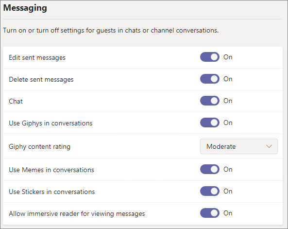

#  Microsoft 365 guest sharing settings

## Azure Active Directory

**Admin role:** Global administrator

Azure Active Directory is the directory service used by  Microsoft 365. The Azure Active Directory Organizational relationships settings directly affect sharing in Teams, Office 365 Groups, SharePoint, and OneDrive.

> [!NOTE]
> These settings only affect SharePoint when [SharePoint and OneDrive integration with Azure AD B2B (Preview)](https://docs.microsoft.com/sharepoint/sharepoint-azureb2b-integration-preview) has been configured.

### Organizational relationships settings

**Navigation:** [Azure Active Directory admin center](https://aad.portal.azure.com) > Azure Active Directory > Organizational relationships > Settings

|**Setting**|**Default**|**Description**|
|:-----|:-----|:-----|
|Guest users permissions are limited|Yes|This setting affects the directory tasks that a guest can perform. It does not affect guests in  Microsoft 365|
|Admins and users in the guest inviter role can invite|Yes|When set to **Yes**, admins can invite guests via Azure AD and via  Microsoft 365 sharing experiences such as Teams and SharePoint; when set to **No**, they cannot.    Microsoft 365 does not use the guest inviter role, so non-admin members of the guest inviter role can only invite guests via Azure AD.|
|Members can invite|Yes|When set to **Yes**, members in Azure AD can invite guests via Azure AD; when set to **No**, they cannot. This setting does not affect  Microsoft 365 guest invitation experiences such as Teams and SharePoint. Note that **members** refers to members in Azure AD (as opposed to guests) and not to site or gorup members in  Microsoft 365.  This is identical to the **Let users add new guests to the organization** setting in the  Microsoft 365 admin center.|
|Guests can invite|Yes|INFO NEEDED|
|Enable Email One-Time Passcode for guests (Preview)|No|When set to **Yes**, guests without an MSA or a work or school account can [authenticate with Azure AD using a one-time passcode](https://docs.microsoft.com/azure/active-directory/b2b/one-time-passcode); when set to **No**, users will need to create a Microsoft account in order to authenticate. This setting must be set to **Yes** for [SharePoint and OneDrive integration with Azure AD B2B (Preview)](https://docs.microsoft.com/sharepoint/sharepoint-azureb2b-integration-preview) to work.|
|Collaboration restrictions|Allow invitations to be sent to any domain|This setting allows you to specify a list of allowed or blocked domains for sharing. When allowed domains are specified, then sharing invitations can only be sent to those domains. When denied domains are specified, then sharing invitations cannot be sent to those domains.  This setting affects  Microsoft 365 sharing experiences such as Teams and SharePoint. You can allow or block domains at a more granular level by using domain filtering in SharePoint or Teams.|

These settings affect how users are invited to the directory. They do not affect sharing with guests who are already in the directory.

##  Microsoft 365

**Admin role:** Global administrator

The Microsoft 365 admin center has organization-level settings for sharing and for Office 365 Groups.

### Sharing

**Navigation:** [Microsoft 365 admin center](https://admin.microsoft.com) > Settings > Security & privacy > Sharing

|**Setting**|**Default**|**Description**|
|:-----|:-----|:-----|
|Let users add new guests to the organization|On|When set to **On**, members in Azure AD can invite guests via Azure AD; when set to **Off**, they cannot. This setting does not affect  Microsoft 365 guest invitation experiences such as Teams and SharePoint. Note that **members** refers to members in Azure AD (as opposed to guests) and not to site or gorup members in  Microsoft 365.  This is identical to the **Members can invite** setting in Azure Active Directory Organizational relationships settings.|

### Office 365 Groups

**Navigation:** [Microsoft 365 admin center](https://admin.microsoft.com) > Settings > Services & add-ins > Office 365 Groups

|**Setting**|**Default**|**Description**|
|:-----|:-----|:-----|
|Let group members outside your organization access group content|On|When set to **On**, guests can access groups content; when set to **Off**, they can't. This setting should be **On** for any scenario where guest users are interacting with Office 365 Groups or Teams.|
|Let group owners add people outside your organization to groups|On|When **On**, Owners of Office 365 Groups or Teams can invite new guests to the group. When **Off**, owners can only invite guests who are already in the directory.|

## Teams

**Admin role:** Teams service administrator

### Guest access

**Navigation:** [Teams admin center](https://admin.teams.microsoft.com) > Org-wide settings > Guest access

|**Setting**|**Default**|**Description**|
|:-----|:-----|:-----|
|Allow guest access in Teams|Off| |

### Guest calling

**Navigation:** [Teams admin center](https://admin.teams.microsoft.com) > Org-wide settings > Guest access

|**Setting**|**Default**|**Description**|
|:-----|:-----|:-----|
|Make private calls|On| |

### Guest meeting

**Navigation:** [Teams admin center](https://admin.teams.microsoft.com) > Org-wide settings > Guest access

|**Setting**|**Default**|**Description**|
|:-----|:-----|:-----|
|Allow IP video|On| |
|Screen sharing mode|Entire screen| |
|Allow Meet Now|On| |

### Guest messaging

**Navigation:** [Teams admin center](https://admin.teams.microsoft.com) > Org-wide settings > Guest access

|**Setting**|**Default**|**Description**|
|:-----|:-----|:-----|
|Edit sent messages|On| |
|Delete sent messages|On| |
|Chat|On| |
|Use Giphys in conversations|On| |
|Giphy content rating|Moderate| |
|Use Memes in conversations|On| |
|User stickers in conversations|On| |
|Allow immersive reader for viewing messages|On| |

## SharePoint and OneDrive (organization-level)

**Admin role:** SharePoint administrator

These settings affect all of the sites in the organization.

### SharePoint and OneDrive sharing settings

**Navigation:** SharePoint admin center > Sharing

|**Setting**|**Default**|**Description**|
|:-----|:-----|:-----|
|SharePoint|Anyone|The most permissive sharing permissions allowed for SharePoint sites.|
|OneDrive|Anyone|The most permissive sharing permissions for OneDrive sites. This setting cannot be more permissive than the SharePoint setting.|

### SharePoint and OneDrive advanced sharing settings

**Navigation:** SharePoint admin center > Sharing

|**Setting**|**Default**|**Description**|
|:-----|:-----|:-----|
|Limit external sharing by domain|Off|This setting allows you to specify a list of allowed or blocked domains for sharing. When allowed domains are specified, then sharing invitations can only be sent to those domains. When denied domains are specified, then sharing invitations cannot be sent to those domains.  This setting affects all SharePoint and OneDrive sites in the organization.|
|Guests must sign in using the same account to which sharing invitations are sent|Off|Prevents guests from redeeming sharing invitations using a different email address than the invitation was sent to.|
|Allow guests to share items they don't own|On|When **On**, guests can share items that they don't own with other users or guests.|

### SharePoint and OneDrive file and folder link settings

**Navigation:** SharePoint admin center > Sharing

|**Setting**|**Default**|**Description**|
|:-----|:-----|:-----|
|File and folder links|Anyone with the link|Specifies which sharing link is shown by default when a user shares a file or folder. Users can change the option before sharing if they want. If the default is set to **Anyone with the link** and *Anyone* sharing is not allowed for a given site, then **Only people in your organization** will be shown as the default for that site.|
|These links must expire within this many days|Off (no expiration)|Specifies the number of days after an *Anyone* link is created that it expires. Expired links cannot be renewed. Create a new link if you need to continue sharing past the expiration.|
|File permssions|View and edit|Specifies the file permission levels available to users when creating an *Anyone* link. If **View** is selected, then users can only create *Anyone* file links with view permissions. If **View, and edit** is selected, then users can choose between view and view and edit permissions when they creat the link.|
|Folder permissions|View, edit, and upload|Specifies the folder permission levels available to users when creating an *Anyone* link. If **View** is selected, then users can only create *Anyone* folder links with view permissions. If **View, edit, and upload** is selected, then users can choose between view and view, edit, and upload permissions when they creat the link.|

### SharePoint and OneDrive security group settings

**Navigation:** SharePoint admin center > Sharing > Limit external sharing to specific security groups

|**Setting**|**Default**|**Description**|
|:-----|:-----|:-----|
|Let only users in selected security groups share with authenticated external users|Off|When **On**, only the people in the specified security groups can share with external users. Only *Specific people* links are available. *Anyone* sharing is effectively disabled unless **Let only users in selected security groups share with authenticated external users and using anonymous links** is also **On**|
|Let only users in selected security groups share with authenticated external users and using anonymous links|Off|When **On**, only the people in the specified security groups can share with guests. Both *Anyone* and *Specific people* links are available.|

Both of these settings can be used at the same time. If a user is in security groups specified for both settings, then the greater permission level prevails (*Anyone* plus *Specific user*).

## SharePoint (site level)

**Admin role:** SharePoint administrator

### Site sharing

**Navigation:** SharePoint admin center > Active sites > click the site > External sharing

|**Setting**|**Default**|**Description**|
|:-----|:-----|:-----|
|Site content can be shared with|Varies by site type (see the table below)|Indicates the type of external shaing allowed for this site. Options available here are subject to the organization-level sharing settings for SharePoint.|

Because these settings are subject to the organization-wide settings for SharePoint, the effective sharing setting for the site may change if the organization-level setting changes. If you choose a setting here and the organization-level is later set to a more restrictive value, then this site will operate at that more restrictive value. For example, if you choose **Anyone** and the organization-level setting is later set to **New and existing guests**, then this site will only allow new and existing guests. If the organization-level setting is then set back to **Anyone**, then this site would again allow *Anyone* links.

The table below shows the default sharing setting for each site type.

|**Site type**|**Default sharing setting**|
|:-----|:-----|
|Classic|**Only people in your organization**|
|OneDrive|**Anyone**|
|Group-connected sites (including Teams)|**New and existing guests** if the Office 365 Groups setting **Let group owners add people outside the organization to groups** is **On**; otherwise **Existing guests only**|
|Communication|**Only people in your organization**|
|Modern sites with no group (#STS3 TeamSite)|**Only people in your organization**|

## See also

|**Setting**|**Default**|**Description**|
|:-----|:-----|:-----|
| | | |

[External sharing overview](https://docs.microsoft.com/sharepoint/external-sharing-overview)