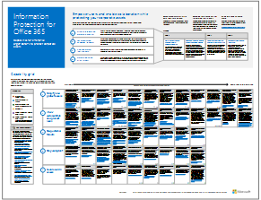
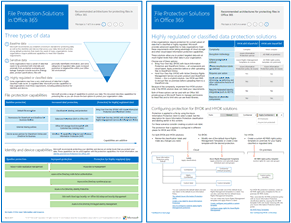

# Microsoft Cloud IT architecture resources

 **Summary:** Learn about Microsoft cloud services and platforms. Review our enterprise cloud roadmap, explore our cloud architecture series, and more.
  
These architecture tools and posters give you information about Microsoft cloud services and platforms, including Office 365, Microsoft Azure, Microsoft Intune, Microsoft Dynamics 365, private cloud datacenter, and hybrid on-premises and cloud solutions. IT decision makers and architects can use these resources to determine the ideal solutions for their workloads and to make decisions about core infrastructure components such as identity and security. 
  
- **[Microsoft's Enterprise Cloud Roadmap](microsoft-cloud-it-architecture-resources.md#roadmap)** (Sway)
    
- **[Microsoft Cloud for Enterprise Architects Series](microsoft-cloud-it-architecture-resources.md#cloudarch)** 
    - [Microsoft Cloud Services and Platform Options](microsoft-cloud-it-architecture-resources.md#platformoptions)
    - [Microsoft Cloud Identity for Enterprise Architects](microsoft-cloud-it-architecture-resources.md#identity)
    - [Microsoft Cloud Security for Enterprise Architects](microsoft-cloud-it-architecture-resources.md#security)
    - [Microsoft Cloud Networking for Enterprise Architects](microsoft-cloud-it-architecture-resources.md#networking)
    - [Microsoft Mobility and Security for Enterprise Architects](microsoft-cloud-it-architecture-resources.md#mobility)
    - [Microsoft Cloud Storage for Enterprise Architects](microsoft-cloud-it-architecture-resources.md#storage)
    - [Microsoft Hybrid Cloud for Enterprise Architects](microsoft-cloud-it-architecture-resources.md#hybrid)
    - [Contoso in the Microsoft Cloud](microsoft-cloud-it-architecture-resources.md#contoso)
    - [Common attacks and Microsoft capabilities that protect your organizaion](#common-attacks-and-microsoft-capabilities-that-protect-your-organization)
    
- **[Office 365 Enterprise Solution Series](microsoft-cloud-it-architecture-resources.md#BKMK_o365solutions)**:
    - [Information Protection for Office 365](microsoft-cloud-it-architecture-resources.md#BKMK_infoprotect)
    - [Identity and Device Protection for Office 365](microsoft-cloud-it-architecture-resources.md#BKMK_O365IDP)
    - [File Protection Solutions in Office 365](microsoft-cloud-it-architecture-resources.md#BKMK_O365fileprotect)
    - [Change Management for Office 365 Clients](microsoft-cloud-it-architecture-resources.md#changemgmt)
    - [Deploy a modern and secure desktop with Microsoft](microsoft-cloud-it-architecture-resources.md#msd)
    
> [!TIP]
> Most of the posters on this page are available in multiple languages, including Chinese, English, French, German, Italian, Japanese, Korean, Portuguese, Russian, and Spanish. To download a poster in one of these languages, click the **More languages** link for that poster.
  
Let us know what you think! Send us email at [cloudadopt@microsoft.com](mailto:cloudadopt@microsoft.com). 
  

## Microsoft's Enterprise Cloud Roadmap

See the posters, icon sets, community venues, and other resources that describe the industry's most complete cloud solution.
  
|**Item**|**Description**|
|:-----|:-----|
|[          ](https://aka.ms/cloudarchitecture)   [Microsoft's Enterprise Cloud Roadmap](https://aka.ms/cloudarchitecture) (https://aka.ms/cloudarchitecture)   |Swipe through this Sway experience for the resources that describe the industry's most complete cloud solution.    |
   

## Microsoft Cloud for Enterprise Architects Series

These cloud architecture posters give you information about Microsoft cloud services and platforms, including Office 365, Microsoft Azure, Microsoft Intune, Microsoft Dynamics CRM Online, private cloud datacenter, and hybrid on-premises and cloud solutions. IT decision makers and architects can use these resources to determine the ideal solutions for their workloads and to make decisions about core infrastructure components such as identity and security.
  

### Microsoft Cloud Services and Platform Options

Learn key differences between Microsoft cloud services and platform offerings. Find the best fit for your solution.
  
|**Item**|**Description**|
|:-----|:-----|
|[          ](https://www.microsoft.com/download/details.aspx?id=54432)   [PDF](https://go.microsoft.com/fwlink/p/?LinkId=524731)  \| [Visio](https://go.microsoft.com/fwlink/p/?LinkId=524732)  \| [More languages](https://www.microsoft.com/download/details.aspx?id=54432)   | This model describes: <ul><li>  Software as a Service (SaaS) offerings, including Office 365 </li><li>  Platform as a Service (PaaS) features in Microsoft Azure </li><li>  Infrastructure as a Service (IaaS) features in Microsoft Azure </li><li>  Private cloud datacenter capabilities using Windows Server and System Center </li><li>  Learn how Microsoft's own IT department is migrating to these cloud services and building its hybrid cloud. </li></ul> |
   

### Microsoft Cloud Identity for Enterprise Architects

What IT architects need to know about designing identity for organizations using Microsoft cloud services and platforms.
  
|**Item**|**Description**|
|:-----|:-----|
|[          ](https://www.microsoft.com/download/details.aspx?id=54431)   [PDF](https://go.microsoft.com/fwlink/p/?LinkId=524586)  \| [Visio](https://download.microsoft.com/download/2/3/8/238228E6-9017-4F6C-BD3C-5559E6708F82/MSFT_cloud_architecture_identity.vsd)           \| [Article](https://technet.microsoft.com/library/mt613459.aspx)   [More languages](https://www.microsoft.com/download/details.aspx?id=54431)   | This model contains: <ul><li>Introduction to identity with Microsoft’s cloud </li> <li>Azure AD IDaaS capabilities </li><li>Integrating on-premises Active Directory Domain Services accounts with Microsoft Azure Active Directory </li> <li>Putting directory components in Azure </li><li>Domain services options for workloads in Azure IaaS </li></ul>  |
   

### Microsoft Cloud Security for Enterprise Architects

What IT architects need to know about security in Microsoft cloud services and platforms.
  
|**Item**|**Description**|
|:-----|:-----|
|[          ](https://www.microsoft.com/download/details.aspx?id=48121)   [PDF](https://go.microsoft.com/fwlink/p/?linkid=842070)  \| [Visio](https://go.microsoft.com/fwlink/p/?LinkId=842071)  \| [More languages](https://www.microsoft.com/download/details.aspx?id=48121)   | This model contains: <ul><li>Microsoft's role in providing secure services and platforms</li><li>Customer responsibilities to mitigate security risks</li><li>Top security certifications </li><li>Security offerings provided by Microsoft consulting services </ul></li>Take [Security in a Cloud-Enabled World](https://mva.microsoft.com/training-courses/security-in-a-cloudenabled-world-12725?l=CfLHobAcB_3904300474), a Microsoft Virtual Academy course based on this architecture poster.  |
   

### Microsoft Cloud Networking for Enterprise Architects

What IT architects need to know about networking for Microsoft cloud services and platforms.
  
|**Item**|**Description**|
|:-----|:-----|
|[          ](https://www.microsoft.com/download/details.aspx?id=54425)   [PDF](https://go.microsoft.com/fwlink/p/?linkid=842073)  \| [Visio](https://go.microsoft.com/fwlink/p/?linkid=842074)           \| [Article](https://technet.microsoft.com/library/mt733214.aspx)  [More languages](https://www.microsoft.com/download/details.aspx?id=54425)   | This model contains the following pages: <ul><li> **Evolving your network for cloud connectivity** Cloud migration changes the volume and nature of traffic flows within and outside a corporate network. It also affects approaches to mitigating security risk. </li><li> **Common elements of Microsoft cloud connectivity** Integrating your networking with the Microsoft cloud provides optimal access to a broad range of services. </li><li> **ExpressRoute for Microsoft cloud connectivity** ExpressRoute provides a private, dedicated, high-throughput network connection to Microsoft's cloud. </li><li> **Designing networking for Microsoft SaaS (Office 365, Microsoft Intune, and Dynamics CRM Online)** Optimizing your network for Microsoft SaaS services requires careful analysis of your Internet edge, your client devices, and typical IT operations. </li><li> **Designing networking for Azure PaaS** Optimizing networking for Azure PaaS apps requires adequate Internet bandwidth and can require the distribution of network traffic across multiple sites or apps. </li><li> **Designing networking for Azure IaaS** Step through the design process to create an optimal Azure virtual network (VNet) for hosting server-based IT workloads, including subnets, address spaces, routing, DNS, load balancing, and connectivity to your on-premises network, other VNets, and the Internet. </li></ul>   Take [Optimize Your Network for Microsoft Cloud Offerings](https://aka.ms/optimizecloudnetworkingmva), a new Microsoft Virtual Academy course based on this architecture poster.   |
   

### Microsoft Mobility and Security for Enterprise Architects

What IT architects need to know about mobility with Microsoft cloud services and platforms.
  
|**Item**|**Description**|
|:-----|:-----|
|[          ](https://www.microsoft.com/download/details.aspx?id=55023)   [PDF](https://go.microsoft.com/fwlink/p/?linkid=842076)  \| [Visio](https://go.microsoft.com/fwlink/p/?linkid=842077)  \| [More languages](https://www.microsoft.com/download/details.aspx?id=55023)   | This model contains: <ul><li>Top mobile apps for business </li><li>Platform, services, and resources for developing mobile apps </li><li>Managing access to cloud-based applications and data from mobile devices </li><li>Comparison of capabilities and platform support for Office 365 MDM, Azure Active Directory Premium, and Intune </li></ul>  |
   

### Microsoft Cloud Storage for Enterprise Architects

What IT architects need to know about storage options in Microsoft cloud services and platforms.
  
|**Item**|**Description**|
|:-----|:-----|
|[          ](https://www.microsoft.com/download/details.aspx?id=49552)   [PDF](https://go.microsoft.com/fwlink/p/?linkid=842079)  \| [Visio](https://go.microsoft.com/fwlink/p/?linkid=842080)           \| [Article](hhttps://technet.microsoft.com/library/mt842597.aspx)  [More languages](https://www.microsoft.com/download/details.aspx?id=49552)   | This model contains: <ul><li>Reasons for using cloud storage and the key scenarios </li><li>Cloud storage options that are bundled with existing services </li><li>Storage options that you can use as a starting point for your storage solution </li><li>Storage building blocks to create your own storage solution or storage for your apps</li></ul> |
   

### Microsoft Hybrid Cloud for Enterprise Architects

What IT architects need to know about hybrid cloud for Microsoft services and platforms.
  
|**Item**|**Description**|
|:-----|:-----|
|[          ](https://www.microsoft.com/download/details.aspx?id=54424)   [PDF](https://go.microsoft.com/fwlink/p/?linkid=842082)  \| [Visio](https://go.microsoft.com/fwlink/p/?linkid=842083)           \| [Article](https://technet.microsoft.com/library/mt750500.aspx)  [More languages](https://www.microsoft.com/download/details.aspx?id=54424)   | This model contains the following pages: <ul><li> **Hybrid cloud overview** Microsoft's cloud offerings (SaaS, Azure PaaS, and Azure IaaS) and their common elements. </li><li> **Architecture of Microsoft hybrid cloud scenarios** An architectural diagram of hybrid cloud for Microsoft's cloud offerings, showing the common layers of on-premises infrastructure, networking, and identity. </li><li> **Hybrid cloud scenarios for Microsoft SaaS (Office 365)** The SaaS hybrid scenario architecture and descriptions of key hybrid configurations for Skype for Business, SharePoint Server, and Exchange Server. </li><li> **Hybrid cloud scenarios for Azure PaaS** The Azure PaaS hybrid scenario architecture, the description of an Azure PaaS hybrid application with an example, and the description of SQL Server 2016 Stretch Database. </li><li> **Hybrid cloud scenarios for Azure IaaS** The Azure IaaS hybrid scenario architecture and the description of a line of business (LOB) application hosted in Azure IaaS. </li></ul> |
   

### Contoso in the Microsoft Cloud

How a fictional but representative global organization has implemented Microsoft's cloud offerings, including Office 365, Azure, Dynamics 365, and Intune.
  
|**Item**|**Description**|
|:-----|:-----|
|[          ](https://www.microsoft.com/download/details.aspx?id=54427)   [PDF](https://go.microsoft.com/fwlink/p/?linkid=842085)  \| [Visio](https://go.microsoft.com/fwlink/p/?linkid=842086)           \| [Article](https://technet.microsoft.com/library/mt775341.aspx)  [More languages](https://www.microsoft.com/download/details.aspx?id=54427)   |This model contains: <ul><li>Overview of the Contoso Corporation </li><li>Contoso's IT infrastructure and needs </li><li>Cloud networking for Contoso</li><li>Cloud identity for Contoso</li><li>Contoso's subscriptions, licenses, and user accounts</li><li>Cloud security for Contoso</li><li>Enterprise cloud scenarios for Contoso</li></ul>  |
   

### Common attacks and Microsoft capabilities that protect your organization
Learn about the most common cyber attacks and how Microsoft can help your organization at every stage of an attack. 

|**Item**|**Description**|
|:-----|:-----|
|   [PDF](http://download.microsoft.com/download/F/A/C/FACFC1E9-FA35-4DF1-943C-8D4237B4275B/MSFT_Cloud_architecture_security_commonattacks.pdf) \| [Visio](http://download.microsoft.com/download/F/A/C/FACFC1E9-FA35-4DF1-943C-8D4237B4275B/MSFT_Cloud_architecture_security_commonattacks.vsdx)   | This poster illustrates the path of common attacks and describes which capabilities help stop attackers at each stage of an attack.  |

### The Santa Cloud

How Santa and his elves use Microsoft's cloud offerings to make their annual deliveries.
  
|**Item**|**Description**|
|:-----|:-----|
|[          ](https://www.microsoft.com/download/details.aspx?id=55039)   [PDF](https://go.microsoft.com/fwlink/p/?linkid=842088)   |To determine who is naughty and nice and the presents to deliver on December 24, Santa Claus and his elfin IT department use Office 365, Azure, Dynamics 365, and Intune.   |
   

## Office 365 Enterprise Solution Series

The Office 365 enterprise solution series provides guidance for implementing Office 365 capabilities, especially where capabilities cross technologies.
  

### Information Protection for Office 365

Capabilities for enterprise organizations to protect corporate assets.
  
|**Item**|**Description**|
|:-----|:-----|
|[          ](https://www.microsoft.com/download/details.aspx?id=54429)   [PDF](http://download.microsoft.com/download/2/3/D/23D91386-8349-4F7A-9470-FD5AED861F16/MSFT_cloud_architecture_informationprotection.pdf)  \| [Visio](http://download.microsoft.com/download/2/3/D/23D91386-8349-4F7A-9470-FD5AED861F16/MSFT_cloud_architecture_informationprotection.vsd)  \| [More languages](https://www.microsoft.com/download/details.aspx?id=54429)   |Microsoft provides the most complete set of capabilities to protect your corporate assets. This model helps organizations take a methodical approach when planning which capabilities to implement.   |
   

### Identity and Device Protection for Office 365

Recommended capabilities for protecting identities and devices that access Office 365, other SaaS services, and on-premises applications published with Azure AD Application Proxy.
  
|**Item**|**Description**|
|:-----|:-----|
|[          ](https://www.microsoft.com/download/details.aspx?id=55032)   [PDF](https://go.microsoft.com/fwlink/p/?linkid=841656)  \| [Visio](https://go.microsoft.com/fwlink/p/?linkid=841657)  \| [More languages](https://www.microsoft.com/download/details.aspx?id=55032)   |It's important to use consistent levels of protection across your data, identities, and devices. This document shows you which capabilities are comparable with more information on capabilities to protect identities and devices.    |
   

### File Protection Solutions in Office 365

Recommended capabilities for protecting files in Office 365 based on three different sensitivity levels.
  
|**Item**|**Description**|
|:-----|:-----|
|[          ](https://www.microsoft.com/download/details.aspx?id=55523)   [PDF](http://download.microsoft.com/download/7/8/9/789645A5-BD10-4541-BC33-F8D1EFF5E911/MSFT_cloud_architecture_O365 file protection.pdf)  \| [Visio](http://download.microsoft.com/download/7/8/9/789645A5-BD10-4541-BC33-F8D1EFF5E911/MSFT_cloud_architecture_O365%20file%20protection.vsdx)   |It's important to use consistent levels of protection across your data, identities, and devices. This document shows you which capabilities are comparable with more information on capabilities to protect files in Office 365.    |
   

### Change Management for Office 365 Clients

What IT architects need to know about managing releases for the Office 365 client applications and Windows 10. 
  
|**Item**|**Description**|
|:-----|:-----|
|[          ](https://www.microsoft.com/download/details.aspx?id=49141)   [PDF](https://go.microsoft.com/fwlink/p/?LinkId=626681)  \| [Visio](https://go.microsoft.com/fwlink/p/?LinkId=626680)           \| [Article](https://technet.microsoft.com/library/mt584223.aspx)  [More languages](https://www.microsoft.com/download/details.aspx?id=49141)   | This model contains: <ul><li>The servicing model for Windows 10 and the Office 365 client applications </li><li>  Release Options </li><li>  Release Cadences </li><li>  Types of Changes </li><li>  Roles and Responsibilities </li><li>  Manage Update Deployments </li></ul>   View the information in article form: [Change management for Office 365 clients](http://technet.microsoft.com/library/815fa1aa-0355-40b5-b7bc-cdf7d4610062.aspx).    |
   

### Deploy a modern and secure desktop with Microsoft

What IT architects need to know about deploying and managing updates for Office 365 ProPlus on Windows 10.
  
|**Item**|**Description**|
|:-----|:-----|
|[          ](https://www.microsoft.com/download/details.aspx?id=55987)   [PDF](http://download.microsoft.com/download/4/E/9/4E90E227-770A-41D1-99FE-925A64D81A55/MSFT_modern_secure_desktop.pdf)  \| [Visio](http://download.microsoft.com/download/4/E/9/4E90E227-770A-41D1-99FE-925A64D81A55/MSFT_modern_secure_desktop.vsdx)   | This model contains: <ul><li>  Deploying Windows 10 and Office ProPlus from the Microsoft cloud </li><li>  Deploying Windows 10 and Office ProPlus with System Center Configuration Manager </li><li>  Managing updates for Windows 10 and Office ProPlus from the Microsoft cloud </li><li>  Managing updates for Windows 10 and Office ProPlus with System Center Configuration Manager </li><li>  Out-of-the-box and additional protection capabilities of Windows 10 </li></ul>  |
   
## See Also

[Architectural models for SharePoint, Exchange, Skype for Business, and Lync](architectural-models-for-sharepoint-exchange-skype-for-business-and-lync.md)
  
[Cloud adoption Test Lab Guides (TLGs)](cloud-adoption-test-lab-guides-tlgs.md)
  
[Security solutions](security-solutions.md)
  
[Hybrid solutions](hybrid-solutions.md)

