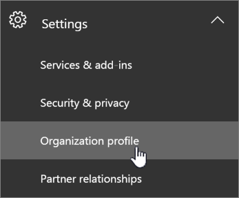
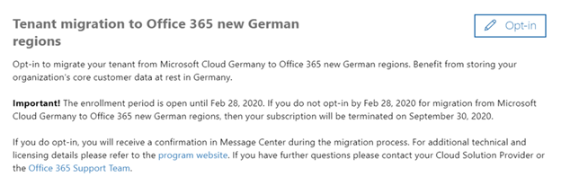
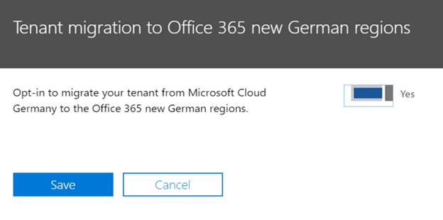

## Microsoft Cloud Germany: Opt-in for migration

>[!Note]
>The information on this page only applies to Office 365 customers with service provisioned in Microsoft Cloud Germany.
>

## When can I request a move?

All customers with service provisioned in Microsoft Cloud Germany are eligible to request migration from Microsoft Cloud Germany to the Office 365 new German regions.  The enrollment period is open from August 28, 2019 through February 28, 2020.

## How to request migration

Customers with service provisioned in Microsoft Cloud Germany will see a page in Admin Center which will allow a customer tenant administrator to opt-in for migration.  Partners with administration on behalf privileges also are eligible to opt-in their customers for migration.

To access the page in the Microsoft 365 Admin Center, in the navigation pane on the left, expand **Settings** and then click **Organization Profile**.

 

On the **Organization Profile** page, scroll down to the **Tenant migration to Office 365 new German regions** section.

 

If your organization wishes to migrate service from Microsoft Cloud Germany to the Office 365 new German regions then click **Opt-in** on the top right of the section. 

A new section will appear on the right side of your screen to accept your confirmation. Select the toggle button next to the text that says **Opt-in to migrate your tenant from Microsoft Cloud Germany to the Office 365 new German regions**, and then click **Save**.

 
 
Once an administrator has opted-in on behalf of your tenant then all administrators will see the text on the **Tenant migration to Office 365 new German regions** section change to indicate **Your organization has chosen to migrate your tenant from Microsoft Cloud Germany to the Office 365 new German regions** along with the date of the opt-in. You will also have a confirmation message in your message center. This confirms that you have successfully requested a move.

 
## What happens after opting-in for migration?

Microsoft will send updates throughout the migration process in Message Center.
