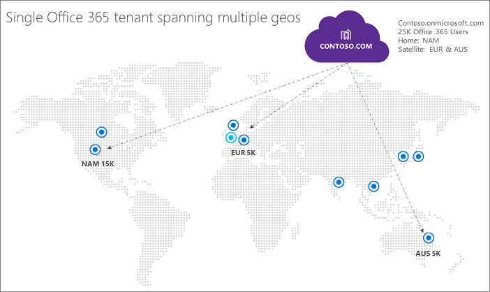

# Multi-Geo Capabilities in OneDrive and SharePoint Online in Office 365

With multi-geo capabilities in OneDrive and SharePoint Online, your organization can expand its Office 365 presence to multiple geographic regions and/or countries within your existing tenant. This feature is currently in preview. Reach out to your Microsoft Account Team to sign up your Multi-National Company for the OneDrive Multi-Geo preview.
  
With OneDrive Multi-Geo, you can provision and store data-at-rest in the geo locations that you've chosen to meet data residency requirements, and at the same time unlock your global roll out of modern productivity experiences to your workforce.
  
Here's how multi-geo features can benefit your organization:
  
- Operate as one global connected organization with a single Office 365 tenant spanning multiple geo locations.
    
- Meet data residency requirements by creating and hosting data-at-rest within a specified geo location.
    
- Empower your satellite users with the same modern productivity experiences enjoyed by your central location users.
    
- Enable your users to move across geo locations as their role changes, while access to their content is kept intact.
    
- Tailor your sharing policies per geo location and data loss prevention policies per site.
    
- Designate eDiscovery managers per geo location and allow governing cases tailored to your geo location.
    
- Choose unique URL namespaces (for example, ContosoEUR.sharepoint.com) for your additional geo locations.
    
- Consolidate your regional on-premises data into your Office 365 multi-geo tenant.
    
For more information, and to see a demonstration, see [Introducing Multi-Geo capabilities in Office 365 and how to configure them](https://youtu.be/3d9-Vt2fArk) and the[Multi-Geo overview poster](https://technet.microsoft.com/library/dn782272.aspx).
  
In a multi-geo configuration, your Office 365 tenant consists of a central location (also known as a default location) and one or more satellite geo locations. The key concept of multi-geo is that a single tenancy will span across one multiple geo locations. In a multi-geo tenant, the information about geo locations, groups, and user information, is mastered in Azure Active Directory (AAD). Because your tenant information is mastered centrally and synchronized into each geo location, sharing and experiences involving anyone from your company contain global awareness.
  
## Sample multi-geo tenant configuration

By using a multi-geo tenant, Contoso, with a central location of North America, can expand to satellite geo locations in Europe, and Australia under the single organization umbrella of Contoso.com. Users with their preferred data location set to Europe will have their OneDrive in Europe while users with their preferred data location in North America will have their OneDrive in the US.
  

  
## Get multi-geo features in three simple steps

Configuring multi-geo is easy:
  
1. Enable your Office 365 tenant for multi-geo.
    
2. Add your satellite locations.
    
3. Configure your user accounts for the appropriate location.
    
## Multi-Geo status and availability

OneDrive Multi-Geo is currently offered in these regions and countries:
  
- Asia-Pacific
    
- Australia
    
- Canada
    
- European Union (EMEA)
    
- India
    
- Japan
    
- United Kingdom
    
- United States (North America)
    
- South Korea
    
> [!NOTE]
> India and South Korea are currently only available for customers with licenses and billing addresses in those geo locations. 
  
Upcoming geo locations:
  
- France
    
## Getting started

To get started with OneDrive for Business Multi-Geo, the fist step is to [plan your OneDrive for Business Multi-Geo environment](plan-for-multi-geo.md). Next, [learn about administering a multi-geo environment](administering-a-multi-geo-environment.md) and [how your users will experience a multi-geo environment](multi-geo-user-experience.md). When you are ready to set up OneDrive for Business Multi-Geo, [configure your tenant for multi-geo](multi-geo-tenant-configuration.md), then [move any existing OneDrive sites to thier new geo-locations](move-onedrive-between-geo-locations.md) and [set up search](configure-search-for-multi-geo.md).
