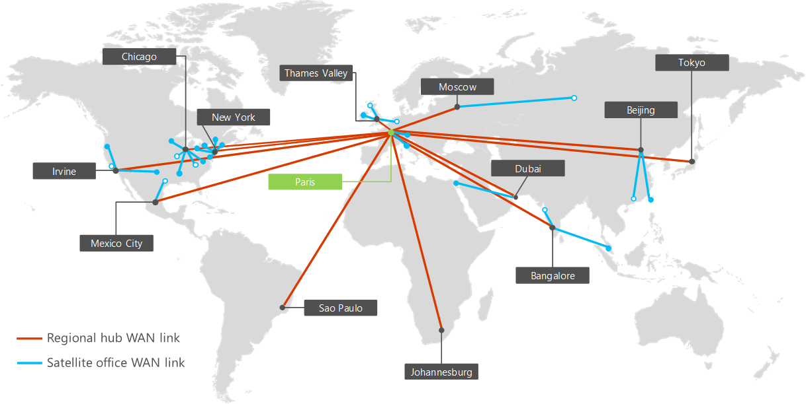

# Networking for the Contoso Corporation

 **Summary:** Understand the definition and elements of Microsoft hybrid cloud.
  
To adopt a cloud-inclusive infrastructure, Contoso's network engineers realized the fundamental shift in the way that network traffic to cloud-based services travels. Instead of only optimizing traffic to on-premises servers and datacenters, equal attention must be paid to optimizing traffic to the Internet edge and across the Internet.
  
## Contoso's networking infrastructure

Contoso has the networking infrastructure shown in Figure 1.
  
**Figure 1: Contoso's WAN infrastructure**

  
Figure 1 shows the Contoso's offices across the globe and the set of regional and satellite office WAN links between them.
  
Additional elements of their network are the following:
  
- On-premises network
    
    WAN links connect the Paris headquarters to regional offices and regional offices to satellite offices in a spoke and hub configuration. Within each office, routers deliver traffic to hosts or wireless access points on subnets, which use the private IP address space.
    
- Internet connectivity
    
    Each office has its own Internet connectivity via a proxy server. This is typically implemented as a WAN link to a local ISP that also provides public IP addresses for the proxy server.
    
- Internet presence
    
    Contoso owns the contoso.com public domain name. The Contoso public web site for ordering products is a set of servers in an Internet-connected datacenter in the Paris campus. Contoso uses a /24 public IP address range on the Internet.
    
## Contoso's app infrastructure

Contoso has architected its application and server infrastructure for the following:
  
**Figure 2: Contoso's infrastructure for internal applications**

  
- Satellite offices use local caching servers to store frequently-accessed documents and internal web sites.
    
- Regional hubs use regional application servers for the regional and satellite offices. These servers synchronize with servers in the Paris headquarters.
    
- The Paris campus has the datacenters that contain the centralized application servers that serve the entire organization.
    
For users in satellite or regional hub offices, 60% of the resources needed by employees can be served by satellite and regional hub office servers. The additional 40% of resource requests must go over the WAN link to the Paris campus.
  
## Contoso's network analysis

Here are the results of Contoso's analysis of the changes needed on their network to accommodate the different categories of Microsoft's cloud offerings:
  
|**SaaS cloud offerings: Office 365, EMS, and Dynamics 365**|**Azure PaaS: Mobile applications**|**Azure IaaS: Server-based workloads**|
|:-----|:-----|:-----|
|Successful adoption of SaaS services by users depends on highly-available and performant connectivity to the Internet, or directly to Microsoft cloud services.    For mobile users, their current Internet access is assumed to be adequate.    For users on the Contoso intranet, each office must be analyzed and optimized for throughput to the Internet and round-trip times to Microsoft's Europe datacenter hosting the Office 365, EMS, and Dynamics 365 tenants.    |To better support mobile workers, legacy apps and some file sharing sites are being reworked and deployed as Azure PaaS apps. For optimum performance, Contoso plans to deploy the new apps from multiple Azure datacenters across the world. Azure Traffic Manager to send client app requests, whether they originate from a mobile user or a computer in the office, to the nearest Azure datacenter hosting the app.     The IT department will need to add PaaS application performance and traffic distribution to their network health monitoring solution.   |To move some legacy and archival servers out of the Paris campus datacenters and add servers as needed for quarter-end processing, Contoso plans to use virtual machines running in Azure infrastructure services.    The Azure virtual networks that contain these servers must be designed for non-overlapping address spaces, routing, and integrated DNS.    The IT department must include these new servers in their network management and monitoring system.    |
   
## Contoso's use of ExpressRoute

ExpressRoute is a dedicated WAN connection from your location to a Microsoft peering location that connects your network to the Microsoft cloud network. ExpressRoute connections provide predictable performance and a 99.9% uptime SLA. .
  
With an ExpressRoute connection, you are connected to the Microsoft cloud network and all the Microsoft datacenter locations in the same continent. The traffic between the cloud peering location and the destination Microsoft datacenter is carried over the Microsoft cloud network
  
**Figure 3: The Microsoft cloud network worldwide**

  
Figure 3 shows the interconnected Microsoft cloud network for the various regions of the world.
  
With ExpressRoute Premium, you can reach any Microsoft datacenter on any continent from any Microsoft peering location on any continent. The traffic between continents is carried over the Microsoft cloud network.
  
Based on the analysis of current and future traffic to Microsoft's cloud offerings, Contoso has performed a network assessment and implemented an any-to-any (MPLS-based) ExpressRoute connection for access to Azure resources, with private and public peering relationships, from the Paris headquarters to the Microsoft peering location in Europe.
  
This connection will give Contoso's IT department:
  
- Consistent performance for administration of distributed Azure PaaS apps
    
    All of Contoso's application developers and core infrastructure IT administrators are in the Paris campus. With Azure PaaS apps distributed to different Azure datacenters around the world, Contoso needs consistent performance from the Paris campus to administer the apps and their storage resources, which consist of TB of documents.
    
- Consistent performance for administration of servers in Azure IaaS
    
    Contoso's datacenter administrators are in the Paris campus and the servers to be deployed in Azure are an extension of the Paris datacenter. Contoso needs consistent performance to these new servers for access to legacy apps and archival storage and for end-of-quarter processing.
    
## Contoso's path to cloud networking readiness

Contoso uses the following steps to ready their network for the Microsoft cloud:
  
1. Optimize employee computers for Internet access
    
    Individual computers will be checked to ensure that the latest TCP/IP stack, browser, NIC drivers, and security and operating system updates are installed.
    
2. Analyze Internet connection utilization at each office and increase as needed
    
    Each office will be analyzed for the current Internet usage and WAN link bandwidth will be increased if operating at 70% or above utilization.
    
3. Analyze DMZ systems at each office for optimal performance
    
    Firewalls, IDSs, and other systems in the Internet path will be analyzed for optimal performance. Proxy servers will be updated or upgraded as needed.
    
4. Add ExpressRoute for the Paris campus
    
    Provides consistent access to Azure resources for administration of Azure PaaS and IaaS workloads.
    
5. Create and test an Azure Traffic Manager profile for Azure PaaS apps
    
    Test an Azure Traffic Manager profile that uses the performance routing method to gain experience in distributing Internet traffic to regional locations.
    
6. Reserve private address space for Azure VNets
    
    Based on the numbers of projected short and long-term servers in Azure IaaS, reserve private address space for Azure VNets and their subnets.
    
## See Also

[Contoso in the Microsoft Cloud](contoso-in-the-microsoft-cloud.md)
  
[Microsoft Cloud IT architecture resources](microsoft-cloud-it-architecture-resources.md)

[Microsoft's Enterprise Cloud Roadmap: Resources for IT Decision Makers](https://sway.com/FJ2xsyWtkJc2taRD)

#### 

