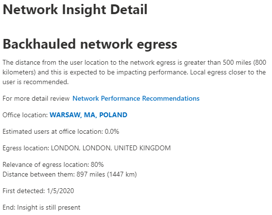
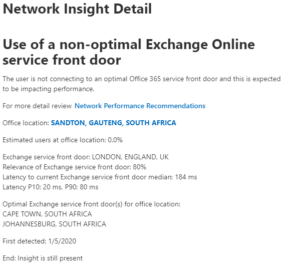

# Office 365 Network Insights (preview)

**Network Insights** are live performance metrics from your Office 365 tenant, and are displayed in the Microsoft 365 Admin Center at the following URL:

```http
https://portal.\<yourtenant\>.com/adminportal/home#/networkperformance
```

Insights are intended to help in designing network perimeters for your office locations. Each Insight provides live details about the performance characteristics for that specific area of concern.

There are five specific Network Insights that may be shown for each office location:

- [Backhauled network egress](#backhauled-network-egress)
- [Better performance detected for customers near you](#better-performance-detected-for-customers-near-you)
- [Use of a non-optimal Exchange Online service front door](#use-of-a-non-optimal-exchange-online-service-front-door)
- [Use of a non-optimal SharePoint Online service front door](#use-of-a-non-optimal-sharepoint-online-service-front-door)
- [Low download speed from SharePoint front door](#low-download-speed-from-sharepoint-front-door)

>[!IMPORTANT]
>Network performance recommendations, insights and assessments in the Microsoft 365 Admin Center is currently in preview status, and is only available for Office 365 tenants that have been enrolled in the feature preview program.

## Backhauled network egress

### Insight content

``` text
The distance from the user location to the network egress is greater than 500 miles (800 kilometers)
and this is expected to be impacting performance. Local egress closer to the user is recommended.
```

This identifies that the distance between the office location and the network egress is more than 500 miles. The office location is identified by an obfuscated client machine location and the network egress location is identified by using reverse IP Address to location databases. The office location may be inaccurate if Windows Location Services is disabled on machines. The network egress location may be inaccurate if the reverse IP Address database information is inaccurate.

Details for this Insight include the office location, the network egress location, and the distance between them.



For this Insight we would recommend network egress closer to the office location so that connectivity can route optimally to Microsoft's network on the Internet and onto Office 365 service front doors. Having close network egress to users office locations also allows for improved performance in the future as Microsoft expands both network points of presence and Office 365 service front doors in the future.

This Insight is abbreviated as "Egress" in some summary views.

## Better performance detected for customers near you

### Insight content

``` text
Since a significant number of customers in your metro area have better performance than users in your
organization at this office location.
```

This looks at the aggregate performance of Office 365 customers in the same city as this office location.


We calculate the percentage of Office 365 customers in the same city in better performance buckets. If this number if 10% of more then we show the network Insight.

This Insight is abbreviated as "Peers" in some summary views.

## Use of a non-optimal Exchange Online service front door

### Insight content

``` text
The user is not connecting to an optimal Office 365 service front door and this is expected to be
impacting performance.
```

We list Exchange Online service front doors which are suitable for use from the office location city with good performance. If the current test shows use of an Exchange Online service front door not on this list, then we call out this recommendation.



Use of a non-optimal Exchange Online service front door could be caused by network backhaul before the corporate network egress in which case we recommend local and direct network egress. It could also be caused by use of a remote DNS Recursive Resolver server in which case we recommend aligning the DNS Recursive Resolver server with the network egress.

This Insight is abbreviated as "Routing" in some summary views.

## Use of non-optimal SharePoint Online service front door

### Insight content

``` text
The user is not connecting to the closest SharePoint Online service front door. This is expected
to be impacting performance.
```

We identify the SharePoint Online service front door that the test client is connecting to. Then for the office location city we compare that to the expected SharePoint Online service front door for that city. If it doesn't match, then we make this recommendation.


This Insight is abbreviated as "Afd" in some summary views.

## Low download speed from SharePoint front door

### Insight content

``` text
Sub-optimal network download speed detected which impacts how long it takes to load documents
from OneDrive for Business.
```

The download speed that a user can get from SharePoint Online and OneDrive for Business service front doors is measured in megabytes per second (MBps). If this value is less than 1 MBps then we provide this Insight.

To improve download speed that a user can get bandwidth may need to be increased. Alternatively, there may be network congestion between user machines at the office location and the SharePoint Online service front door. This is sometimes called congestive loss and it restricts the download speed available to users even if sufficient bandwidth is available.

This Insight is abbreviated as "Throughput" in some summary views.

## Related topics

[Network performance recommendations in the Microsoft 365 Admin Center (preview)](office-365-network-mac-perf-overview.md)

[Office 365 network assessment (preview)](office-365-network-mac-perf-score.md)

[Office 365 Network Onboarding Tool in the M365 Admin Center (preview)](office-365-network-mac-perf-onboarding-tool.md)
