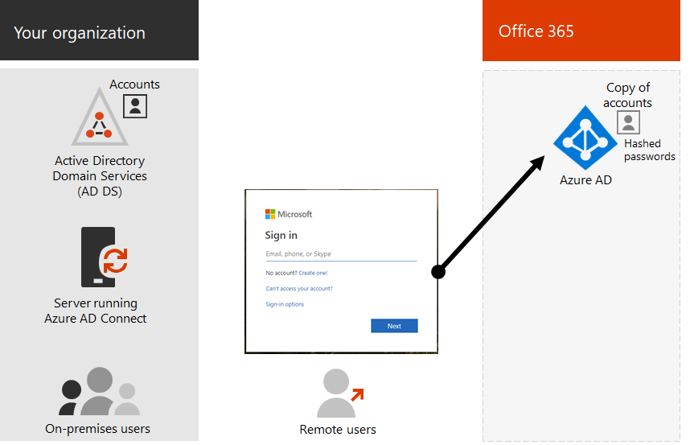
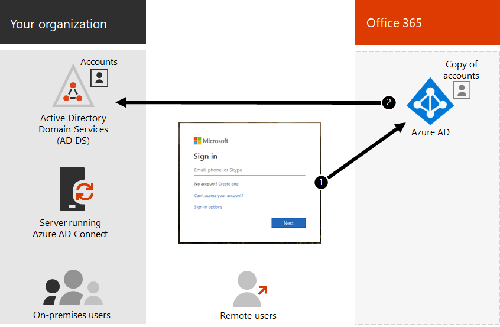

# Hybrid identity and directory synchronization for Office 365

Depending on business needs and technical requirements, the hybrid identity model and directory synchronization is the most common choice for enterprise customers who are adopting Office 365. Directory synchronization allows you to manage identities in your Active Directory Domain Services (AD DS) and all updates to user accounts, groups, and contacts are synchronized to the Azure Active Directory (Azure AD) tenant of your Office 365 subscription.

>[!Note]
>When AD DS user accounts are synchronized for the first time, they are not automatically assigned an Office 365 license and cannot access Office 365 services, such as email. You must assign a license to these user accounts, either individually or dynamically through group membership.
>

## Authentication for hybrid identity

There are two types of authentication when using the hybrid identity model:

- Managed authentication

  Azure AD handles the authentication process by using a locally stored hashed version of the password or sends the credentials to an on-premises software agent to be authenticated by the on-premises AD DS.

- Federated authentication

  Azure AD redirects the client computer requesting authentication to contact another identity provider.

### Managed authentication

There are two types of managed authentication:

- Password hash synchronization (PHS)

  Azure AD performs the authentication itself.

- Pass-through authentication (PTA)

  Azure AD has AD DS perform the authentication.

#### Password hash synchronization

With password hash synchronization (PHS), you synchronize your AD DS user accounts with Office 365 and manage your users on-premises. Hashes of user passwords are synchronized from your AD DS to Azure AD so that the users have the same password on-premises and in the cloud. This is the simplest way to enable authentication for AD DS identities in Azure AD. 

When passwords are changed or reset on-premises, the new password hashes are synchronized to Azure AD so that your users can always use the same password for cloud resources and on-premises resources. The user passwords are never sent to Azure AD or stored in Azure AD in clear text. Some premium features of Azure AD, such as Identity Protection, require PHS regardless of which authentication method is selected.
  
See [choosing PHS](https://docs.microsoft.com/azure/security/azure-ad-choose-authn) to learn more.
  
#### Pass-through authentication

Pass-through authentication (PTA) provides a simple password validation for Azure AD authentication services using a software agent running on one or more on-premises servers to validate the users directly with your AD DS. With pass-through authentication (PTA), you synchronize AD DS user accounts with Office 365 and manage your users on-premises. 

PTA allows your users to sign in to both on-premises and Office 365 resources and applications using their on-premises account and password. This configuration validates users passwords directly against your on-premises AD DS without storing password hashes in Azure AD. 

PTA is also for organizations with a security requirement to immediately enforce on-premises user account states, password policies, and logon hours. 
  
See [choosing PTA](https://docs.microsoft.com/azure/security/azure-ad-choose-authn) to learn more.
  
### Federated authentication

Federated authentication is primarily for large enterprise organizations with more complex authentication requirements. AD DS identities are synchronized with Office 365 and users accounts are managed on-premises. With federated authentication, users have the same password on-premises and in the cloud and they do not have to sign in again to use Office 365. 

Federated authentication can support additional authentication requirements, such as smartcard-based authentication or a third-party multi-factor authentication and is typically required when organizations have an authentication requirement not natively supported by Azure AD.
 
See [choosing federated authentication](https://docs.microsoft.com/azure/security/azure-ad-choose-authn) to learn more.
  
#### Third-party authentication and identity providers

On-premises directory objects may be synchronized to Office 365 and cloud resource access is primarily managed by a third-party identity provider (IdP). If your organization uses a third-party federation solution, you can configure sign-on with that solution for Office 365 provided that the third-party federation solution is compatible with Azure AD.
  
See [Azure AD federation compatibility](https://docs.microsoft.com/azure/active-directory/connect/active-directory-aadconnect-federation-compatibility) to learn more.
  
## AD DS Cleanup

To help ensure a seamless transition to Office 365 by using synchronization, you must prepare your AD DS forest before you begin your Office 365 directory synchronization deployment.
  
When you [set up directory synchronization in Office 365](set-up-directory-synchronization.md), one of the steps is to [download and run the IdFix tool](install-and-run-idfix.md). You can use the IdFix tool to help with [directory cleanup](prepare-directory-attributes-for-synch-with-idfix.md).
  
Your directory cleanup should focus on the following tasks:

- Remove duplicate **proxyAddress** and **userPrincipalName** attributes.
- Update blank and invalid **userPrincipalName** attributes with valid **userPrincipalName** attributes.
- Remove invalid and questionable characters in the **givenName**, surname ( **sn** ), **sAMAccountName**, **displayName**, **mail**, **proxyAddresses**, **mailNickname**, and **userPrincipalName** attributes. For details about preparing attributes, see [List of attributes that are synced by the Azure Active Directory Sync Tool](https://go.microsoft.com/fwlink/p/?LinkId=396719).

    > [!NOTE]
    > These are the same attributes that Azure AD Connect synchronizes. 
  
## Multi-forest deployment considerations

For multiple forests and SSO options, use [Custom Installation of Azure AD Connect](https://go.microsoft.com/fwlink/p/?LinkId=698430).
  
If your organization has multiple forests for authentication (logon forests), we highly recommend the following:
  
- **Consider consolidating your forests.** In general, there's more overhead required to maintain multiple forests. Unless your organization has security constraints that dictate the need for separate forests, consider simplifying your on-premises environment.
- **Use only in your primary logon forest.** Consider deploying Office 365 only in your primary logon forest for your initial rollout of Office 365. 

If you can't consolidate your multi-forest AD DS deployment or are using other directory services to manage identities, you may be able to synchronize these with the help of Microsoft or a partner.
  
See [Multi-forest Directory Sync with Single Sign-On Scenario](https://go.microsoft.com/fwlink/p/?LinkId=525321) for more information.
  
## Features that are dependent on directory synchronization
  
Directory synchronization is required for the following features and functionality:
  
- Azure AD Seamless Single Sign-On (SSO)
- Skype coexistence
- Exchange hybrid deployment, including:
  - Fully shared global address list (GAL) between your on-premises Exchange environment and Office 365.
  - Synchronizing GAL information from different mail systems.
  - The ability to add users to and remove users from Office 365 service offerings. This requires the following:
  - Two-way synchronization must be configured during directory synchronization setup. By default, directory synchronization tools write directory information only to the cloud. When you configure two-way synchronization, you enable write-back functionality so that a limited number of object attributes are copied from the cloud, and then written them back to your local AD DS. Write-back is also referred to as Exchange hybrid mode. 
  - An on-premises Exchange hybrid deployment
  - The ability to move some user mailboxes to Office 365 while keeping other user mailboxes on-premises.
  - Safe senders and blocked senders on-premises are replicated to Office 365.
  - Basic delegation and send-on-behalf-of email functionality.
  - You have an integrated on-premises smart card or multi-factor authentication solution.
- Synchronization of photos, thumbnails, conference rooms, and security groups

## Next step

When you are ready to deploy hybrid identity, see [prepare to provision users](prepare-for-directory-synchronization.md).
  

