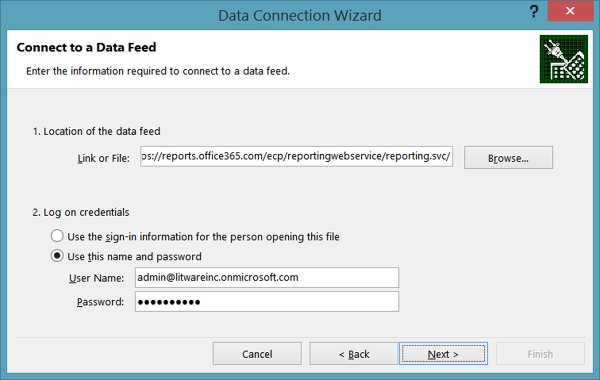
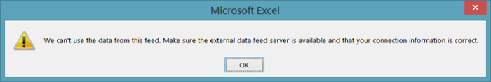
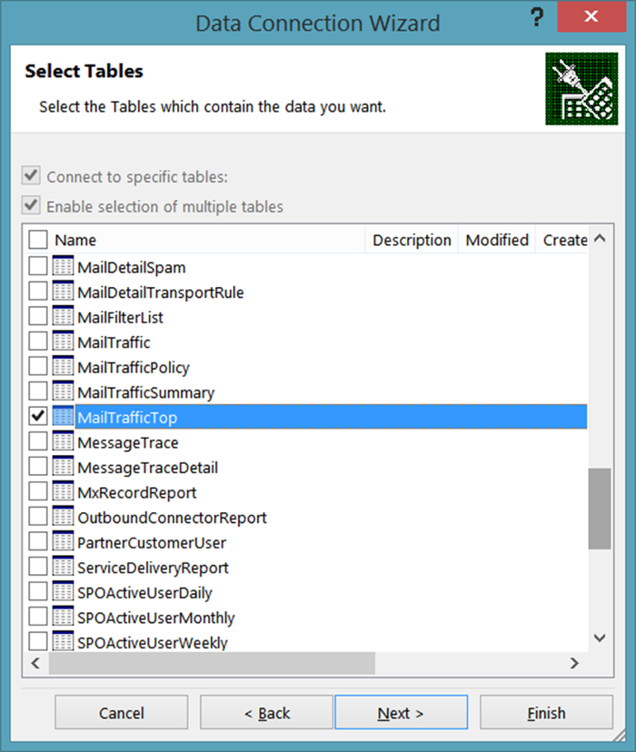
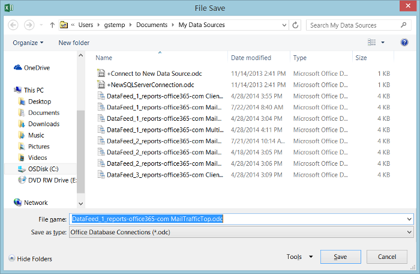
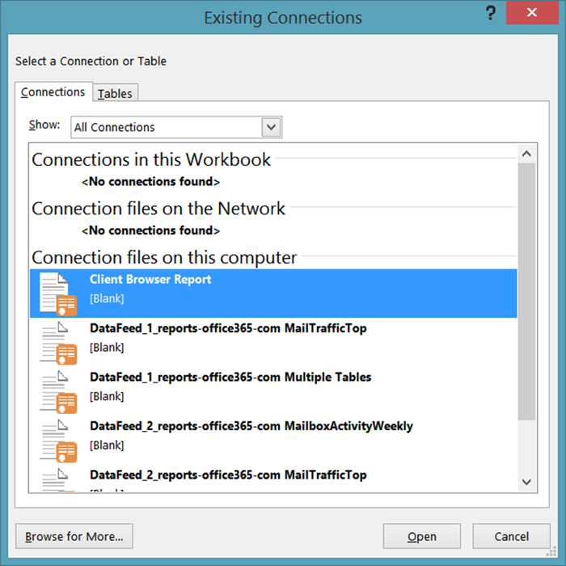
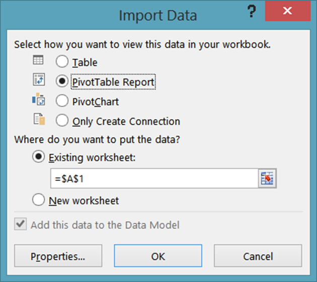
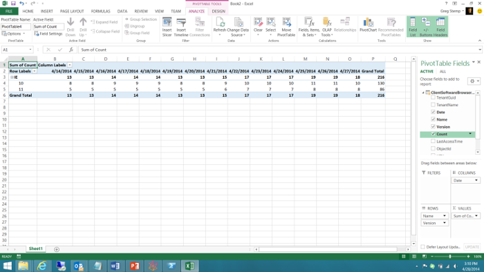

# Using Excel to Retrieve Office 365 Reporting Data
[]
 **Summary:** Use the oData feature in Microsoft Excel to retrieve detailed reporting information for your deployment of Office 365
  
Reporting is a key part of system administration. The Office 365 Admin center includes a number of predefined reports, which you can access from the **Reports** section of the left navigation. There are usage reports and security and compliance reports.
  
The reports available to you depend on the version of Office 365 you are using and which Office 365 services you have enabled. For more information, see the [Reports page](https://technet.microsoft.com/en-us/library/office-365-reports.aspx).
  
The pre-defined Admin center reports are an excellent resource. They make it easy to check on such things as mailbox usage or the number of minutes that your users have been spending in online conferences. However, when it comes to detailed analysis of your Office 365 domain, the reports do have their limitations.
  
One way to work around these limitations is to use Windows PowerShell or another development language to access the Office 365 reporting service and create custom reports; custom reports give you the ability to dictate which data (and how much data) is returned from the Office 365 reporting service. By writing custom reports you can also specify how the data should be sorted and grouped, and, if applicable, how that data should be saved; for example, you can save data in XML format or in a comma-separated values format that can easily be imported in Excel. 
  
In addition, custom scripts/applications enable you to access reports that are not available in the Office 365 Admin center. For example, the Admin center can tell you how many stale mailboxes you have, but it can't tell which mailboxes haven't been accessed in the past 30 days. That is something that a custom PowerShell script can tell you. Taken together, this represents an enormous amount of flexibility in return for having to write a short and relatively-simple Windows PowerShell script.
  
> [!VISUAL BASIC NOTE]
> For more information, see the [home page](https://msdn.microsoft.com/en-us/library/office/jj984325%28v=office.15%29.aspx) for the Office 365 reporting service.
  
In order to retrieve this data, you do have to write code of some kind. That's worth it if you are a larger organization that needs to limit the amount and the type of information that gets returned. But if you're a smaller organization, and you don't need to limit the amount and type of information that gets returned, you might consider opening the Office 365 reports from within Excel itself.
  
However, there are a few limitations here, the primary one being this: you cannot filter, sort, select, or otherwise manipulate the data that before it gets returned. Instead, you simply get back the default set of data returned by the report. In some cases that might not be enough data. For example, the report might return data for, say, only the previous month and not for the entire year. Conversely, in other cases that might be too much data: you might get back data for the entire year even though you only want data for the previous month.
  
To open an Office 365 report directly from within Excel, complete the following procedure:
  
1. Start by opening a new worksheet in Excel. On that worksheet, click **Data**, click **From Other Sources**, and then click **From OData Data Feed**. That brings up the **Data Connection Wizard** dialog box:
    
     
  
2. On the **Connect to a Data Feed** page, enter **https://reports.office365.com/ecp/reportingwebservice/reporting.svc/** as the data feed location. Note that you can only enter the base URL as shown; you cannot add any Select, Filter, or Format statements. If you enter anything but the base URL you won't get back any data; instead, you'll simply see the following error message:
    
     
  
3. After entering the reporting service URL, select **Use this name and password** under **Log on credentials**. In the **User Name** box, enter your Office 365 logon name (for example, admin@litwareinc.onmicrosoft.com). In the **Password** box, enter your Office 365 logon password and then click **Next**. Excel will then attempt to connect to the reporting service using the supplied credentials.
    
4. After you have been authenticated, you'll see the **Select Tables** page. Select the report that you'd like to view (for example, **MailTrafficTop** ) and then click **Next**:
    
     
  
    > [!NOTE]
    > It's possible to select multiple reports; that results in multiple tables/charts being added to your Excel spreadsheet. It's even possible to create a single table/chart that combines data from multiple reports. However, we won't discuss that in this introductory article. 
  
5. After clicking **Next** you'll be presented with the **Save Data Connection File and Finish** page:
    
     
  
    You don't have to enter any information here. All you need to do to retrieve your data is to click **Finish**. However, it's worth noting that, by default, Excel saves information about each data connection you make; this data is stored in your **My Data Sources** folder:
    
     
  
    That's why the dialog box includes text boxes with labels like **Friendly Name** and **Search Keywords**; these options give you the chance to customize these data connections. That way you do not end up with a whole bunch of data sources that look like these:
    
  ```
  DataFeed_1_reports-office365-com ClientSoftwareBrowserDetail.odc
DataFeed_1_reports-office365-com MailTrafficTop.odc
DataFeed_1_reports-office365-com Multiple Tables.odc
DataFeed_2_reports-office365-com MailboxActivityWeekly.odc
DataFeed_2_reports-office365-com MailTrafficTop.odc
DataFeed_3_reports-office365-com ClientSoftwareBrowserDetail.odc
  ```

    If you select the checkbox **Save password in file**, you'll be able to reuse these data feeds. For example, suppose you save a data connection as **Client Browser Report**. The next time you want information about the web browsers being used to access your Office 365 domain you don't have to walk through the data connection wizard. Instead, all you need to do is open Excel, click **Data**, and then click **Existing Sources**. Select the desired data connection in the **Existing Connections** dialog box and then click **OK**:
    
     
  
    At that point, Excel will make the connection for you and retrieve the data.
    
    Note that these .ODC files are plain-text XML files. Included in these plain-text XML files are your Office 365 user name and password:
    
    <odc:ConnectionString>Data Source=https://reports.office365.com/ecp/reportingwebservice/reporting.svc/;Namespaces to Include=*;Max Received Message Size=4398046511104;Integrated Security=Basic; **User ID=admin@litwareinc.onmicrosoft.com;Password=MYpassw0rd!**;Persist Security Info=false;Service Document Url=https://reports.office365.com/ecp/reportingwebservice/reporting.svc/</odc:ConnectionString>
    
    If you don't like the idea of saving your user name and password in a plain-text file, then don't check the box labeled **Save password in file**. If you do that, however, keep in mind that you won't be able to reuse these data connections. That's because, without the user name and password, Office 365 will not be able to authenticate your attempt to log on to the service.
    
6. Click **Finish** on the **Save Data Connection File and Finish** page you'll be presented with the **Import Data** dialog box:
    
     
  
7. Select your view options (for example, **PivotTable Report** ) and then click **OK**. If all goes well, your data will be imported and be presented in whichever view option you happened to choose:
    
     
  
What you do with that data is then entirely up to you. For some suggestions. take a look at [Create an Excel Services dashboard using an oData data feed](https://technet.microsoft.com/en-us/library/jj873965%28v=office.15%29.aspx). Although that article doesn't use the Office 365 reporting service, it does provide some handy hints for doing things like adding filters and slicers to your new dashboard.
  
## See also

#### 

[Manage Office 365 with Office 365 PowerShell](manage-office-365-with-office-365-powershell.md)
  
[Getting started with Office 365 PowerShell](getting-started-with-office-365-powershell.md)
  
[Use Windows PowerShell to create reports in Office 365](use-windows-powershell-to-create-reports-in-office-365.md)

