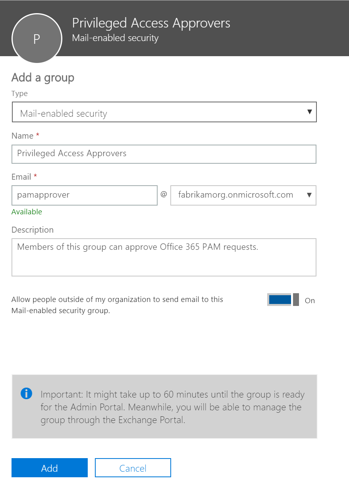

> [!IMPORTANT]
> This topic covers deployment and configuration for a public beta feature only currently available in Office 365 E5 and Advanced Compliance SKUs.

# Privileged Access Management in Office 365
Privileged Access Management (PAM) allows more granular access control over privileged admin tasks in Office 365. Users can request Just-In-Time (JIT) access to complete privileged tasks through an approval workflow that is highly scoped and time bound. This gives the users Just-Enough-Access (JEA) to perform the task at hand. Enabling PAM in Office 365 will enable your organization to operate with Zero Standing Privilege and provide a layer of defense against vulnerabilities arising because of such standing administrative access. 

This topic will guide you through enabling and configuring PAM in your Office 365 organization and serve as a reference guide for requesting, approving, and managing the feature. 

## Before you begin

### Limited functionality
During the public beta, the features of PAM are only available through PowerShell for the Exchange in Office 365. PAM covers the task definitions at the level of Exchange management cmdlets. In coming releases PAM’s features will be available through the admin portal and will cover other office 365 workloads.

### Connecting to Exchange Online PowerShell
The configuration steps in this topic will walk you through enabling and using Privileged Access Management in Office 365 using Exchange Online PowerShell. 

Follow the steps in [Connect to Exchange Online PowerShell using Multi-Factor authentication](https://docs.microsoft.com/powershell/exchange/exchange-online/connect-to-exchange-online-powershell/mfa-connect-to-exchange-online-powershell?view=exchange-ps) to connect to Exchange Online PowerShell with your Office 365 credentials to enable and configure previleged access for your organization.

> [!NOTE]
> You do not need to enable multi-factor authentication for your Office 365 organization to use the steps to enable prvileged access while connecting to Exchange Online PowerShell. Connecting with multi-factor authentication creates an OAuth token that is used by privileged access for signing your requests.

## Enable and configure privileged access management

### Step 1 - Create an approver's group
From Office 365 Admin Portal > Groups > Add a group, create a mail enabled security group for the default PAM approvers.



### Step 2 - Enable privileged access in Office 365
PAM feature needs to be explicitly turned on with the default approver group and including a set of system accounts that you’d want to be excluded from the PAM access control. 

Run the command below in Exchange Online PowerShell:
```
Enable-ElevatedAccessControl 
    -AdminGroup '<default approver group>' 
    -SystemAccounts @('<systemAccountUPN1>','<systemAccountUPN2>')
```
Example:
```
Enable-ElevatedAccessControl 
    -AdminGroup 'pamapprovers@fabrikam.onmicrosoft.com' 
    -SystemAccounts @('sys1@fabrikam.onmicrosoft.com', sys2@fabrikam.onmicrosoft.com')
```

> [!NOTE]
> System accounts feature is made available to ensure certain automations within your organizations can work without dependency on PAM, however it is recommended that such exclusions be exceptional and those allowed should be approved and audited regularly.

### Step 3 - Create an approval policy
An approval policy allows you to define the specific approval requirements scoped at individual tasks. The approval type could by Auto or Manual. 

Run the following command in Exchange Online PowerShell to define an approval policy.
```
New-ElevatedAccessApprovalPolicy 
    -Task 'Exchange\<exchange management cmdlet name>' 
    -ApprovalType <Manual, Auto> 
    -ApproverGroup '<default/custom approver group>'
```
Example:
```
New-ElevatedAccessApprovalPolicy 
    -Task 'Exchange\New-MoveRequest' 
    -ApprovalType Manual 
    -ApproverGroup 'mbmanagers@fabrikam.onmicrosoft.com'
```

## Using privileged access in your Office 365 organization

### Requesting elevation authorization to execute tasks
Once enabled, PAM will require approvals for executing any task that has an associated approval policy defined. 

Run the command below in Exchange Online PowerShell to raise an approval request.
```
New-ElevatedAccessRequest 
    -Task 'Exchange\<exchange management cmdlet name>' 
    -Reason '<appropriate reason>' 
    -DurationHours <duration in hours>
```
Example:
```
New-ElevatedAccessRequest 
    -Task 'Exchange\New-MoveRequest' 
    -Reason 'Attempting to fix the user mailbox error' 
    -DurationHours 4
```

### Approving an elevation authorization request
When an approval request is raised, members of the relevant approver group can approve the request with the request ID. 

Run the command below in Exchange Online PowerShell to approve a request:
```
Approve-ElevatedAccessRequest 
    -RequestId <request id>
    -Comment '<approval comment>'
```
Example:
```
Approve-ElevatedAccessRequest 
    -RequestId a4bc1bdf-00a1-42b4-be65-b6c63d6be279 
    -Comment '<approval comment>'
```

### Running the task
After approval is granted, you can execute the intended task and PAM will authorize and execute the task on users’ behalf. The approval remains valid for the requested duration (default duration is 4 hours), during which the requester can execute the intended task multiple times. All such executions are logged and made available for audit for compliance. 

### Disable privileged access in Office 365
If needed, you can disable privileged access management in Office 365. Disabling privileged access does not delete any associated approval policies or approver groups.

Run the following command in Exchange Online Powershell to disable privileged access:

```
Disable-ElevatedAccessControl
```
## Project Euclid with Privileged Access Management
Project Euclid is a service that helps organizations exert a more granular level of control over their Office 365 data, they provide to application developers who build solutions to mine data to build useful insights. 

Project Euclid uses Office 365 PAM to assert control over their data through PAM’s approval workflow, to allow scoped access to Office 365 data with admin oversight. Requests for data from Project Euclid come in through the integration when apps are installed.

### View request details for Office 365 data
View details of the access requests for Office 365 data from the Euclid system.

Run the following command in Exchange Online Powershell to view data requests for Project Euclid apps:
```
Get-ElevatedAccessRequest 
    –Identity <request id>
    | select RequestorUPN, Service, RequestedAccess
    | fl
```
Example:
```
RequestorUPN    : admin@contoso.com
Service         : Office365
RequestedAccess : Data Access Request
```

### Approve all data access requests for Project Euclid apps
All requests for Data Access Requests can be approved through same approve cmdlets as other PAM requests.

```
Approve-ElevatedAccessRequest 
    -RequestId <request id>
    -Comment '<approval comment>'
```
Example:
```
Approve-ElevatedAccessRequest 
    -RequestId a4bc1bdf-00a1-42b4-be65-b6c63d6be279 
    -Comment '<approval comment>'
```

## Getting help and providing feedback
We recognize that during the public beta you may come across an occasional bug or have feedback and suggestions on how we can improve privileged access management. 

We value your feedback and encourage you to share it with us:
- Post your feedback ad suggestions in the [Office Preview Yammer Group](https://www.yammer.com/officeenterprisenda/#/threads/inGroup?type=in_group&feedId=14435206).
- File your bug reports under area path “Office 365 Privileged Access Management” on the [Office Preview VSO](https://office-previews.visualstudio.com/previews).

## Frequently asked questions (FAQ)

### What SKUs do I need to use PAM in Office 365?
PAM in Office 365 is available for customers with E5 and Advanced Compliance SKUs.

### When will PAM be available for Office 365 workloads beyond Exchange?
We do plan to offer this feature in other Office 365 workloads – when we’re ready to share a timeline, it will be available through Office 365 Roadmap.

### How is this different from Azure Active Directory’s Privileged Identity Management (AAD PIM)?
Privileged access management in Office 365 and AAD PIM complement each other by providing access control with JIT access at different scopes.

Privileged access management in Office 365 can be defined and scoped at the task level, while AAD PIM applies at the role level with the ability to execute multiple tasks.  AAD PIM primarily allows managing accesses for AD roles and role groups while privileged access management in Office 365 is applied at the task level.

Enabling privileged access management in Office 365 while already using AAD PIM: Adding privileged access management in Office 365 can provide another granular layer of protection and audit capabilities for privileged access to Office 365 data.

Enabling AAD PIM while already using privileged access management in Office 365:  Adding AAD PIM to privileged access management in Office 365 can extend privileged access to data outside of Office 365 that’s primarily defined by a user’s role or identity. 

Together they provide a robust set of controls for protecting your data.

### Do I need to be a Global Admin to manage PAM in Office 365?
During the preview you need to have a Global Admin privilege to be able to manage PAM in Office 365. Users who’re part of an approvers’ group, do not need to be a Global Admin to review and approve requests. 

### How is privileged access management in Office 365 related to Customer Lockbox?
Customer Lockbox allows a level of access control for organizations around accessed to data by their service provider, i.e. Microsoft. Privileged access management in Office 365, allows granular access control within an organization for all Office 365 privileged tasks.
