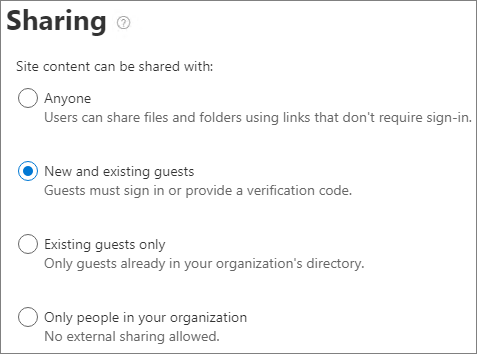

# Limit accidental exposure to files when sharing with guests

## Set Anyone link permission to View

If people in your organization do a lot of anonymous sharing, but you're concerned about unauthenticated guests modifying content, you can set the default permissions for Anyone links to View. Your users can change this to Edit when they share, but with a default of View, it's less likely that users will share with edit permissions unintentionally.

To set the default Anyone link permissions
1. In the SharePoint admin center, in the left navigation, click **Sharing**.
2. Under **Advanced settings for Anyone links**, select **View** for **Files** and **Folders**.
   
3. Click **Save**.

## Set default link type to company link

If you have Anyone sharing enabled for your organization, the default sharing link is normally set to Anyone. While this can be convenient if you have users who do a lot of anonymous sharing, it can increase the risk of unintentional anonymous sharing. If a user forgets to change the link type while sharing a sensitive document, they might accidentally create a sharing link that doesn't require authentication.

An easy way to mitigate this risk, while still allowing anonymous sharing for those who need it, is to change the default link setting to a link that only works for people inside your organization. Users who want to share anonymously would then have to specifically select that option.

To set the default file and folder sharing link
1. In the SharePoint admin center, in the left navigation, click **Sharing**.
2. Under **File and folder links**, select **Only people in your organization**.
   
3. Click **Save**

## Turn off Anyone links

If you always want guests to authenticate when accessing content in SharePoint, Groups, or Teams, you can turn off Anyone sharing. This will prevent users from sharing content anonymously.

If you disable Anyone links, users can still easily share with guests using Specific people links. In this case, all guests will be required to authenticate before they can access the shared content.

Depending on your needs, you can disable Anyone links for specific sites, or for your whole organization.

To turn off Anyone links for your organization
1. In the SharePoint admin center, in the left navigation, click **Sharing**.
2. Set the SharePoint external sharing settings to **New and existing guests**.
   
3. Click **Save**.

To turn off Anyone links for a site
1. In the SharePoint admin center, in the left navigation, expand **Sites** and click **Active sites**.
2. Select the site for the team that you just created.
3. In the ribbon, click **Sharing**.
4. Ensure that sharing is set to **Anyone** or **New and existing guests**.
   
5. If you made changes, click **Save**.

## Domain filtering

You can use domain allow or deny lists to determine which domains your users can invite guests from.

With an allow list, you can specify a list of domains from which users in your organization can invite guests. Guest invitations to other domains are blocked. If your organization only collaborates with guests from a list of specific domains, you can use this feature to prevent sharing with other domains.

With a deny list, you can specify a list of domains from which users in your organization cannot invite guests. Guest invitations to the listed domains are blocked. This can be useful if you have competitors, for example, who you want to prevent from becoming guests in your organization.

The allow and deny lists only affect sharing with authenticated guests. Users can still share with guests from prohibited by using Anyone links if you haven't disabled them. For best results with domain allow and deny lists, consider disabling Anyone links as described above.

To set up a domain allow or deny list for guest sharing
1. In the SharePoint admin center, in the left navigation, click **Sharing**.
2. Under **Advanced settings for external sharing**, select the **Limit external sharing by domain** check box.
3. Click **Add domains**.
4. Select whether you want to block domains, type the domains, and click **OK**.
   
5. Click **Save**.

## Limit guest sharing to specified security groups

You can restrict guest sharing to members of a specific security group. This is useful if you want to enable guest sharing, but with an approval workflow or request process. 

To limit guest sharing to members of a security group
1. In the SharePoint admin center, in the left navigation, click **Sharing**.
2. Under **Other settings**. follow the **Limit external sharing to specific security groups** link.
3. Under **Who can share outside your organization**, select one or both of the check boxes:
    a. **Let only users in selected security groups share with authenticated external users** to specify a security group that can share with authenticated users
    b. **Let only users in selected security groups share with authenticated external users and using anonymous links** to specify a security group that can share with authenticated users and by using Anyone links
4. Click **OK**.

## See Also

SharingSecurity