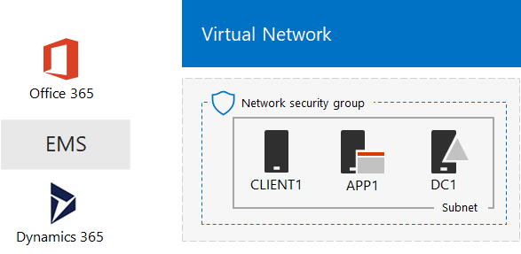
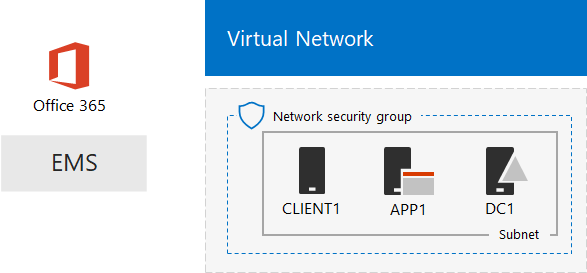

# The One Microsoft Cloud dev/test environment

 **Summary:** Use this Test Lab Guide to create a dev/test environment that includes all of Microsoft's cloud offerings.
  
With the instructions in this article, you create a simulated intranet in Microsoft Azure infrastructure services and then add Microsoft Office 365, Microsoft Enterprise Mobility + Security (EMS), and Microsoft Dynamics 365 subscriptions. The result is a simplified organization that uses all Microsoft's cloud offerings at the same time in a single dev/test environment. 
  

  
You can use the resulting configuration to:
  
- Experience the integration across Microsoft's cloud offerings, such as the common identity infrastructure provided by Azure Active Directory (AD).
    
- Evaluate end-to-end scenarios that include multiple Microsoft Cloud offerings.
    
- Create a demo, proof-of-concept, or dev/test configuration that uses multiple Microsoft Cloud offerings.
    
- Build your Microsoft Cloud skills for professional development.
    
## Phase 1: Create a simulated intranet and add Office 365

Follow the instructions in [DirSync for your Office 365 dev/test environment](dirsync-for-your-office-365-dev-test-environment.md).
  
Figure 1 shows your resulting configuration, which includes Office 365 and a simulated intranet running in Azure infrastructure services and directory synchronization from an on-premises Active Directory Domain Services (AD DS) forest.
  
**Figure 1: The simulated intranet in Azure with Office 365**

  
> [!NOTE]
> The Azure trial is 30 days. The Office 365 Enterprise E5 Trial subscription is 30 days, which can be easily extended for another 30 days. For a permanent dev/test environment, create a new paid Azure subscription and a new paid Office 365 Enterprise E5 subscription with a small number of licenses. 
  
## Phase 2: Add EMS

In this phase, you sign up for the EMS trial subscription and add it to the same organization as your Office 365 trial subscription.
  
1. With a browser on either your desktop computer or from CLIENT1, sign in to the Office 365 portal at [https://www.office.com](https://www.office.com) with the credentials of your global administrator account.
    
2. Click the **Admin** tile.
    
3. On the **Office Admin center** tab in your browser, in the left navigation, click **Billing > Purchase services**.
    
4. On the **Purchase services** page, find the **Enterprise Mobility + Security E5** item. Hover your mouse pointer over it and click **Start free trial**.
    
5. On the **Confirm your order** page, click **Try now**.
    
6. On the **Order receipt** page, click **Continue**.
    
> [!NOTE]
> The Enterprise Mobility + Security E5 trial subscription is 90 days. For a permanent dev/test environment, create a new paid subscription with a small number of licenses. 
  
Next, enable the Enterprise Mobility + Security E5 license for all user accounts.
  
1. On the **Office 365 Admin center** tab in your browser, in the left navigation, click **Users > Active users**.
    
2. Click your global administrator account, and then click **Edit** for **Product licenses**.
    
3. On the **Product licenses** pane, turn the product license for **Enterprise Mobility + Security E5** to **On**, click **Save,** and then click **Close** twice.
    
4. For all of your other accounts (User1, User 2, User 3, User 4, and User 5), do steps 2 and 3.
    
Your dev/test environment now has:
  
- A simulated intranet running in Azure infrastructure services.
    
- Office 365 E5 Enterprise and EMS trial subscriptions sharing the same organization and the same Azure AD tenant with your list of user accounts.
    
- All of your user accounts enabled to use Office 365 E5 Enterprise and EMS.
    
Figure 2 shows your resulting configuration, which adds EMS.
  
**Figure 2: The simulated intranet in Azure with Office 365 and EMS**

  
## Phase 3: Add Dynamics 365

In this phase, you sign up for the Dynamics 365 trial subscription and add it to the same organization as your Office 365 and EMS trial subscriptions.
  
1. Using a browser on either your desktop computer or from CLIENT1, sign in to the Office 365 portal at [https://www.office.com](https://www.office.com) with the credentials of your global administrator account.
    
2. Click the **Admin** tile.
    
3. On the **Microsoft 365 admin center** tab, in the left navigation, click **Billing > Purchase services**.
    
4. On the **Purchase services** page, find the **Dynamics 365 Plan 1 Enterprise Edition** item. Hover your mouse pointer over it and click **Start free trial**.
    
5. On the **Confirm your order** page, click **Try now**.
    
6. On the **Order receipt** page, click **Continue**.
    
> [!NOTE]
> The Dynamics 365 Plan 1 Enterprise Edition trial subscription is 30 days. You can easily extend the trail subscription for another 30 days. For a permanent dev/test environment, create a new paid subscription with a small number of licenses. 
  
Use these steps to assign Dynamics 365 licenses to the global administrator, User 2, and User 3 accounts and make them system administrators.
  
1. On the **Microsoft 365 admin center** tab, click **Users > Active users**.
    
2. In the list of active users, click your global administrator account, and then click **Edit** for **Product licenses**.
    
3. On the **Product licenses** pane, turn the product license for **Dynamics 365 Plan 1 Enterprise Edition** to **On**, click **Save,** and then click **Close** twice.
    
4. Perform steps 2 and 3 for the User 2 and User 3 accounts.
    
5. Close the **Microsoft 365 admin center** tab.
    
Use these steps to configure the User 2 and User 3 accounts as Dynamics 365 system administrators.
  
1. On the **Office Admin center** tab in your browser, in the left navigation, click **Admin centers**, and then click **Dynamics 365**.
    
    You may need to wait for Dynamics 365 to finish provisioning before Dynamics 365 appears in the menu.
    
2. On the Dynamics 365 tab, click **All of these**, and then click **Complete Setup.**
    
    Wait for setup to complete.
    
    When setup completes, it shows a Sales Activity Dashboard based on sample data that is part of the trail subscription. Take a few moments to view the **Welcome to your trial** video. Close the video window when complete.
    
3. On the toolbar at the top, click the down arrow next to **Sales**, click **Settings**, and then click **Security**.
    
4. On the **Security** page, click **Users**.
    
5. In the list of users, click **User 2**.
    
6. In the tool bar, click **Manage Roles**.
    
7. In **Manage Roles**, click **System Administrator**, and then click **OK**.
    
8. In the tool bar at the top click **Security**.
    
9. Repeat steps 5-8 for the User 3 account.
    
10. Close the **User: User3** tab.
    
> [!NOTE]
> Your Office 365 global administrator account was automatically assigned the Dynamics 365 system administrator role. 
  
Your dev/test environment now has:
  
- A simulated intranet running in Azure infrastructure services.
    
- Office 365 E5 Enterprise, EMS, and Dynamics 365 trial subscriptions sharing the same organization and the same Azure AD tenant with your list of user accounts.
    
- All of your user accounts enabled to use Office 365 E5 Enterprise and EMS.
    
- Your global enterprise administrator, User 2, and User 3 accounts are enabled to use Dynamics 365 and are Dynamics 365 system administrators.
    
Figure 3 shows your resulting configuration.
  
**Figure 3: The simulated intranet in Azure with Office 365, EMS, and Dynamics 365**

  
## Next steps

You can now experiment with your One Microsoft Cloud dev/test environment. Here are some ideas for guided experiences:
  
- [Configure mobile application management (MAM) policies in EMS for Office 365 applications](https://technet.microsoft.com/library/mt764059.aspx)
    
- [Demonstrate Exchange Online in Office 365 integration with Dynamics 365 contacts](https://technet.microsoft.com/library/mt798313.aspx)
    
- [Create a simulated cross-premises network in Azure infrastructure services for hosting server-based workloads](https://technet.microsoft.com/library/mt745150.aspx)
    
## See Also

[Cloud adoption Test Lab Guides (TLGs)](cloud-adoption-test-lab-guides-tlgs.md)
  
[Microsoft Cloud IT architecture resources](microsoft-cloud-it-architecture-resources.md)
  
[Hybrid solutions](hybrid-solutions.md)
  
[Security solutions](security-solutions.md)

